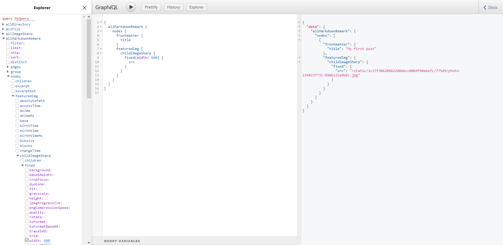
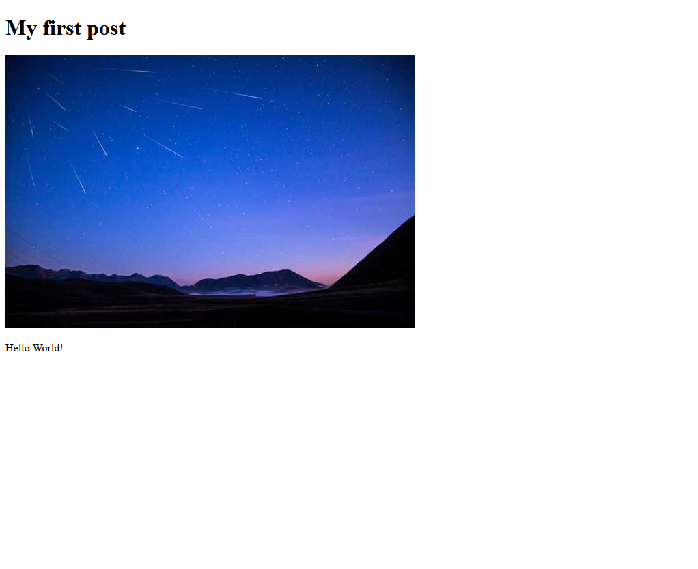

Gatsby allows powerful image processing features using the [`sharp`](https://github.com/lovell/sharp/) library to automatically process images to be performant, with features like lazy-loading. That said, this only works if the image is a `File` node in the GraphQL layer.

If you want the same functionality for files that are remotely hosted online and not located in your Git repo, [`gatsby-source-filesystem`](/plugins/gatsby-source-filesystem/) has an API called `createRemoteFileNode` to solve this.

This guide will show you how to use the `createRemoteFileNode` process and get the same benefits of gatsby-transformer-sharp with externally sourced images.

## Setup

A use case that this technique can support is if you want to create a featured image in a blog post with an image sourced from a URL out on the web, instead of a local file. This could be hosted somewhere like Imgur, S3, or anywhere on the internet.

Given a sample post:

```markdown
---
title: My first blog post!
featuredImgUrl: https://images.unsplash.com/photo-1560237731-890b122a9b6c
featuredImgAlt: Mountains with a starry sky
---

Hello World
```

You can use a custom frontmatter field for the URL of the featured image you want to pull down and use as part of the site.

By default, this is a string value as you haven't told Gatsby yet how to interpret it. However, you can add some code into `gatsby-node.js` to modify it.

## Gatsby Node

In your `gatsby-node.js` file, you can do some processing to create file nodes for the custom `featuredImgUrl` Frontmatter field.

As you may not want to require all blog posts to have a featured image, you can define some GraphQL types with Gatsby's [Schema Customization API](/docs/reference/graphql-data-layer/schema-customization/) to provide flexibility and control with your queries. Explicitly defining these types allows you to return `null` when a blog post does not contain a featured image in its frontmatter data. Even if there are no blog posts with these data fields, the type will still exist in the schema and can be used in your code.

```js:title=gatsby-node.js
const { createRemoteFileNode } = require("gatsby-source-filesystem")

exports.createSchemaCustomization = ({ actions }) => {
  const { createTypes } = actions

  createTypes(`
    type MarkdownRemark implements Node {
      frontmatter: Frontmatter
      featuredImg: File @link(from: "fields.localFile")
    }

    type Frontmatter {
      title: String!
      featuredImgUrl: String
      featuredImgAlt: String
    }
  `)
}

exports.onCreateNode = async ({
  node,
  actions: { createNode, createNodeField },
  createNodeId,
  getCache,
}) => {
  // For all MarkdownRemark nodes that have a featured image url, call createRemoteFileNode
  if (
    node.internal.type === "MarkdownRemark" &&
    node.frontmatter.featuredImgUrl !== null
  ) {
    const fileNode = await createRemoteFileNode({
      url: node.frontmatter.featuredImgUrl, // string that points to the URL of the image
      parentNodeId: node.id, // id of the parent node of the fileNode you are going to create
      createNode, // helper function in gatsby-node to generate the node
      createNodeId, // helper function in gatsby-node to generate the node id
      getCache,
    })

    // if the file was created, extend the node with "localFile"
    if (fileNode) {
      createNodeField({ node, name: "localFile", value: fileNode.id })
    }
  }
}
```

Going step by step through the code:

1. Define some types for `MarkdownRemark` using the Schema Customization API. For `featuredImg`, use the `from` argument to point the `link` extension to the correct field name (the `createNodeField` extends the node with a `fields` key), [more details about foreign-key fields here](/docs/reference/graphql-data-layer/schema-customization/#foreign-key-fields). Defining a field for alternative text as `featuredImgAlt` can also improve accessibility, in addition to providing context for the image if it fails to load.
2. Create an `onCreateNode` function so you can watch for when `MarkdownRemark` nodes are made.
3. Use `createRemoteFileNode` by passing in the various required fields and get a reference to the file afterwards.
4. If the Node is created, extend the node with a `localFile` field. To do this, pass the `id` as the reference. Do note, this new node is now attached to the root of the `markdownRemark` node instead of the `frontmatter` field as `fields`.

And since it is a File Node, `gatsby-transformer-sharp` will pick it up and create a `childImageSharp` child Node inside this newly created Node.

## Usage in templates

Now that the images are being generated and available in GraphQL, you can use them in action.

If you open GraphiQL and write a query on the Markdown Nodes, you can see a new Node attached to any `MarkdownRemark` Node that had a featured image:

```graphql
query {
  allMarkdownRemark {
    nodes {
      featuredImg {
        childImageSharp {
          # ...
        }
      }
    }
  }
}
```



You can then use `gatsby-transformer-sharp` & `gatsby-plugin-image` to fill in the query for a fixed image here. For more information on transforming images using parameters and fragments, check out the ["Using Gatsby Plugin Image" guide](/docs/how-to/images-and-media/using-gatsby-plugin-image/).

```graphql
query {
  allMarkdownRemark {
    nodes {
      featuredImg {
        childImageSharp {
          gatsbyImageData(width: 600, layout: FIXED)
        }
      }
    }
  }
}
```

And finally, you can update the template for this blog post to include a featured image node. Note the alt text still comes from the post frontmatter. This template is based on the one in the [Programmatically create pages from data](/docs/tutorial/part-7/) section of the Gatsby Tutorial.

```jsx
import React from "react"
import { GatsbyImage } from "gatsby-plugin-image"
import { graphql } from "gatsby"

const template = ({ data }) => {
  return (
    <>
      <h1>{data.markdownRemark.frontmatter.title}</h1>
      {data.markdownRemark.featuredImg && (
        <GatsbyImage
          image={
            data.markdownRemark.featuredImg.childImageSharp.gatsbyImageData
          }
          alt={data.markdownRemark.frontmatter.featuredImgAlt}
        />
      )}
      <div dangerouslySetInnerHTML={{ __html: data.markdownRemark.html }} />
    </>
  )
}

export default template

export const query = graphql`
  query BlogPostQuery($slug: String) {
    markdownRemark(fields: { slug: { eq: $slug } }) {
      frontmatter {
        title
        featuredImgAlt
      }
      html
      featuredImg {
        childImageSharp {
          gatsbyImageData(width: 600, layout: FIXED)
        }
      }
    }
  }
`
```

And if you run `gatsby develop`, you'll see the remote file locally now:


