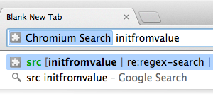

When the user enters your extension's keyword, the user starts interacting solely with your
extension. Each keystroke is sent to your extension, and you can provide suggestions in response.

The suggestions can be richly formatted in a variety of ways. When the user accepts a suggestion,
your extension is notified and can take action.

## Manifest

You must include an `omnibox` `keyword` field in the [manifest][1] to use the omnibox API. You
should also specify a 16x16-pixel icon, which will be displayed in the address bar when suggesting
that users enter keyword mode.

For example:

```json
{
  "name": "Aaron's omnibox extension",
  "version": "1.0",
  "omnibox": { "keyword": "aaron" },
  "icons": {
    "16": "16-full-color.png"
  },
  "background": {
    "persistent": false,
    "scripts": ["background.js"]
  }
}
```



**Note:** Chrome automatically creates a grayscale version of your 16x16-pixel icon. You should
provide a full-color version so that it can also be used in other situations that require color. For
example, the [context menus API][2] also uses a 16x16-pixel icon, but it is displayed in color.



## Examples

You can find samples of this API on the [sample page][3].

[1]: /docs/extensions/mv2/tabs
[2]: /docs/extensions/contextMenus
[3]: /docs/extensions/mv2/samples#search:omnibox
