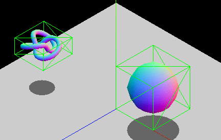
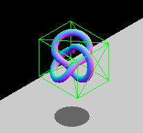
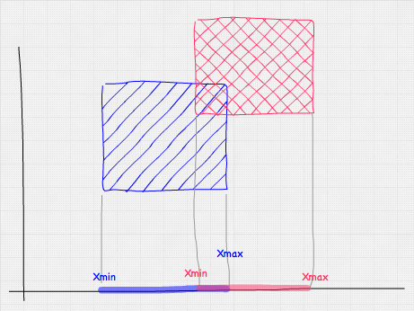
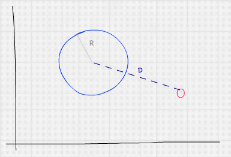
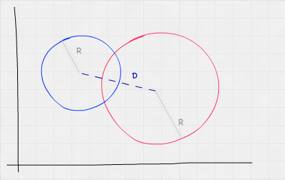
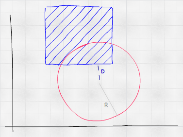

--- title: 3D collision detection slug: Games/Techniques/3D\_collision\_detection tags: - 3D - Games - JavaScript - bounding boxes - collision detection ---

{{GamesSidebar}}

This article provides an introduction to the different bounding volume techniques used to implement collision detection in 3D environments. Followup articles will cover implementations in specific 3D libraries.

Axis-aligned bounding boxes
---------------------------

As with 2D collision detection, **axis-aligned bounding boxes** (AABB) are the quickest algorithm to determine whether the two game entities are overlapping or not. This consists of wrapping game entities in a non-rotated (thus axis-aligned) box and checking the positions of these boxes in the 3D coordinate space to see if they are overlapping.

The **axis-aligned constraint** is there because of performance reasons. The overlapping area between two non-rotated boxes can be checked with logical comparisons alone, whereas rotated boxes require additional trigonometric operations, which are slower to calculate. If you have entities that will be rotating, you can either modify the dimensions of the bounding box so it still wraps the object, or opt to use another bounding geometry type, such as spheres (which are invariant to rotation.) The animated GIF below shows a graphic example of an AABB that adapts its size to fit the rotating entity. The box constantly changes dimensions to snugly fit the entity contained inside.

**Note:** Check out the [Bounding Volumes with Three.js](/en-US/docs/Games/Techniques/3D_collision_detection/Bounding_volume_collision_detection_with_THREE.js) article to see a practical implementation of this technique.

### Point vs. AABB

Checking if a point is inside an AABB is pretty simple — we just need to check whether the point's coordinates fall inside the AABB; considering each axis separately. If we assume that *Px*, *Py* and *Pz* are the point's coordinates, and *BminX*–*BmaxX*, *BminY*–*BmaxY*, and *BminZ*–*BmaxZ* are the ranges of each axis of the AABB, we can calculate whether a collision has occurred between the two using the following formula:

*f*(*P*, *B*) = (*P**x* &gt;  = *B**m**i**n**X* ∧ *P**x* &lt;  = *B**m**a**x**X*) ∧ (*P**y* &gt;  = *B**m**i**n**Y* ∧ *P**y* &lt;  = *B**m**a**x**Y*) ∧ (*P**z* &gt;  = *B**m**i**n**Z* ∧ *P**z* &lt;  = *B**m**a**x**Z*)

Or in JavaScript:

    function isPointInsideAABB(point, box) {
      return (point.x >= box.minX && point.x <= box.maxX) &&
             (point.y >= box.minY && point.y <= box.maxY) &&
             (point.z >= box.minZ && point.z <= box.maxZ);
    }

### AABB vs. AABB

Checking whether an AABB intersects another AABB is similar to the point test. We just need to do one test per axis, using the boxes' boundaries. The diagram below shows the test we'd perform over the X-axis — basically, do the ranges *AminX*–*AmaxX* and *BminX*–*BmaxX* overlap?

Mathematically this would look like so:

*f*(*A*, *B*) = (*A**m**i**n**X* &lt;  = *B**m**a**x**X* ∧ *A**m**a**x**X* &gt;  = *B**m**i**n**X*) ∧ (*A**m**i**n**Y* &lt;  = *B**m**a**x**Y* ∧ *A**m**a**x**Y* &gt;  = *B**m**i**n**Y*) ∧ (*A**m**i**n**Z* &lt;  = *B**m**a**x**Z* ∧ *A**m**a**x**Z* &gt;  = *B**m**i**n**Z*)

And in JavaScript, we'd use this:

    function intersect(a, b) {
      return (a.minX <= b.maxX && a.maxX >= b.minX) &&
             (a.minY <= b.maxY && a.maxY >= b.minY) &&
             (a.minZ <= b.maxZ && a.maxZ >= b.minZ);
    }

Bounding spheres
----------------

Using bounding spheres to detect collisions is a bit more complex than AABB, but still fairly quick to test. The main advantage of spheres is that they are invariant to rotation, so if the wrapped entity rotates, the bounding sphere would still be the same. Their main disadvantage is that unless the entity they are wrapping is actually spherical, the wrapping is usually not a good fit (i.e. wrapping a person with a bounding sphere will cause a lot of false positives, whereas an AABB would be a better match).

### Point vs. sphere

To check whether a sphere contains a point we need to calculate the distance between the point and the sphere's center. If this distance is smaller than or equal to the radius of the sphere, the point is inside the sphere.

Taking into account that the Euclidean distance between two points *A* and *B* is $\\sqrt{(A\_{x} - B\_{x})^{2}) + (A\_{y} - B\_{y})^{2} + (A\_{z} - B\_{z})}$ , our formula for point vs. sphere collision detection would work out like so:

$f(P,S) = S\_{radius}&gt;=\\sqrt{(P\_{x} - S\_{x})^{2} + (P\_{y} - S\_{y})^{2} + (P\_{z} - S\_{z})^{2}}$

Or in JavaScript:

    function isPointInsideSphere(point, sphere) {
      // we are using multiplications because is faster than calling Math.pow
      var distance = Math.sqrt((point.x - sphere.x) * (point.x - sphere.x) +
                               (point.y - sphere.y) * (point.y - sphere.y) +
                               (point.z - sphere.z) * (point.z - sphere.z));
      return distance < sphere.radius;
    }

The code above features a square root, which can be expensive to calculate. An easy optimization to avoid it consists of comparing the squared distance with the squared radius, so the optimized equation would instead involve `distanceSqr < sphere.radius * sphere.radius`.

### Sphere vs. sphere

The sphere vs sphere test is similar to the point vs sphere test. What we need to test here is that the distance between the sphere's centers is less than or equal to the sum of their radii.

Mathematically, this looks like:

$f(A,B) = \\sqrt{(A\_{x} - B\_{x})^{2} + (A\_{y} - B\_{y})^{2} + (A\_{z} - B\_{z})^{2}}&lt;=A\_{radius} + B\_{radius}$

Or in JavaScript:

    function intersect(sphere, other) {
      // we are using multiplications because it's faster than calling Math.pow
      var distance = Math.sqrt((sphere.x - other.x) * (sphere.x - other.x) +
                               (sphere.y - other.y) * (sphere.y - other.y) +
                               (sphere.z - other.z) * (sphere.z - other.z));
      return distance < (sphere.radius + other.radius);
    }

### Sphere vs. AABB

Testing whether a sphere and an AABB are colliding is slightly more complicated, but still simple and fast. A logical approach would be to check every vertex of the AABB, doing a point vs sphere test for each one. This is overkill, however — testing all the vertices is unnecessary, as we can get away with just calculating the distance between the AABB's *closest point* (not necessarily a vertex) and the sphere's center, seeing if it is less than or equal to the sphere's radius. We can get this value by clamping the sphere's center to the AABB's limits.

In JavaScript, we'd do this test like so:

    function intersect(sphere, box) {
      // get box closest point to sphere center by clamping
      var x = Math.max(box.minX, Math.min(sphere.x, box.maxX));
      var y = Math.max(box.minY, Math.min(sphere.y, box.maxY));
      var z = Math.max(box.minZ, Math.min(sphere.z, box.maxZ));

      // this is the same as isPointInsideSphere
      var distance = Math.sqrt((x - sphere.x) * (x - sphere.x) +
                               (y - sphere.y) * (y - sphere.y) +
                               (z - sphere.z) * (z - sphere.z));

      return distance < sphere.radius;
    }

Using a physics engine
----------------------

**3D physics engines** provide collision detection algorithms, most of them based on bounding volumes as well. The way a physics engine works is by creating a **physical body**, usually attached to a visual representation of it. This body has properties such as velocity, position, rotation, torque, etc., and also a **physical shape**. This shape is the one that is considered in the collision detection calculations.

We have prepared a [live collision detection demo](https://mozdevs.github.io/gamedev-js-3d-aabb/physics.html) (with [source code](https://github.com/mozdevs/gamedev-js-3d-aabb)) that you can take a look at to see such techniques in action — this uses the open-source 3D physics engine [cannon.js](https://github.com/schteppe/cannon.js).

See also
--------

Related articles on MDN:

-   [Bounding volumes collision detection with Three.js](/en-US/docs/Games/Techniques/3D_collision_detection/Bounding_volume_collision_detection_with_THREE.js)
-   [2D collision detection](/en-US/docs/Games/Techniques/2D_collision_detection)

External resources:

-   [Simple intersection tests for games](https://www.gamasutra.com/view/feature/3383/simple_intersection_tests_for_games.php) on Gamasutra
-   [Bounding volume](https://en.wikipedia.org/wiki/Bounding_volume) on Wikipedia
