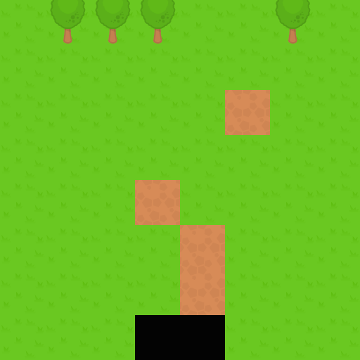

--- title: 'Square tilemaps implementation: Static maps' slug: Games/Techniques/Tilemaps/Square\_tilemaps\_implementation:\_Static\_maps tags: - Canvas - Games - JavaScript - Static - atlas - spritesheet - tilemap - tilemaps - tiles ---

{{GamesSidebar}}

This article covers how to implement static square tilemaps using the [Canvas API](/en-US/docs/Web/API/Canvas_API).

**Note**: When writing this article, we assumed previous reader knowledge of canvas basics such as how get a 2D canvas context, load images, etc., which is all explained in the [Canvas API tutorial](/en-US/docs/Web/API/Canvas_API/Tutorial), as well as the basic information included in our [Tilemaps](/en-US/docs/Games/Techniques/Tilemaps) introduction article.

The tile atlas
--------------

A tilemap might use one or several atlases — or spritesheets — that contain all of the tile images. This is the atlas we will be using as an example, which features five different tiles:

To draw a tile from the atlas into the canvas we make use of the {{domxref("CanvasRenderingContext2D.drawImage","drawImage()")}} method in a canvas 2D context. We need to supply the atlas image, the coordinates and dimensions of the tile inside the atlas, and the target coordinates and size (a different tile size in here would scale the tile.)

So, for instance, to draw the tree tile, which is the third in the atlas, at the screen coordinates `(128, 320)`, we would call `drawImage()` with these values:

    context.drawImage(atlasImage, 192, 0, 64, 64, 128, 320, 64, 64);

In order to support atlases with multiple rows and columns, you would need to know how many rows and columns there are to be able to compute the source `x` and `y`.

The tilemap data structure
--------------------------

To store that map data, we can use a plain object or a custom class. For the sake of simplicity, in the example code a plain object has been used. It contains the basic map properties:

-   `cols`: The width of the map, in columns.
-   `rows`: The height of the map, in rows.
-   `tsize`: The tile size, in pixels.
-   `tiles`: A 1-dimensional array containing the visual grid.
-   `getTile()`: A helper method that gets the tile index in a certain position.

`tiles` contains the actual visual map data. We are representing the tiles with indices, assigned to the tiles dependant on their position in the atlas (e.g. `0` for the left-most tile.) However, we must account for **empty tiles**, since they are crucial for implementing layers — empty tiles are usually assigned a negative index value, `0`, or a null value. In these examples, empty tiles will be represented by index `0`, so we will shift the indices of the atlases by one (and thus the first tile of the atlas will be assigned index `1`, the second index `2`, etc.)

The `getTile()` helper method returns the tile contained at the specified column and row. If `tiles` were a 2D matrix, then the returned value would just be `tiles[column][row]`. However, it's usually more common to represent the grid with a 1-dimensional array. In this case, we need to map the column and row to an array index:

    var index = row * map.cols + column;

Wrapping up, an example of a tilemap object could look like the following. This features an 8 x 8 map with tiles 64 x 64 pixels in size:

    var map = {
      cols: 8,
      rows: 8,
      tsize: 64,
      tiles: [
        1, 3, 3, 3, 1, 1, 3, 1,
        1, 1, 1, 1, 1, 1, 1, 1,
        1, 1, 1, 1, 1, 2, 1, 1,
        1, 1, 1, 1, 1, 1, 1, 1,
        1, 1, 1, 2, 1, 1, 1, 1,
        1, 1, 1, 1, 2, 1, 1, 1,
        1, 1, 1, 1, 2, 1, 1, 1,
        1, 1, 1, 0, 0, 1, 1, 1
      ],
      getTile: function(col, row) {
        return this.tiles[row * map.cols + col]
      }
    };

Rendering the map
-----------------

We can render the map by iterating over its columns and rows. This snippets assumes the following definitions:

-   `context`: A 2D canvas context.
-   `tileAtlas`: An image object containing the tile atlas.
-   `map`: The tilemap object discussed above.

<!-- -->

    for (var c = 0; c < map.cols; c++) {
      for (var r = 0; r < map.rows; r++) {
        var tile = map.getTile(c, r);
        if (tile !== 0) { // 0 => empty tile
          context.drawImage(
            tileAtlas, // image
            (tile - 1) * map.tsize, // source x
            0, // source y
            map.tsize, // source width
            map.tsize, // source height
            c * map.tsize, // target x
            r * map.tsize, // target y
            map.tsize, // target width
            map.tsize // target height
          );
        }
      }
    }

Demo
----

Our static tilemap implementation demo pulls the above code together to show what an implementation of this map looks like. You can see a [live demo](https://mozdevs.github.io/gamedev-js-tiles/square/no-scroll.html) and grab the [full source code](https://github.com/mozdevs/gamedev-js-tiles).

