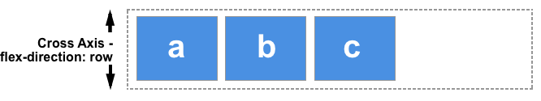
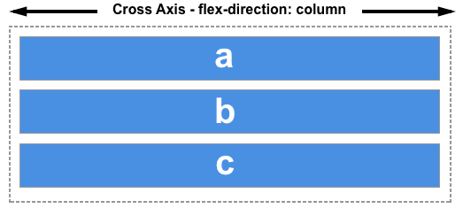

--- title: Cross Axis slug: Glossary/Cross\_Axis tags: - CSS - Glossary - cross axis - flexbox ---

The cross axis in {{glossary("flexbox")}} runs perpendicular to the {{glossary("main axis")}}, therefore if your {{cssxref("flex-direction")}} is either `row` or `row-reverse` then the cross axis runs down the columns.

If your main axis is `column` or `column-reverse` then the cross axis runs along the rows.

Alignment of items on the cross axis is achieved with the `align-items` property on the flex container or `align-self` property on individual items. In the case of a multi-line flex container, with additional space on the cross axis, you can use `align-content` to control the spacing of the rows.

Learn more
----------

### Property reference

-   {{cssxref("align-content")}}
-   {{cssxref("align-items")}}
-   {{cssxref("align-self")}}
-   {{cssxref("flex-wrap")}}
-   {{cssxref("flex-direction")}}
-   {{cssxref("flex")}}

### Further reading

-   CSS Flexbox Guide: *[Basic Concepts of Flexbox](/en-US/docs/Web/CSS/CSS_Flexible_Box_Layout/Basic_Concepts_of_Flexbox)*
-   CSS Flexbox Guide: *[Aligning items in a flex container](/en-US/docs/Web/CSS/CSS_Flexible_Box_Layout/Aligning_Items_in_a_Flex_Container)*
-   CSS Flexbox Guide: *[Mastering wrapping of flex items](/en-US/docs/Web/CSS/CSS_Flexible_Box_Layout/Mastering_Wrapping_of_Flex_Items)*

1.  [MDN Web Docs Glossary](/en-US/docs/Glossary)
    1.  {{Glossary("Cross Axis")}}
    2.  {{Glossary("Flex")}}
    3.  {{Glossary("Flex Container")}}
    4.  {{Glossary("Flex Item")}}
    5.  {{Glossary("Grid")}}
2.  Related CSS Properties
    1.  {{cssxref("align-content")}}
    2.  {{cssxref("align-items")}}
    3.  {{cssxref("align-self")}}
    4.  {{cssxref("flex")}}
    5.  {{cssxref("flex-basis")}}
    6.  {{cssxref("flex-direction")}}
    7.  {{cssxref("flex-flow")}}
    8.  {{cssxref("flex-grow")}}
    9.  {{cssxref("flex-shrink")}}
    10. {{cssxref("flex-wrap")}}
    11. {{cssxref("justify-content")}}
    12. {{cssxref("order")}}
