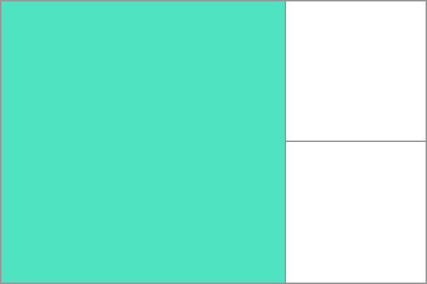

--- title: Grid Areas slug: Glossary/Grid\_Areas tags: - CSS - CSS Grids - Reference ---

A **grid area** is one or more {{glossary("grid cell", "grid cells")}} that make up a rectangular area on the grid. Grid areas are created when you place an item using [line-based placement](/en-US/docs/Web/CSS/CSS_Grid_Layout/Line-based_Placement_with_CSS_Grid) or when defining areas using [named grid areas](/en-US/docs/Web/CSS/CSS_Grid_Layout/Grid_Template_Areas).

Grid areas *must* be rectangular in nature; it is not possible to create, for example, a T- or L-shaped grid area.

In the example below I have a grid container with two grid items. I have named these with the {{cssxref("grid-area")}} property and then laid them out on the grid using {{cssxref("grid-template-areas")}}. This creates two grid areas, one covering four grid cells, the other two.

    * {box-sizing: border-box;}

    .wrapper {
        border: 2px solid #f76707;
        border-radius: 5px;
        background-color: #fff4e6;
    }

    .wrapper > div {
        border: 2px solid #ffa94d;
        border-radius: 5px;
        background-color: #ffd8a8;
        padding: 1em;
        color: #d9480f;
    }

    .wrapper {
      display: grid;
      grid-template-columns: repeat(3,1fr);
      grid-template-rows: 100px 100px;
      grid-template-areas:
        "a a b"
        "a a b";
    }
    .item1 {
      grid-area: a;
    }
    .item2 {
      grid-area: b;
    }

    

       
Item

       
Item

    

{{ EmbedLiveSample('example\_1', '300', '280') }}

Learn More
----------

### Property reference

-   {{cssxref("grid-template-columns")}}
-   {{cssxref("grid-template-rows")}}
-   {{cssxref("grid-auto-rows")}}
-   {{cssxref("grid-auto-columns")}}
-   {{cssxref("grid-template-areas")}}
-   {{cssxref("grid-area")}}

### Further reading

-   CSS Grid Layout Guide: *[Basic concepts of grid layout](/en-US/docs/Web/CSS/CSS_Grid_Layout/Basic_Concepts_of_Grid_Layout)*
-   CSS Grid Layout Guide: *[Grid template areas](/en-US/docs/Web/CSS/CSS_Grid_Layout/Grid_Template_Areas)*
-   [Definition of Grid Areas in the CSS Grid Layout specification](https://drafts.csswg.org/css-grid/#grid-area-concept)
