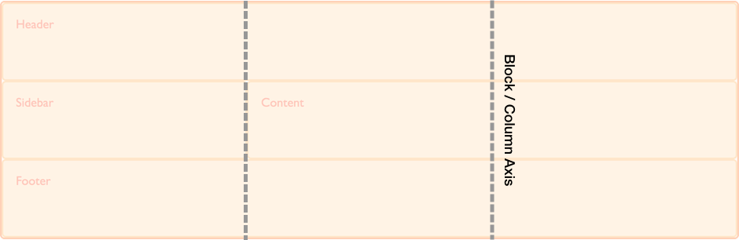
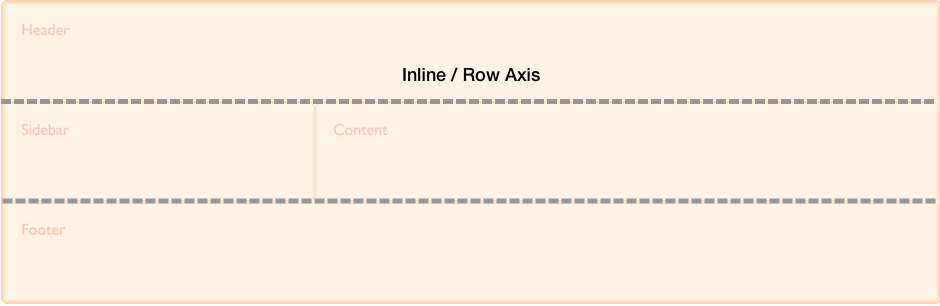

--- title: Grid Axis slug: Glossary/Grid\_Axis tags: - CSS - CSS Grids ---

CSS Grid Layout is a two-dimensional layout method enabling the laying out of content in *rows* and *columns*. Therefore in any grid we have two axes. The *block or column axis*, and the *inline or row axis*.

It is along these axes that items can be aligned and justified using the properties defined in the [Box Alignment specification](/en-US/docs/Web/CSS/CSS_Grid_Layout/Box_Alignment_in_CSS_Grid_Layout).

In CSS the *block or column axis* is the axis used when laying out blocks of text. If you have two paragraphs and are working in a right to left, top to bottom language they lay out one below the other, on the block axis.

The *inline or row axis* runs across the Block Axis and is the direction along which regular text flows. These are our rows in CSS Grid Layout.

The physical direction of these axes can change according to the [writing mode](/en-US/docs/Web/CSS/CSS_Grid_Layout/CSS_Grid_Logical_Values_and_Writing_Modes) of the document.

Learn More
----------

### Further reading

-   CSS Grid Layout Guide: *[Basic concepts of grid layout](/en-US/docs/Web/CSS/CSS_Grid_Layout/Basic_Concepts_of_Grid_Layout)*
-   CSS Grid Layout Guide: *[Box alignment in Grid Layout](/en-US/docs/Web/CSS/CSS_Grid_Layout/Box_Alignment_in_CSS_Grid_Layout)*
-   CSS Grid Layout Guide: *[Grids, logical values and writing modes](/en-US/docs/Web/CSS/CSS_Grid_Layout/CSS_Grid_Logical_Values_and_Writing_Modes)*
