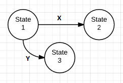
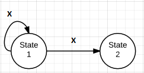

--- title: State machine slug: Glossary/State\_machine tags: - CodingScripting - Finite - Glossary - Input - Mealy - Moore - State Machine - Turing Machine ---

A state machine is a mathematical abstraction used to design algorithms. A state machine reads a set of inputs and changes to a different state based on those inputs.

A state is a description of the status of a system waiting to execute a transition. A transition is a set of actions to execute when a condition is fulfilled or an event received. In a state diagram, circles represent each possible state and arrows represent transitions between states.

Looking at the final state, you can discern something about the series of inputs leading to that state.

There are two types of basic state machines:

deterministic finite state machine  
This kind allows only one possible transition for any allowed input. This is like the "if" {{Glossary("statement")}} in that `if x == true then doThis else doThat` is not possible. The computer must perform *one* of the two options.

non-deterministic finite state machine  
Given some state, an input can lead to more than one different state.

.

*Figure 1: Deterministic Finite State Machine*

In *Figure 1*, the state begins in State 1; the state changes to State 2 given input 'X', or to State 3 given input 'Y'.

*Figure 2: Non-Deterministic Finite State Machine*

In *Figure 2*, given input 'X', the state can persist or change to State 2.

Note that any {{Glossary("regular expression")}} can be represented by a state machine.

Learn more
----------

### General knowledge

-   {{Interwiki("wikipedia", "Finite-state machine")}} on Wikipedia
-   {{Interwiki("wikipedia", "UML state machine")}} on Wikipedia
-   {{Interwiki("wikipedia", "Moore machine")}} on Wikipedia
-   {{Interwiki("wikipedia", "Mealy machine")}} on Wikipedia
