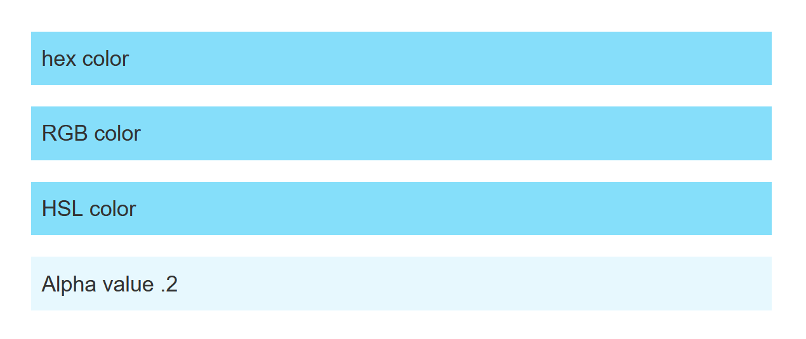
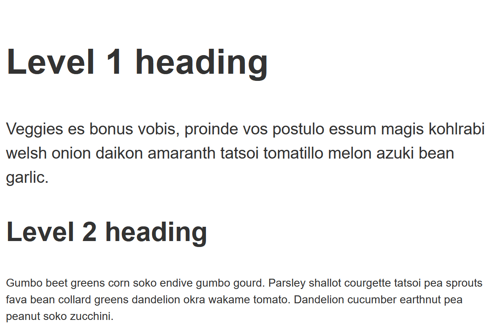

--- title: 'Test your skills: values and units' slug: Learn/CSS/Building_blocks/Values_tasks tags: - Beginner - CSS - Example ---

{{LearnSidebar}}

The aim of this task is to help you check your understanding of some of the values and units that we looked at in the lesson on [CSS Values and Units](/en-US/docs/Learn/CSS/Building_blocks/Values_and_units).

**Note**: You can try out solutions in the interactive editors below, however it may be helpful to download the code and use an online tool such as [CodePen](https://codepen.io/), [jsFiddle](https://jsfiddle.net/), or [Glitch](https://glitch.com/) to work on the tasks.

If you get stuck, then ask us for help — see the {{anch("Assessment or further help")}} section at the bottom of this page.

## Task One

In this task, the first list item has been given a background color using hex color codes. Your task is to complete the CSS using the same color in different formats, plus a final list item where you should make the background semi-opaque.

- The second list item should use RGB color.
- The third should use HSL color.
- The fourth should use RGB color but with the alpha channel set to .2.

You can find conversions for the hex color at [this link](https://convertingcolors.com/hex-color-86DEFA.html). You need to figure out how to use the values in CSS.

Try updating the live code below to recreate the finished example:

{{EmbedGHLiveSample("css-examples/learn/tasks/values/color.html", '100%', 1000)}}

For assessment or further work purposes, [download the starting point for this task](https://github.com/mdn/css-examples/blob/master/learn/tasks/values/color-download.html) to work in your own editor or in an online editor.

## Task Two

In this task you need to set the size of various items of text.

- The {{HTMLElement("h1")}} should be 50 pixels.
- The {{HTMLElement("h2")}} should be 2em.
- All {{HTMLElement("p")}} elements should be 16 pixels.
- A {{HTMLElement("p")}} element that is directly after an {{HTMLElement("h1")}} should be 120%.

Try updating the live code below to recreate the example as displayed in the image:

{{EmbedGHLiveSample("css-examples/learn/tasks/values/length.html", '100%', 1000)}}

For assessment or further work purposes, [download the starting point for this task](https://github.com/mdn/css-examples/blob/master/learn/tasks/values/length-download.html) to work in your own editor or in an online editor.

## Task Three

In this task you need to move the background image so that it is centered horizontally, and 20% from the top of the box.

Try updating the live code below to recreate the example as displayed in the image:

{{EmbedGHLiveSample("css-examples/learn/tasks/values/position.html", '100%', 800)}}

For assessment or further work purposes, [download the starting point for this task](https://github.com/mdn/css-examples/blob/master/learn/tasks/values/position-download.html) to work in your own editor or in an online editor.

## Assessment or further help

You can practice these examples in the Interactive Editors mentioned above.

If you would like your work assessed, or are stuck and want to ask for help:

1.  Put your work into an online shareable editor such as [CodePen](https://codepen.io/), [jsFiddle](https://jsfiddle.net/), or [Glitch](https://glitch.com/). You can write the code yourself, or use the starting point files linked to in the above sections.
2.  Write a post asking for assessment and/or help at the <a href="https://discourse.mozilla.org/c/mdn/learn" class="external external-icon">MDN Discourse forum Learning category</a>. Your post should include:
    - A descriptive title such as "Assessment wanted for values and units skill test 1".
    - Details of what you have already tried, and what you would like us to do, e.g. if you are stuck and need help, or want an assessment.
    - A link to the example you want assessed or need help with, in an online shareable editor (as mentioned in step 1 above). This is a good practice to get into — it's very hard to help someone with a coding problem if you can't see their code.
    - A link to the actual task or assessment page, so we can find the question you want help with.
