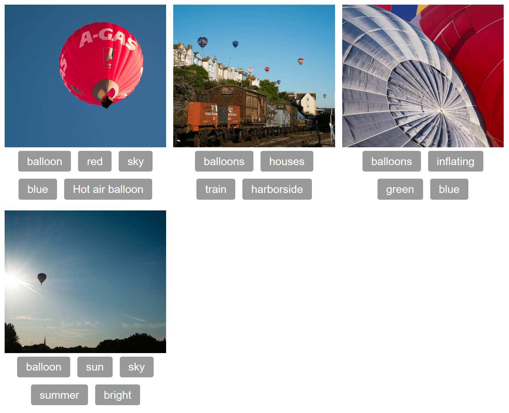

--- title: 'Test your skills: Grid Layout' slug: Learn/CSS/CSS_layout/Grid_skills tags: - Beginner - CSS - Guide - Learn ---

{{LearnSidebar}}

The aim of this task is to get you working with CSS Grid Layout, and test that you understand how a grid and grid items behave. You will be working through three small tasks which use different elements of the material you have just covered.

**Note**: You can try out solutions in the interactive editors below, however it may be helpful to download the code and use an online tool such as [CodePen](https://codepen.io/), [jsFiddle](https://jsfiddle.net/), or [Glitch](https://glitch.com/) to work on the tasks.

If you get stuck, then ask us for help — see the {{anch("Assessment or further help")}} section at the bottom of this page.

## Grid Layout One

In this task you should create a grid into which the four child elements will auto-place. The grid should have three columns sharing the available space equally, and a 20-pixel gap between the column and row tracks.

Try updating the live code below to recreate the finished example:

{{EmbedGHLiveSample("css-examples/learn/tasks/grid/grid1.html", '100%', 700)}}

For assessment or further work purposes, [download the starting point for this task](https://github.com/mdn/css-examples/blob/master/learn/tasks/grid/grid1-download.html) to work in your own editor or in an online editor.

## Grid Layout Two

In this example we already have a grid defined. By editing the CSS rules for the two child elements, cause them to span over several grid tracks each; the second item should overlay the first as in the image below.

Try updating the live code below to recreate the finished example:

{{EmbedGHLiveSample("css-examples/learn/tasks/grid/grid2.html", '100%', 800)}}

Additional questions:

- Can you now cause the first item to display on top without changing the order of items in the source?

For assessment or further work purposes, [download the starting point for this task](https://github.com/mdn/css-examples/blob/master/learn/tasks/grid/grid2-download.html) to work in your own editor or in an online editor.

## Grid Layout Three

There are four direct children in this grid; the starting point has them displayed using auto-placement. Use the grid-area and grid-template-areas properties to lay the items out as shown in the image.

Try updating the live code below to recreate the finished example:

{{EmbedGHLiveSample("css-examples/learn/tasks/grid/grid3.html", '100%', 800)}}

For assessment or further work purposes, [download the starting point for this task](https://github.com/mdn/css-examples/blob/master/learn/tasks/grid/grid3-download.html) to work in your own editor or in an online editor.

## Grid and Flex Layout 4

You will need to use both Grid Layout and Flexbox to recreate the example as seen in the image. You do not need to make any changes to the HTML in order to do this.

Try updating the code below to create your example:

{{EmbedGHLiveSample("css-examples/learn/tasks/grid/grid4.html", '100%', 1200)}}

For assessment or further work purposes, [download the starting point for this task](https://github.com/mdn/css-examples/blob/master/learn/tasks/grid/grid4-download.html) to work in your own editor or in an online editor.

## Assessment or further help

You can practice these examples in the Interactive Editors mentioned above.

If you'd like your work assessed, or are stuck and want to ask for help:

1.  Put your work into an online shareable editor such as [CodePen](https://codepen.io/), [jsFiddle](https://jsfiddle.net/), or [Glitch](https://glitch.com/). You can write the code yourself, or use the starting point files linked to in the above sections.
2.  Write a post asking for assessment and/or help at the <a href="https://discourse.mozilla.org/c/mdn/learn" class="external external-icon">MDN Discourse forum Learning category</a>. Your post should include:
    - A descriptive title such as "Assessment wanted for Grid layout 1 skill test".
    - Details of what you have already tried, and what you would like us to do, e.g. if you are stuck and need help, or want an assessment.
    - A link to the example you want assessed or need help with, in an online shareable editor (as mentioned in step 1 above). This is a good practice to get into — it's very hard to help someone with a coding problem if you can't see their code.
    - A link to the actual task or assessment page, so we can find the question you want help with.
