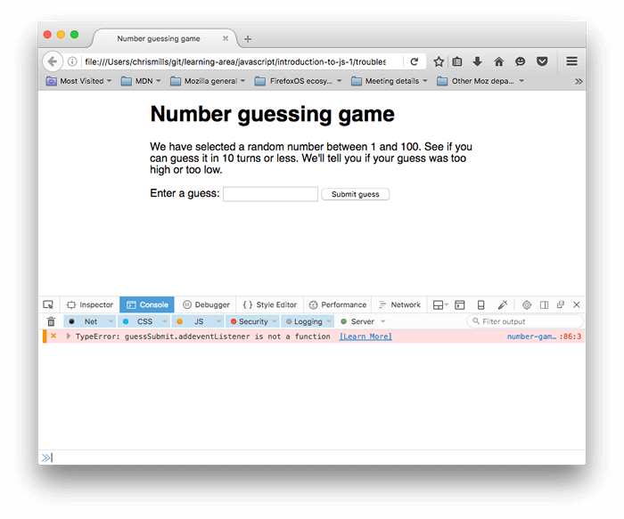
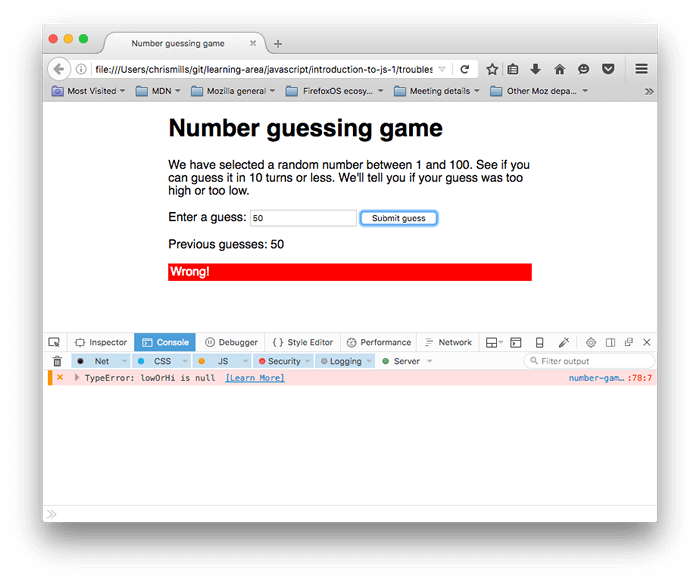
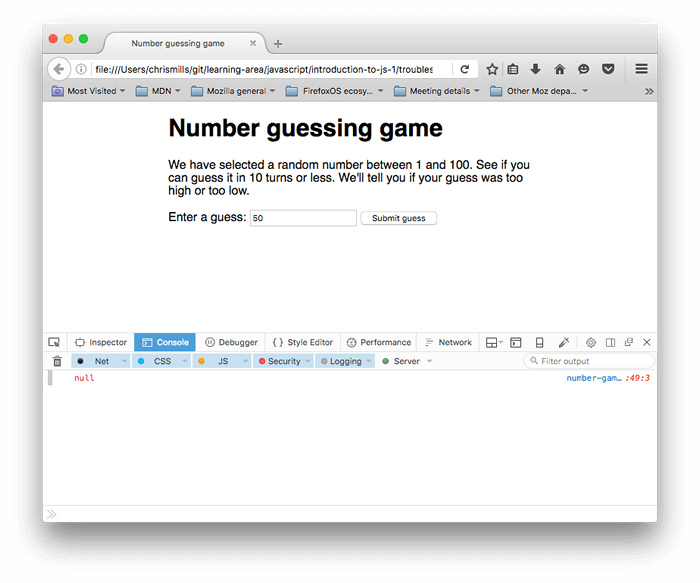

--- title: What went wrong? Troubleshooting JavaScript slug: Learn/JavaScript/First_steps/What_went_wrong tags: - Article - Beginner - CodingScripting - Debugging - Developer Tools - Error - JavaScript - Learn - Tutorial - console.log - l10n:priority ---

{{LearnSidebar}}

{{PreviousMenuNext("Learn/JavaScript/First\_steps/A\_first\_splash", "Learn/JavaScript/First\_steps/Variables", "Learn/JavaScript/First\_steps")}}

When you built up the "Guess the number" game in the previous article, you may have found that it didn't work. Never fear — this article aims to save you from tearing your hair out over such problems by providing you with some tips on how to find and fix errors in JavaScript programs.

<table><tbody><tr class="odd"><td>Prerequisites:</td><td>Basic computer literacy, a basic understanding of HTML and CSS, an understanding of what JavaScript is.</td></tr><tr class="even"><td>Objective:</td><td>To gain the ability and confidence to start fixing problems in your own code.</td></tr></tbody></table>

## Types of error

Generally speaking, when you do something wrong in code, there are two main types of error that you'll come across:

- **Syntax errors**: These are spelling errors in your code that actually cause the program not to run at all, or stop working part way through — you will usually be provided with some error messages too. These are usually okay to fix, as long as you are familiar with the right tools and know what the error messages mean!
- **Logic errors**: These are errors where the syntax is actually correct but the code is not what you intended it to be, meaning that program runs successfully but gives incorrect results. These are often harder to fix than syntax errors, as there usually isn't an error message to direct you to the source of the error.

Okay, so it's not quite _that_ simple — there are some other differentiators as you drill down deeper. But the above classifications will do at this early stage in your career. We'll look at both of these types going forward.

## An erroneous example

To get started, let's return to our number guessing game — except this time we'll be exploring a version that has some deliberate errors introduced. Go to Github and make yourself a local copy of [number-game-errors.html](https://github.com/mdn/learning-area/blob/master/javascript/introduction-to-js-1/troubleshooting/number-game-errors.html) (see it [running live here](https://mdn.github.io/learning-area/javascript/introduction-to-js-1/troubleshooting/number-game-errors.html)).

1.  To get started, open the local copy inside your favorite text editor, and your browser.
2.  Try playing the game — you'll notice that when you press the "Submit guess" button, it doesn't work!

**Note**: You might well have your own version of the game example that doesn't work, which you might want to fix! We'd still like you to work through the article with our version, so that you can learn the techniques we are teaching here. Then you can go back and try to fix your example.

At this point, let's consult the developer console to see if it reports any syntax errors, then try to fix them. You'll learn how below.

## Fixing syntax errors

Earlier on in the course we got you to type some simple JavaScript commands into the [developer tools JavaScript console](/en-US/docs/Learn/Common_questions/What_are_browser_developer_tools) (if you can't remember how to open this in your browser, follow the previous link to find out how). What's even more useful is that the console gives you error messages whenever a syntax error exists inside the JavaScript being fed into the browser's JavaScript engine. Now let's go hunting.

1.  Go to the tab that you've got `number-game-errors.html` open in, and open your JavaScript console. You should see an error message along the following lines: 
2.  This is a pretty easy error to track down, and the browser gives you several useful bits of information to help you out (the screenshot above is from Firefox, but other browsers provide similar information). From left to right, we've got:
    - A red "x" to indicate that this is an error.
    - An error message to indicate what's gone wrong: "TypeError: guessSubmit.addeventListener is not a function"
    - A "Learn More" link that links through to an MDN page that explains what this error means in greater detail.
    - The name of the JavaScript file, which links through to the Debugger tab of the developer tools. If you follow this link, you'll see the exact line where the error is highlighted.
    - The line number where the error is, and the character number in that line where the error is first seen. In this case, we've got line 86, character number 3.
3.  If we look at line 86 in our code editor, we'll find this line:

        guessSubmit.addeventListener('click', checkGuess);

4.  The error message says "guessSubmit.addeventListener is not a function", which means that the function we're calling is not recognized by the JavaScript interpreter. Often, this error message actually means that we've spelled something wrong. If you are not sure of the correct spelling of a piece of syntax, it is often good to look up the feature on MDN. The best way to do this currently is to search for "mdn _name-of-feature_" with your favorite search engine. Here's a shortcut to save you some time in this instance: `addEventListener()`.
5.  So, looking at this page, the error appears to be that we've spelled the function name wrong! Remember that JavaScript is case sensitive, so any slight difference in spelling or casing will cause an error. Changing `addeventListener` to `addEventListener` should fix this. Do this now.

**Note**: See our [TypeError: "x" is not a function](/en-US/docs/Web/JavaScript/Reference/Errors/Not_a_function) reference page for more details about this error.

### Syntax errors round two

1.  Save your page and refresh, and you should see the error has gone.
2.  Now if you try to enter a guess and press the Submit guess button, you'll see ... another error! 
3.  This time the error being reported is "TypeError: lowOrHi is null", on line 78.
    **Note**: `Null` is a special value that means "nothing", or "no value". So `lowOrHi` has been declared and initialised, but not with any meaningful value — it has no type or value.

    **Note**: This error didn't come up as soon as the page was loaded because this error occurred inside a function (inside the `checkGuess() { ... }` block). As you'll learn in more detail in our later [functions article](/en-US/docs/Learn/JavaScript/Building_blocks/Functions), code inside functions runs in a separate scope than code outside functions. In this case, the code was not run and the error was not thrown until the `checkGuess()` function was run by line 86.

4.  Have a look at line 78, and you'll see the following code:

        lowOrHi.textContent = 'Last guess was too high!';

5.  This line is trying to set the `textContent` property of the `lowOrHi` constant to a text string, but it's not working because `lowOrHi` does not contain what it's supposed to. Let's see why this is — try searching for other instances of `lowOrHi` in the code. The earliest instance you'll find in the JavaScript is on line 48:

        const lowOrHi = document.querySelector('lowOrHi');

6.  At this point we are trying to make the variable contain a reference to an element in the document's HTML. Let's check whether the value is `null` after this line has been run. Add the following code on line 49:

        console.log(lowOrHi);

    **Note**: `console.log()` is a really useful debugging function that prints a value to the console. So it will print the value of `lowOrHi` to the console as soon as we have tried to set it in line 48.

7.  Save and refresh, and you should now see the `console.log()` result in your console.  Sure enough, `lowOrHi`'s value is `null` at this point, so there is definitely a problem with line 48.
8.  Let's think about what the problem could be. Line 48 is using a `document.querySelector()` method to get a reference to an element by selecting it with a CSS selector. Looking further up our file, we can find the paragraph in question:

        

9.  So we need a class selector here, which begins with a dot (`.`), but the selector being passed into the `querySelector()` method in line 48 has no dot. This could be the problem! Try changing `lowOrHi` to `.lowOrHi` in line 48.
10. Try saving and refreshing again, and your `console.log()` statement should return the `
` element we want. Phew! Another error fixed! You can delete your `console.log()` line now, or keep it to reference later on — your choice.

**Note**: See our [TypeError: "x" is (not) "y"](/en-US/docs/Web/JavaScript/Reference/Errors/Unexpected_type) reference page for more details about this error.

### Syntax errors round three

1.  Now if you try playing the game through again, you should get more success — the game should play through absolutely fine, until you end the game, either by guessing the right number, or by running out of guesses.
2.  At that point, the game fails again, and the same error is spat out that we got at the beginning — "TypeError: resetButton.addeventListener is not a function"! However, this time it's listed as coming from line 94.
3.  Looking at line number 94, it is easy to see that we've made the same mistake here. We again just need to change `addeventListener` to `.addEventListener`. Do this now.

## A logic error

At this point, the game should play through fine, however after playing through a few times you'll undoubtedly notice that the "random" number you've got to guess is always 1. Definitely not quite how we want the game to play out!

There's definitely a problem in the game logic somewhere — the game is not returning an error; it just isn't playing right.

1.  Search for the `randomNumber` variable, and the lines where the random number is first set. The instance that stores the random number that we want to guess at the start of the game should be around line number 44:

        let randomNumber = Math.floor(Math.random()) + 1;

2.  And the one that generates the random number before each subsequent game is around line 113:

        randomNumber = Math.floor(Math.random()) + 1;

3.  To check whether these lines are indeed the problem, let's turn to our friend `console.log()` again — insert the following line directly below each of the above two lines:

        console.log(randomNumber);

4.  Save and refresh, then play a few games — you'll see that `randomNumber` is equal to 1 at each point where it is logged to the console.

### Working through the logic

To fix this, let's consider how this line is working. First, we invoke `Math.random()`, which generates a random decimal number between 0 and 1, e.g. 0.5675493843.

    Math.random()

Next, we pass the result of invoking `Math.random()` through `Math.floor()`, which rounds the number passed to it down to the nearest whole number. We then add 1 to that result:

    Math.floor(Math.random()) + 1

Rounding a random decimal number between 0 and 1 down will always return 0, so adding 1 to it will always return 1.  We need to multiply the random number by 100 before we round it down. The following would give us a random number between 0 and 99:

    Math.floor(Math.random()*100);

Hence us wanting to add 1, to give us a random number between 1 and 100:

    Math.floor(Math.random()*100) + 1;

Try updating both lines like this, then save and refresh — the game should now play like we are intending it to!

## Other common errors

There are other common errors you'll come across in your code. This section highlights most of them.

### SyntaxError: missing ; before statement

This error generally means that you have missed a semicolon at the end of one of your lines of code, but it can sometimes be more cryptic. For example, if we change this line inside the `checkGuess()` function:

    let userGuess = Number(guessField.value);

to

    let userGuess === Number(guessField.value);

It throws this error because it thinks you are trying to do something different. You should make sure that you don't mix up the assignment operator (`=`) — which sets a variable to be equal to a value — with the strict equality operator (`===`), which tests whether one value is equal to another, and returns a `true`/`false` result.

**Note**: See our [SyntaxError: missing ; before statement](/en-US/docs/Web/JavaScript/Reference/Errors/Missing_semicolon_before_statement) reference page for more details about this error.

### The program always says you've won, regardless of the guess you enter

This could be another symptom of mixing up the assignment and strict equality operators. For example, if we were to change this line inside `checkGuess()`:

    if (userGuess === randomNumber) {

to

    if (userGuess = randomNumber) {

the test would always return `true`, causing the program to report that the game has been won. Be careful!

### SyntaxError: missing ) after argument list

This one is pretty simple — it generally means that you've missed the closing parenthesis at the end of a function/method call.

**Note**: See our [SyntaxError: missing ) after argument list](/en-US/docs/Web/JavaScript/Reference/Errors/Missing_parenthesis_after_argument_list) reference page for more details about this error.

### SyntaxError: missing : after property id

This error usually relates to an incorrectly formed JavaScript object, but in this case we managed to get it by changing

    function checkGuess() {

to

    function checkGuess( {

This has caused the browser to think that we are trying to pass the contents of the function into the function as an argument. Be careful with those parentheses!

### SyntaxError: missing } after function body

This is easy — it generally means that you've missed one of your curly braces from a function or conditional structure. We got this error by deleting one of the closing curly braces near the bottom of the `checkGuess()` function.

### SyntaxError: expected expression, got '_string_' or SyntaxError: unterminated string literal

These errors generally mean that you've left off a string value's opening or closing quote mark. In the first error above, _string_ would be replaced with the unexpected character(s) that the browser found instead of a quote mark at the start of a string. The second error means that the string has not been ended with a quote mark.

For all of these errors, think about how we tackled the examples we looked at in the walkthrough. When an error arises, look at the line number you are given, go to that line and see if you can spot what's wrong. Bear in mind that the error is not necessarily going to be on that line, and also that the error might not be caused by the exact same problem we cited above!

**Note**: See our [SyntaxError: Unexpected token](/en-US/docs/Web/JavaScript/Reference/Errors/Unexpected_token) and [SyntaxError: unterminated string literal](/en-US/docs/Web/JavaScript/Reference/Errors/Unterminated_string_literal) reference pages for more details about these errors.

## Summary

So there we have it, the basics of figuring out errors in simple JavaScript programs. It won't always be that simple to work out what's wrong in your code, but at least this will save you a few hours of sleep and allow you to progress a bit faster when things don't turn out right, especially in the earlier stages of your learning journey.

## See also

- There are many other types of errors that aren't listed here; we are compiling a reference that explains what they mean in detail — see the [JavaScript error reference](/en-US/docs/Web/JavaScript/Reference/Errors).
- If you come across any errors in your code that you aren't sure how to fix after reading this article, you can get help! Ask for help on the [MDN Discourse forum Learning category](https://discourse.mozilla.org/c/mdn/learn), or in the [MDN Web Docs room](https://chat.mozilla.org/#/room/#mdn:mozilla.org) on <a href="https://wiki.mozilla.org/Matrix" class="external external-icon">Matrix</a>. Tell us what your error is, and we'll try to help you. A listing of your code would be useful as well.

{{PreviousMenuNext("Learn/JavaScript/First\_steps/A\_first\_splash", "Learn/JavaScript/First\_steps/Variables", "Learn/JavaScript/First\_steps")}}

## In this module

- [What is JavaScript?](/en-US/docs/Learn/JavaScript/First_steps/What_is_JavaScript)
- [A first splash into JavaScript](/en-US/docs/Learn/JavaScript/First_steps/A_first_splash)
- [What went wrong? Troubleshooting JavaScript](/en-US/docs/Learn/JavaScript/First_steps/What_went_wrong)
- [Storing the information you need — Variables](/en-US/docs/Learn/JavaScript/First_steps/Variables)
- [Basic math in JavaScript — numbers and operators](/en-US/docs/Learn/JavaScript/First_steps/Math)
- [Handling text — strings in JavaScript](/en-US/docs/Learn/JavaScript/First_steps/Strings)
- [Useful string methods](/en-US/docs/Learn/JavaScript/First_steps/Useful_string_methods)
- [Arrays](/en-US/docs/Learn/JavaScript/First_steps/Arrays)
- [Assessment: Silly story generator](/en-US/docs/Learn/JavaScript/First_steps/Silly_story_generator)
