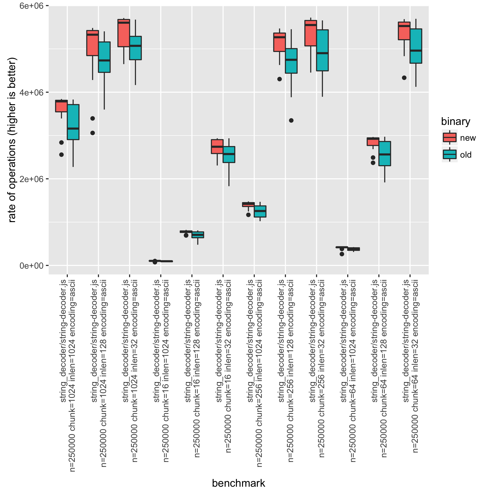

### Testing and CI

All fixes must have a test case which demonstrates the defect. The test should
fail before the change, and pass after the change.

Do not land any pull requests without the necessary passing CI runs.
A passing (green) GitHub Actions CI result is required. A passing (green or
yellow) [Jenkins CI](https://ci.nodejs.org/) is also required if the pull
request contains changes that will affect the `node` binary. This is because
GitHub Actions CI does not cover all the environments supported by Node.js.

<details>
<summary>Changes that affect the `node` binary</summary>

Changes in the following folders (except comment-only changes) are guaranteed to
affect the `node` binary:

* `deps/`
* `lib/`
* `src/`
* `test/`
* `tools/code_cache/`
* `tools/gyp/`
* `tools/icu/`
* `tools/inspector-protocol/`
* `tools/msvs/`
* `tools/snapshot/`
* `tools/v8_gypfiles/`

There are some other files that touch the build chain. Changes in the following
files also qualify as affecting the `node` binary:

* `tools/*.py`
* `tools/build-addons.js`
* `*.gyp`
* `*.gypi`
* `configure`
* `configure.py`
* `Makefile`
* `vcbuilt.bat`

</details>

If there are GitHub Actions CI failures unrelated to the change in the pull
request, try the "🔄 Re-run all jobs" button, on the right-hand side of the
"Checks" tab.

If there are Jenkins CI failures unrelated to the change in the pull request,
try "Resume Build". It is in the left navigation of the relevant
`node-test-pull-request` job. It will preserve all the green results from the
current job but re-run everything else. Start a fresh CI if more than seven days
have elapsed since the original failing CI as the compiled binaries for the
Windows and ARM platforms are only kept for seven days.

#### Useful Jenkins CI jobs

* [`node-test-pull-request`](https://ci.nodejs.org/job/node-test-pull-request/)
  is the CI job to test pull requests. It runs the `build-ci` and `test-ci`
  targets on all supported platforms.

* [`citgm-smoker`](https://ci.nodejs.org/job/citgm-smoker/)
  uses [`CitGM`](https://github.com/nodejs/citgm) to allow you to run
  `npm install && npm test` on a large selection of common modules. This is
  useful to check whether a change will cause breakage in the ecosystem.

* [`node-stress-single-test`](https://ci.nodejs.org/job/node-stress-single-test/)
  can run a group of tests over and over on a specific platform. Use it to check
  that the tests are reliable.

* [`node-test-commit-v8-linux`](https://ci.nodejs.org/job/node-test-commit-v8-linux/)
  runs the standard V8 tests. Run it when updating V8 in Node.js or floating new
  patches on V8.

* [`node-test-commit-custom-suites-freestyle`](https://ci.nodejs.org/job/node-test-commit-custom-suites-freestyle/)
  enables customization of test suites and parameters. It can execute test
  suites not used in other CI test runs (such as tests in the `internet` or
  `pummel` directories). It can also make sure tests pass when provided with a
  flag not used in other CI test runs (such as `--worker`).

#### Starting a Jenkins CI job

From the CI Job page, click "Build with Parameters" on the left side.

You generally need to enter only one or both of the following options
in the form:

* `GIT_REMOTE_REF`: Change to the remote portion of git refspec.
  To specify the branch this way, `refs/heads/BRANCH` is used
  (e.g. for `master` -> `refs/heads/master`).
  For pull requests, it will look like `refs/pull/PR_NUMBER/head`
  (e.g. for pull request #42 -> `refs/pull/42/head`).
* `REBASE_ONTO`: Change that to `origin/master` so the pull request gets rebased
  onto master. This can especially be important for pull requests that have been
  open a while.

Look at the list of jobs on the left hand side under "Build History" and copy
the link to the one you started (which will be the one on top, but click
through to make sure it says something like "Started 5 seconds ago"
(top right) and "Started by user ...".

Copy/paste the URL for the job into a comment in the pull request.
[`node-test-pull-request`](https://ci.nodejs.org/job/node-test-pull-request/)
is an exception where the GitHub bot will automatically post for you.

The [`node-test-pull-request`](https://ci.nodejs.org/job/node-test-pull-request/)
CI job can be started by adding the `request-ci` label into the pull request.
Once this label is added, `github-actions bot` will start
the `node-test-pull-request` automatically. If the `github-actions bot`
is unable to start the job, it will update the label with `request-ci-failed`.

### Internal vs. public API

All functionality in the official Node.js documentation is part of the public
API. Any undocumented object, property, method, argument, behavior, or event is
internal. There are exceptions to this rule. Node.js users have come to rely on
some undocumented behaviors. Collaborators treat many of those undocumented
behaviors as public.

All undocumented functionality exposed via  `process.binding(...)` is internal.

All undocumented functionality in `lib/internal/**/*.js` is internal. It is
public, though, if it is re-exported by code in `lib/*.js`.

Non-exported `Symbol` properties and methods are internal.

Any undocumented object property or method that begins with `_` is internal.

Any native C/C++ APIs/ABIs requiring the `NODE_WANT_INTERNALS` flag are
internal.

Sometimes, there is disagreement about whether functionality is internal or
public. In those cases, the TSC makes a determination.

For undocumented APIs that are public, open a pull request documenting the API.

### Breaking changes

At least two TSC members must approve backward-incompatible changes to the
master branch.

Examples of breaking changes include:

* Removal or redefinition of existing API arguments.
* Changing return values.
* Removing or modifying existing properties on an options argument.
* Adding or removing errors.
* Altering expected timing of an event.
* Changing the side effects of using a particular API.

#### Breaking changes and deprecations

Existing stable public APIs that change in a backward-incompatible way must
undergo deprecation. The exceptions to this rule are:

* Adding or removing errors thrown or reported by a public API.
* Changing error messages for errors without error code.
* Altering the timing and non-internal side effects of the public API.
* Changes to errors thrown by dependencies of Node.js, such as V8.
* One-time exceptions granted by the TSC.

For more information, see [Deprecations](#deprecations).

#### Breaking changes to internal elements

Breaking changes to internal elements can occur in semver-patch or semver-minor
commits. Take significant care when making and reviewing such changes. Make
an effort to determine the potential impact of the change in the ecosystem. Use
[Canary in the Goldmine](https://github.com/nodejs/citgm) to test such changes.
If a change will cause ecosystem breakage, then it is semver-major. Consider
providing a Public API in such cases.

#### Unintended breaking changes

Sometimes, a change intended to be non-breaking turns out to be a breaking
change. If such a change lands on the master branch, a collaborator can revert
it. As an alternative to reverting, the TSC can apply the semver-major label
after-the-fact.

##### Reverting commits

Revert commits with `git revert <HASH>` or `git revert <FROM>..<TO>`. The
generated commit message will not have a subsystem and might violate line length
rules. That is OK. Append the reason for the revert and any `Refs` or `Fixes`
metadata. Raise a pull request like any other change.

### Introducing new modules

Treat commits that introduce new core modules with extra care.

Check if the module's name conflicts with an existing ecosystem module. If it
does, choose a different name unless the module owner has agreed in writing to
transfer it.

If the new module name is free, register a placeholder in the module registry as
soon as possible. Link to the pull request that introduces the new core module
in the placeholder's `README`.

For pull requests introducing new core modules:

* Allow at least one week for review.
* Land only after sign-off from at least two TSC members.
* Land with a [Stability Index][] of Experimental. The module must remain
  Experimental until a semver-major release.

### Additions to Node-API

Node-API provides an ABI-stable API guaranteed for future Node.js versions.
Node-API additions call for unusual care and scrutiny. If a change adds to
`node_api.h`, `js_native_api.h`, `node_api_types.h`, or `js_native_api_types.h`,
consult [the relevant guide](https://github.com/nodejs/node/blob/HEAD/doc/guides/adding-new-napi-api.md).

### Deprecations

Node.js uses three [Deprecation][] levels. For all deprecated APIs, the API
documentation must state the deprecation status.

* Documentation-Only Deprecation
  * A deprecation notice appears in the API documentation.
  * There are no functional changes.
  * By default, there will be no warnings emitted for such deprecations at
    runtime.
  * Might cause a runtime warning with the [`--pending-deprecation`][] flag or
    `NODE_PENDING_DEPRECATION` environment variable.

* Runtime Deprecation
  * Emits a warning at runtime on first use of the deprecated API.
  * If used with the [`--throw-deprecation`][] flag, will throw a runtime error.

* End-of-Life
  * The API is no longer subject to the semantic versioning rules.
  * Backward-incompatible changes including complete removal of such APIs can
    occur at any time.

Apply the `notable change` label to all pull requests that introduce
Documentation-Only Deprecations. Such deprecations have no impact on code
execution. Thus, they are not breaking changes (`semver-major`).

Runtime Deprecations and End-of-Life APIs (internal or public) are breaking
changes (`semver-major`). The TSC can make exceptions, deciding that one of
these deprecations is not a breaking change.

Avoid Runtime Deprecations when an alias or a stub/no-op will suffice. An alias
or stub will have lower maintenance costs for end users and Node.js core.

All deprecations receive a unique and immutable identifier. Documentation,
warnings, and errors use the identifier when referring to the deprecation. The
documentation for the deprecation identifier must always remain in the API
documentation. This is true even if the deprecation is no longer in use (for
example, due to removal of an End-of-Life deprecated API).

<a id="deprecation-cycle"></a>
A _deprecation cycle_ is a major release during which an API has been in one of
the three Deprecation levels. Documentation-Only Deprecations can land in a
minor release. They can not change to a Runtime Deprecation until the next major
release.

No API can change to End-of-Life without going through a Runtime Deprecation
cycle. There is no rule that deprecated code must progress to End-of-Life.
Documentation-Only and Runtime Deprecations can remain in place for an unlimited
duration.

Communicate pending deprecations and associated mitigations with the ecosystem
as soon as possible. If possible, do it before the pull request adding the
deprecation lands on the master branch.

Use the `notable-change` label on pull requests that add or change the
deprecation level of an API.

### Involving the TSC

Collaborators can opt to elevate pull requests or issues to the [TSC][].
Do this if a pull request or issue:

* Is labeled `semver-major`, or
* Has a significant impact on the codebase, or
* Is controversial, or
* Is at an impasse among collaborators who are participating in the discussion.

@-mention the `@nodejs/tsc` GitHub team if you want to elevate an issue to the
[TSC][]. Do not use the GitHub UI on the right-hand side to assign to
`@nodejs/tsc` or request a review from `@nodejs/tsc`.

The TSC serves as the final arbiter where required.

## Landing pull requests

1. Avoid landing pull requests that have someone else as an assignee. Authors
   who wish to land their own pull requests will self-assign them. Sometimes, an
   author will delegate to someone else. If in doubt, ask the assignee whether
   it is okay to land.
2. Never use GitHub's green ["Merge pull request"][] button. Reasons for not
   using the web interface button:
   * The "Create a merge commit" method will add an unnecessary merge commit.
   * The "Squash and merge" method will add metadata (the pull request #) to the
     commit title. If more than one author contributes to the pull request,
     squashing only keeps one author.
   * The "Rebase and merge" method has no way of adding metadata to the commit.
3. Make sure CI is complete and green. If the CI is not green, check for
   unreliable tests and infrastructure failures. If there are not corresponding
   issues in the [node][unreliable tests] or
   [build](https://github.com/nodejs/build/issues) repositories, open new
   issues. Run a new CI any time someone pushes new code to the pull request.
4. Check that the commit message adheres to [commit message guidelines][].
5. Add all necessary [metadata](#metadata) to commit messages before landing. If
   you are unsure exactly how to format the commit messages, use the commit log
   as a reference. See [this commit][commit-example] as an example.

For pull requests from first-time contributors, be
[welcoming](#welcoming-first-time-contributors). Also, verify that their git
settings are to their liking.

All commits should be self-contained, meaning every commit should pass all
tests. This makes it much easier when bisecting to find a breaking change.

### Using the commit queue GitHub labels

See the [commit queue guide][commit-queue.md].

### Using `git-node`

In most cases, using [the `git-node` command][git-node] of [`node-core-utils`][]
is enough to land a pull request. If you discover a problem when using
this tool, please file an issue [to the issue tracker][node-core-utils-issues].

Quick example:

```text
$ npm install -g node-core-utils
$ git node land $PRID
```

To use `node-core-utils`, you will need a GitHub access token. If you do not
have one, `node-core-utils` will create one for you the first time you use it.
To do this, it will ask for your GitHub password and two-factor authentication
code. If you wish to create the token yourself in advance, see
[the `node-core-utils` guide][node-core-utils-credentials].

### Technical HOWTO

Infrequently, it is necessary to manually perform the steps required to land a
pull request rather than rely on `git-node`.

<details>
<Summary>Manual Landing Steps</Summary>

Clear any `am`/`rebase` that might already be underway:

```text
$ git am --abort
$ git rebase --abort
```

Checkout proper target branch:

```text
$ git checkout master
```

Update the tree (assumes your repository is set up as detailed in
[CONTRIBUTING.md](./contributing/pull-requests.md#step-1-fork)):

```text
$ git fetch upstream
$ git merge --ff-only upstream/master
```

Apply external patches:

```text
$ curl -L https://github.com/nodejs/node/pull/xxx.patch | git am --whitespace=fix
```

If the merge fails even though recent CI runs were successful, try a 3-way
merge:

```text
$ git am --abort
$ curl -L https://github.com/nodejs/node/pull/xxx.patch | git am -3 --whitespace=fix
```

If the 3-way merge succeeds, check the results against the original pull
request. Build and test on at least one platform before landing.

If the 3-way merge fails, then it is most likely that a conflicting pull request
has landed since the CI run. You will have to ask the author to rebase.

Check and re-review the changes:

```text
$ git diff upstream/master
```

Check the number of commits and commit messages:

```text
$ git log upstream/master...master
```

Squash commits and add metadata:

```text
$ git rebase -i upstream/master
```

This will open a screen like this (in the default shell editor):

```text
pick 6928fc1 crypto: add feature A
pick 8120c4c add test for feature A
pick 51759dc crypto: feature B
pick 7d6f433 test for feature B

# Rebase f9456a2..7d6f433 onto f9456a2
#
# Commands:
#  p, pick = use commit
#  r, reword = use commit, but edit the commit message
#  e, edit = use commit, but stop for amending
#  s, squash = use commit, but meld into previous commit
#  f, fixup = like "squash", but discard this commit's log message
#  x, exec = run command (the rest of the line) using shell
#
# These lines can be re-ordered; they are executed from top to bottom.
#
# If you remove a line here THAT COMMIT WILL BE LOST.
#
# However, if you remove everything, the rebase will be aborted.
#
# Note that empty commits are commented out
```

Replace a couple of `pick`s with `fixup` to squash them into a
previous commit:

```text
pick 6928fc1 crypto: add feature A
fixup 8120c4c add test for feature A
pick 51759dc crypto: feature B
fixup 7d6f433 test for feature B
```

Replace `pick` with `reword` to change the commit message:

```text
reword 6928fc1 crypto: add feature A
fixup 8120c4c add test for feature A
reword 51759dc crypto: feature B
fixup 7d6f433 test for feature B
```

Save the file and close the editor. When prompted, enter a new commit message
for that commit. This is an opportunity to fix commit messages.

* The commit message text must conform to the [commit message guidelines][].
* <a name="metadata"></a>Change the original commit message to include metadata. (The
  [`git node metadata`][git-node-metadata] command can generate the metadata
  for you).

  * Required: A `PR-URL:` line that references the full GitHub URL of the pull
    request. This makes it easy to trace a commit back to the conversation that
    led up to that change.
  * Optional: A `Fixes: X` line, where _X_ is the full GitHub URL for an
    issue. A commit message can include more than one `Fixes:` lines.
  * Optional: One or more `Refs:` lines referencing a URL for any relevant
    background.
  * Required: A `Reviewed-By: Name <email>` line for each collaborator who
    reviewed the change.
    * Useful for @mentions / contact list if something goes wrong in the
      pull request.
    * Protects against the assumption that GitHub will be around forever.

Other changes might have landed on master since the successful CI run. As a
precaution, run tests (`make -j4 test` or `vcbuild test`).

Confirm that the commit message format is correct using
[core-validate-commit](https://github.com/nodejs/core-validate-commit).

```text
$ git rev-list upstream/master...HEAD | xargs core-validate-commit
```

Optional: For your own commits, force push the amended commit to the pull
request branch. If your branch name is `bugfix`, then:
`git push --force-with-lease origin master:bugfix`. Don't close the pull
request. It will close after you push it upstream. It will have the purple
merged status rather than the red closed status. If you close the pull request
before GitHub adjusts its status, it will show up as a 0 commit pull
request with no changed files. The order of operations is important.
If you push upstream before you push to your branch, GitHub will close
the issue with the red closed status.

Time to push it:

```text
$ git push upstream master
```

Close the pull request with a "Landed in `<commit hash>`" comment. Even if
your pull request shows the purple merged status,
add the "Landed in \<commit hash>..\<commit hash>" comment if you added
more than one commit.

</details>

### Troubleshooting

Sometimes, when running `git push upstream master`, you might get an error
message like this:

```console
To https://github.com/nodejs/node
 ! [rejected]              master -> master (fetch first)
error: failed to push some refs to 'https://github.com/nodejs/node'
hint: Updates were rejected because the tip of your current branch is behind
hint: its remote counterpart. Integrate the remote changes (e.g.
hint: 'git pull ...') before pushing again.
hint: See the 'Note about fast-forwards' in 'git push --help' for details.
```

That means a commit has landed since your last rebase against `upstream/master`.
To fix this, pull with rebase from upstream, run the tests again, and (if the
tests pass) push again:

```bash
git pull upstream master --rebase
make -j4 test
git push upstream master
```

### I made a mistake

* Ping a TSC member.
* With `git`, there's a way to override remote trees by force pushing
  (`git push -f`). This is generally forbidden as it creates conflicts in other
  people's forks. It is permissible for simpler slip-ups such as typos in commit
  messages. You are only allowed to force push to any Node.js branch within 10
  minutes from your original push. If someone else pushes to the branch or the
  10-minute period passes, consider the commit final.
  * Use `--force-with-lease` to reduce the chance of overwriting someone else's
    change.

### Long Term Support

#### What is LTS?

Long Term Support (LTS) guarantees 30-month support cycles for specific Node.js
versions. You can find more information
[in the full release plan](https://github.com/nodejs/Release#release-plan). Once
a branch enters LTS, the release plan limits the types of changes permitted in
the branch.

#### How are LTS branches managed?

Each LTS release has a corresponding branch (v10.x, v8.x, etc.). Each also has a
corresponding staging branch (v10.x-staging, v8.x-staging, etc.).

Commits that land on master are cherry-picked to each staging branch as
appropriate. If a change applies only to the LTS branch, open the pull request
against the _staging_ branch. Commits from the staging branch land on the LTS
branch only when a release is being prepared. They might land on the LTS branch
in a different order than they do in staging.

Only members of @nodejs/backporters should land commits onto LTS staging
branches.

#### How can I help?

When you send your pull request, please state if your change is breaking. Also
state if you think your patch is a good candidate for backporting. For more
information on backporting, please see the [backporting guide][].

There are several LTS-related labels:

* `lts-watch-` labels are for pull requests to consider for landing in staging
  branches. For example, `lts-watch-v10.x` would be for a change
  to consider for the `v10.x-staging` branch.

* `land-on-` are for pull requests that should land in a future v\*.x
  release. For example, `land-on-v10.x` would be for a change to land in Node.js
  10.x.

Any collaborator can attach these labels to any pull request/issue. As commits
land on the staging branches, the backporter removes the `lts-watch-` label.
Likewise, as commits land in an LTS release, the releaser removes the `land-on-`
label.

Attach the appropriate `lts-watch-` label to any pull request that
might impact an LTS release.

## Who to CC in the issue tracker

| Subsystem                                                                  | Maintainers                                                           |
| -------------------------------------------------------------------------- | --------------------------------------------------------------------- |
| `benchmark/*`                                                              | @nodejs/benchmarking, @mscdex                                         |
| `doc/*`, `*.md`                                                            | @nodejs/documentation                                                 |
| `lib/assert`                                                               | @nodejs/assert                                                        |
| `lib/async_hooks`                                                          | @nodejs/async\_hooks for bugs/reviews (+ @nodejs/diagnostics for API) |
| `lib/buffer`                                                               | @nodejs/buffer                                                        |
| `lib/child_process`                                                        | @nodejs/child\_process                                                |
| `lib/cluster`                                                              | @nodejs/cluster                                                       |
| `lib/{crypto,tls,https}`                                                   | @nodejs/crypto                                                        |
| `lib/dgram`                                                                | @nodejs/dgram                                                         |
| `lib/domains`                                                              | @nodejs/domains                                                       |
| `lib/fs`, `src/{fs,file}`                                                  | @nodejs/fs                                                            |
| `lib/{_}http{*}`                                                           | @nodejs/http                                                          |
| `lib/inspector.js`, `src/inspector_*`                                      | @nodejs/v8-inspector                                                  |
| `lib/internal/bootstrap/*`                                                 | @nodejs/process                                                       |
| `lib/internal/url`, `src/node_url`                                         | @nodejs/url                                                           |
| `lib/net`                                                                  | @bnoordhuis, @indutny, @nodejs/streams                                |
| `lib/repl`                                                                 | @nodejs/repl                                                          |
| `lib/{_}stream{*}`                                                         | @nodejs/streams                                                       |
| `lib/timers`                                                               | @nodejs/timers                                                        |
| `lib/util`                                                                 | @nodejs/util                                                          |
| `lib/zlib`                                                                 | @nodejs/zlib                                                          |
| `src/async_wrap.*`                                                         | @nodejs/async\_hooks                                                  |
| `src/node_api.*`                                                           | @nodejs/n-api                                                         |
| `src/node_crypto.*`                                                        | @nodejs/crypto                                                        |
| `test/*`                                                                   | @nodejs/testing                                                       |
| `tools/node_modules/eslint`, `.eslintrc`                                   | @nodejs/linting                                                       |
| build                                                                      | @nodejs/build                                                         |
| `src/module_wrap.*`, `lib/internal/modules/*`, `lib/internal/vm/module.js` | @nodejs/modules                                                       |
| GYP                                                                        | @nodejs/gyp                                                           |
| performance                                                                | @nodejs/performance                                                   |
| platform specific                                                          | @nodejs/platform-{aix,arm,freebsd,macos,ppc,smartos,s390,windows}     |
| python code                                                                | @nodejs/python                                                        |
| upgrading c-ares                                                           | @rvagg                                                                |
| upgrading http-parser                                                      | @nodejs/http, @nodejs/http2                                           |
| upgrading libuv                                                            | @nodejs/libuv                                                         |
| upgrading npm                                                              | @nodejs/npm                                                           |
| upgrading V8                                                               | @nodejs/V8, @nodejs/post-mortem                                       |
| Embedded use or delivery of Node.js                                        | @nodejs/delivery-channels                                             |

When things need extra attention, are controversial, or `semver-major`:
@nodejs/tsc

If you cannot find who to cc for a file, `git shortlog -n -s <file>` can help.

## Labels

### General labels

* `confirmed-bug`: Bugs you have verified
* `discuss`: Things that need larger discussion
* `feature request`: Any issue that requests a new feature
* `good first issue`: Issues suitable for newcomers to fix
* `meta`: Governance, policies, procedures, etc.
* `tsc-agenda`: Open issues and pull requests with this label will be added to
  the Technical Steering Committee meeting agenda

***

* `author-ready` - A pull request is _author ready_ when:
  * There is a CI run in progress or completed.
  * There is at least one collaborator approval (or two TSC approvals for
    semver-major pull requests).
  * There are no outstanding review comments.

Please always add the `author ready` label to pull requests that qualify.
Please always remove it again as soon as the conditions are not met anymore,
such as if the CI run fails or a new outstanding review comment is posted.

***

* `semver-{minor,major}`
  * be conservative – that is, if a change has the remote _chance_ of breaking
    something, go for semver-major
  * when adding a semver label, add a comment explaining why you're adding it
  * minor vs. patch: roughly: "does it add a new method / does it add a new
    section to the docs"
  * major vs. everything else: run last versions tests against this version, if
    they pass, **probably** minor or patch

### LTS/version labels

We use labels to keep track of which branches a commit should land on:

* `dont-land-on-v?.x`
  * For changes that do not apply to a certain release line
  * Also used when the work of backporting a change outweighs the benefits
* `land-on-v?.x`
  * Used by releasers to mark a pull request as scheduled for inclusion in an
    LTS release
  * Applied to the original pull request for clean cherry-picks, to the backport
    pull request otherwise
* `backport-requested-v?.x`
  * Used to indicate that a pull request needs a manual backport to a branch in
    order to land the changes on that branch
  * Typically applied by a releaser when the pull request does not apply cleanly
    or it breaks the tests after applying
  * Will be replaced by either `dont-land-on-v?.x` or `backported-to-v?.x`
* `backported-to-v?.x`
  * Applied to pull requests for which a backport pull request has been merged
* `lts-watch-v?.x`
  * Applied to pull requests which the Release working group should consider
    including in an LTS release
  * Does not indicate that any specific action will be taken, but can be
    effective as messaging to non-collaborators
* `release-agenda`
  * For things that need discussion by the Release working group
  * (for example semver-minor changes that need or should go into an LTS
    release)
* `v?.x`
  * Automatically applied to changes that do not target `master` but rather the
    `v?.x-staging` branch

Once a release line enters maintenance mode, the corresponding labels do not
need to be attached anymore, as only important bugfixes will be included.

### Other labels

* Operating system labels
  * `macos`, `windows`, `smartos`, `aix`
  * No `linux` label because it is the implied default
* Architecture labels
  * `arm`, `mips`, `s390`, `ppc`
  * No `x86{_64}` label because it is the implied default

["Merge pull request"]: https://help.github.com/articles/merging-a-pull-request/#merging-a-pull-request-on-github
[Deprecation]: https://en.wikipedia.org/wiki/Deprecation
[SECURITY.md]: https://github.com/nodejs/node/blob/HEAD/SECURITY.md
[Stability Index]: ../api/documentation.md#stability-index
[TSC]: https://github.com/nodejs/TSC
[`--pending-deprecation`]: ../api/cli.md#--pending-deprecation
[`--throw-deprecation`]: ../api/cli.md#--throw-deprecation
[`node-core-utils`]: https://github.com/nodejs/node-core-utils
[backporting guide]: backporting-to-release-lines.md
[commit message guidelines]: contributing/pull-requests.md#commit-message-guidelines
[commit-example]: https://github.com/nodejs/node/commit/b636ba8186
[commit-queue.md]: ./commit-queue.md
[git-email]: https://help.github.com/articles/setting-your-commit-email-address-in-git/
[git-node]: https://github.com/nodejs/node-core-utils/blob/HEAD/docs/git-node.md
[git-node-metadata]: https://github.com/nodejs/node-core-utils/blob/HEAD/docs/git-node.md#git-node-metadata
[git-username]: https://help.github.com/articles/setting-your-username-in-git/
[node-core-utils-credentials]: https://github.com/nodejs/node-core-utils#setting-up-credentials
[node-core-utils-issues]: https://github.com/nodejs/node-core-utils/issues
[unreliable tests]: https://github.com/nodejs/node/issues?q=is%3Aopen+is%3Aissue+label%3A%22CI+%2F+flaky+test%22

# Commit queue

> Stability: 1 - Experimental

_tl;dr: You can land pull requests by adding the `commit-queue` label to it._

Commit Queue is an experimental feature for the project which simplifies the
landing process by automating it via GitHub Actions. With it, collaborators can
land pull requests by adding the `commit-queue` label to a PR. All
checks will run via node-core-utils, and if the pull request is ready to land,
the Action will rebase it and push to master.

This document gives an overview of how the Commit Queue works, as well as
implementation details, reasoning for design choices, and current limitations.

## Overview

From a high-level, the Commit Queue works as follow:

1. Collaborators will add `commit-queue` label to pull requests ready to land
2. Every five minutes the queue will do the following for each pull request
   with the label:
   1. Check if the PR also has a `request-ci` label (if it has, skip this PR
      since it's pending a CI run)
   2. Check if the last Jenkins CI is finished running (if it is not, skip this
      PR)
   3. Remove the `commit-queue` label
   4. Run `git node land <pr> --oneCommitMax`
   5. If it fails:
      1. Abort `git node land` session
      2. Add `commit-queue-failed` label to the PR
      3. Leave a comment on the PR with the output from `git node land`
      4. Skip next steps, go to next PR in the queue
   6. If it succeeds:
      1. Push the changes to nodejs/node
      2. Leave a comment on the PR with `Landed in ...`
      3. Close the PR
      4. Go to next PR in the queue

To make the Commit Queue squash all the commits of a pull request into the
first one, add the `commit-queue-squash` label.
To make the Commit Queue land a pull request containing several commits, add the
`commit-queue-rebase` label. When using this option, make sure
that all commits are self-contained, meaning every commit should pass all tests.

## Current limitations

The Commit Queue feature is still in early stages, and as such it might not
work for more complex pull requests. These are the currently known limitations
of the commit queue:

1. All commits in a pull request must either be following commit message
   guidelines or be a valid [`fixup!`](https://git-scm.com/docs/git-commit#Documentation/git-commit.txt---fixupltcommitgt)
   commit that will be correctly handled by the [`--autosquash`](https://git-scm.com/docs/git-rebase#Documentation/git-rebase.txt---autosquash)
   option
2. A CI must've ran and succeeded since the last change on the PR
3. A collaborator must have approved the PR since the last change
4. Only Jenkins CI and GitHub Actions are checked (V8 CI and CITGM are ignored)

## Implementation

The [action](../../.github/workflows/commit-queue.yml) will run on scheduler
events every five minutes. Five minutes is the smallest number accepted by
the scheduler. The scheduler is not guaranteed to run every five minutes, it
might take longer between runs.

Using the scheduler is preferable over using pull\_request\_target for two
reasons:

1. if two Commit Queue Actions execution overlap, there's a high-risk that
   the last one to finish will fail because the local branch will be out of
   sync with the remote after the first Action pushes. `issue_comment` event
   has the same limitation.
2. `pull_request_target` will only run if the Action exists on the base commit
   of a pull request, and it will run the Action version present on that
   commit, meaning we wouldn't be able to use it for already opened PRs
   without rebasing them first.

`node-core-utils` is configured with a personal token and
a Jenkins token from
[@nodejs-github-bot](https://github.com/nodejs/github-bot).
`octokit/graphql-action` is used to fetch all pull requests with the
`commit-queue` label. The output is a JSON payload, so `jq` is used to turn
that into a list of PR ids we can pass as arguments to
[`commit-queue.sh`](../../tools/actions/commit-queue.sh).

> The personal token only needs permission for public repositories and to read
> profiles, we can use the GITHUB\_TOKEN for write operations. Jenkins token is
> required to check CI status.

`commit-queue.sh` receives the following positional arguments:

1. The repository owner
2. The repository name
3. The Action GITHUB\_TOKEN
4. Every positional argument starting at this one will be a pull request ID of
   a pull request with commit-queue set.

The script will iterate over the pull requests. `ncu-ci` is used to check if
the last CI is still pending, and calls to the GitHub API are used to check if
the PR is waiting for CI to start (`request-ci` label). The PR is skipped if CI
is pending. No other CI validation is done here since `git node land` will fail
if the last CI failed.

The script removes the `commit-queue` label. It then runs `git node land`,
forwarding stdout and stderr to a file. If any errors happen,
`git node land --abort` is run, and then a `commit-queue-failed` label is added
to the PR, as well as a comment with the output of `git node land`.

If no errors happen during `git node land`, the script will use the
`GITHUB_TOKEN` to push the changes to `master`, and then will leave a
`Landed in ...` comment in the PR, and then will close it. Iteration continues
until all PRs have done the steps above.

## Reverting broken commits

Reverting broken commits is done manually by collaborators, just like when
commits are landed manually via `git node land`. An easy way to revert is a
good feature for the project, but is not explicitly required for the Commit
Queue to work because the Action lands PRs just like collaborators do today. If
once we start using the Commit Queue we notice that the number of required
reverts increases drastically, we can pause the queue until a Revert Queue is
implemented, but until then we can enable the Commit Queue and then work on a
Revert Queue as a follow-up.

# To be or not to be in core

This document explains things to consider when deciding whether a component
should be in core or not.

A component may be included in core as a dependency, a module, or integrated
into the code base. The same arguments for including/not including in core
generally apply in all of these cases.

## Strong arguments for including a component in core

1. The component provides functionality that is standardized (such as a
   [Web API][]) and overlaps with existing functionality.
2. The component can only be implemented in core.
3. The component can only be implemented in a performant way in core.
4. Developer experience is significantly improved if the component is in core.
5. The component provides functionality that can be expected to solve at
   least one common use case Node.js users face.
6. The component requires native bindings. Inclusion in core enables
   utility across operating systems and architectures without requiring
   users to have a native compilation toolchain.
7. Part or all of the component will also be re-used or duplicated in core.

## Strong arguments against including a component in core

1. None of the arguments listed in the previous section apply.
2. The component has a license that prohibits Node.js from including it in core
   without also changing its own license.
3. There is already similar functionality in core and adding the component will
   provide a second API to do the same thing.
4. A component (or/and the standard it is based on) is deprecated and there is
   a non-deprecated alternative.
5. The component is evolving quickly and inclusion in core will require frequent
   API changes.

## Benefits and challenges

When it is unclear whether a component should be included in core, it might be
helpful to consider these additional factors.

### Benefits

1. The component will receive more frequent testing with Node.js CI and CITGM.
2. The component will be integrated into the LTS workflow.
3. Documentation will be integrated with core.
4. There is no dependency on npm.

### Challenges

1. Inclusion in core, rather than as an ecosystem module, is likely to reduce
   code merging velocity. The Node.js process for code review and merging is
   more time-consuming than that of most separate modules.
2. By being bound to the Node.js release cycle, it is harder and slower to
   publish patches.
3. Less flexibility for users. They can't update the component
   when they choose without also updating Node.js.

[Web API]: https://developer.mozilla.org/en-US/docs/Web/API

# C++ style guide

See also the [C++ codebase README](../../src/README.md) for C++ idioms in the
Node.js codebase not related to stylistic issues.

## Table of contents

* [Guides and references](#guides-and-references)
* [Formatting](#formatting)
  * [Left-leaning (C++ style) asterisks for pointer declarations](#left-leaning-c-style-asterisks-for-pointer-declarations)
  * [C++ style comments](#c-style-comments)
  * [2 spaces of indentation for blocks or bodies of conditionals](#2-spaces-of-indentation-for-blocks-or-bodies-of-conditionals)
  * [4 spaces of indentation for statement continuations](#4-spaces-of-indentation-for-statement-continuations)
  * [Align function arguments vertically](#align-function-arguments-vertically)
  * [Initialization lists](#initialization-lists)
  * [CamelCase for methods, functions, and classes](#camelcase-for-methods-functions-and-classes)
  * [`snake_case` for local variables and parameters](#snake_case-for-local-variables-and-parameters)
  * [`snake_case_` for private class fields](#snake_case_-for-private-class-fields)
  * [`snake_case` for C-like structs](#snake_case-for-c-like-structs)
  * [Space after `template`](#space-after-template)
* [Memory management](#memory-management)
  * [Memory allocation](#memory-allocation)
  * [Use `nullptr` instead of `NULL` or `0`](#use-nullptr-instead-of-null-or-0)
  * [Use explicit pointer comparisons](#use-explicit-pointer-comparisons)
  * [Ownership and smart pointers](#ownership-and-smart-pointers)
  * [Avoid non-const references](#avoid-non-const-references)
  * [Use AliasedBuffers to manipulate TypedArrays](#use-aliasedbuffers-to-manipulate-typedarrays)
* [Others](#others)
  * [Type casting](#type-casting)
  * [Using `auto`](#using-auto)
  * [Do not include `*.h` if `*-inl.h` has already been included](#do-not-include-h-if--inlh-has-already-been-included)
  * [Avoid throwing JavaScript errors in C++ methods](#avoid-throwing-javascript-errors-in-c)
    * [Avoid throwing JavaScript errors in nested C++ methods](#avoid-throwing-javascript-errors-in-nested-c-methods)

## Guides and references

The Node.js C++ codebase strives to be consistent in its use of language
features and idioms, as well as have some specific guidelines for the use of
runtime features.

Coding guidelines are based on the following guides (highest priority first):

1. This document.
2. The [Google C++ Style Guide][].
3. The ISO [C++ Core Guidelines][].

In general, code should follow the C++ Core Guidelines, unless overridden by the
Google C++ Style Guide or this document. At the moment these guidelines are
checked manually by reviewers with the goal to validate this with automatic
tools.

## Formatting

Unfortunately, the C++ linter (based on [Google’s `cpplint`][]), which can be
run explicitly via `make lint-cpp`, does not currently catch a lot of rules that
are specific to the Node.js C++ code base. This document explains the most
common of these rules:

### Left-leaning (C++ style) asterisks for pointer declarations

`char* buffer;` instead of `char *buffer;`

### C++ style comments

Use C++ style comments (`//`) for both single-line and multi-line comments.
Comments should also start with uppercase and finish with a dot.

Examples:

```cpp
// A single-line comment.

// Multi-line comments
// should also use C++
// style comments.
```

The codebase may contain old C style comments (`/* */`) from before this was the
preferred style. Feel free to update old comments to the preferred style when
working on code in the immediate vicinity or when changing/improving those
comments.

### 2 spaces of indentation for blocks or bodies of conditionals

```cpp
if (foo)
  bar();
```

or

```cpp
if (foo) {
  bar();
  baz();
}
```

Braces are optional if the statement body only has one line.

`namespace`s receive no indentation on their own.

### 4 spaces of indentation for statement continuations

```cpp
VeryLongTypeName very_long_result = SomeValueWithAVeryLongName +
    SomeOtherValueWithAVeryLongName;
```

Operators are before the line break in these cases.

### Align function arguments vertically

```cpp
void FunctionWithAVeryLongName(int parameter_with_a_very_long_name,
                               double other_parameter_with_a_very_long_name,
                               ...);
```

If that doesn’t work, break after the `(` and use 4 spaces of indentation:

```cpp
void FunctionWithAReallyReallyReallyLongNameSeriouslyStopIt(
    int okay_there_is_no_space_left_in_the_previous_line,
    ...);
```

### Initialization lists

Long initialization lists are formatted like this:

```cpp
HandleWrap::HandleWrap(Environment* env,
                       Local<Object> object,
                       uv_handle_t* handle,
                       AsyncWrap::ProviderType provider)
    : AsyncWrap(env, object, provider),
      state_(kInitialized),
      handle_(handle) {
```

### CamelCase for methods, functions, and classes

Exceptions are simple getters/setters, which are named `property_name()` and
`set_property_name()`, respectively.

```cpp
class FooBar {
 public:
  void DoSomething();
  static void DoSomethingButItsStaticInstead();

  void set_foo_flag(int flag_value);
  int foo_flag() const;  // Use const-correctness whenever possible.
};
```

### `snake_case` for local variables and parameters

```cpp
int FunctionThatDoesSomething(const char* important_string) {
  const char* pointer_into_string = important_string;
}
```

### `snake_case_` for private class fields

```cpp
class Foo {
 private:
  int counter_ = 0;
};
```

### `snake_case` for C-like structs

For plain C-like structs snake\_case can be used.

```cpp
struct foo_bar {
  int name;
};
```

### Space after `template`

```cpp
template <typename T>
class FancyContainer {
 ...
};
```

## Memory management

### Memory allocation

* `Malloc()`, `Calloc()`, etc. from `util.h` abort in Out-of-Memory situations
* `UncheckedMalloc()`, etc. return `nullptr` in OOM situations

### Use `nullptr` instead of `NULL` or `0`

Further reading in the [C++ Core Guidelines][ES.47].

### Use explicit pointer comparisons

Use explicit comparisons to `nullptr` when testing pointers, i.e.
`if (foo == nullptr)` instead of `if (foo)` and
`foo != nullptr` instead of `!foo`.

### Ownership and smart pointers

* [R.20][]: Use `std::unique_ptr` or `std::shared_ptr` to represent ownership
* [R.21][]: Prefer `unique_ptr` over `shared_ptr` unless you need to share
  ownership

Use `std::unique_ptr` to make ownership transfer explicit. For example:

```cpp
std::unique_ptr<Foo> FooFactory();
void FooConsumer(std::unique_ptr<Foo> ptr);
```

Since `std::unique_ptr` has only move semantics, passing one by value transfers
ownership to the callee and invalidates the caller's instance.

Don't use `std::auto_ptr`, it is deprecated ([Reference][cppref_auto_ptr]).

### Avoid non-const references

Using non-const references often obscures which values are changed by an
assignment. Consider using a pointer instead, which requires more explicit
syntax to indicate that modifications take place.

```cpp
class ExampleClass {
 public:
  explicit ExampleClass(OtherClass* other_ptr) : pointer_to_other_(other_ptr) {}

  void SomeMethod(const std::string& input_param,
                  std::string* in_out_param);  // Pointer instead of reference

  const std::string& get_foo() const { return foo_string_; }
  void set_foo(const std::string& new_value) { foo_string_ = new_value; }

  void ReplaceCharacterInFoo(char from, char to) {
    // A non-const reference is okay here, because the method name already tells
    // users that this modifies 'foo_string_' -- if that is not the case,
    // it can still be better to use an indexed for loop, or leave appropriate
    // comments.
    for (char& character : foo_string_) {
      if (character == from)
        character = to;
    }
  }

 private:
  std::string foo_string_;
  // Pointer instead of reference. If this object 'owns' the other object,
  // this should be a `std::unique_ptr<OtherClass>`; a
  // `std::shared_ptr<OtherClass>` can also be a better choice.
  OtherClass* pointer_to_other_;
};
```

### Use AliasedBuffers to manipulate TypedArrays

When working with typed arrays that involve direct data modification
from C++, use an `AliasedBuffer` when possible. The API abstraction and
the usage scope of `AliasedBuffer` are documented in
[aliased\_buffer.h][aliased_buffer.h].

```cpp
// Create an AliasedBuffer.
AliasedBuffer<uint32_t, v8::Uint32Array> data;
...

// Modify the data through natural operator semantics.
data[0] = 12345;
```

## Others

### Type casting

* Use `static_cast<T>` if casting is required, and it is valid.
* Use `reinterpret_cast` only when it is necessary.
* Avoid C-style casts (`(type)value`).
* `dynamic_cast` does not work because Node.js is built without
  [Run Time Type Information][].

Further reading:

* [ES.48][]: Avoid casts
* [ES.49][]: If you must use a cast, use a named cast

### Using `auto`

Being explicit about types is usually preferred over using `auto`.

Use `auto` to avoid type names that are noisy, obvious, or unimportant. When
doing so, keep in mind that explicit types often help with readability and
verifying the correctness of code.

```cpp
for (const auto& item : some_map) {
  const KeyType& key = item.first;
  const ValType& value = item.second;
  // The rest of the loop can now just refer to key and value,
  // a reader can see the types in question, and we've avoided
  // the too-common case of extra copies in this iteration.
}
```

### Do not include `*.h` if `*-inl.h` has already been included

Do:

```cpp
#include "util-inl.h"  // already includes util.h
```

Instead of:

```cpp
#include "util.h"
#include "util-inl.h"
```

### Avoid throwing JavaScript errors in C++

When there is a need to throw errors from a C++ binding method, try to
return the data necessary for constructing the errors to JavaScript,
then construct and throw the errors [using `lib/internal/errors.js`][errors].

In general, type-checks on arguments should be done in JavaScript
before the arguments are passed into C++. Then in the C++ binding, simply using
`CHECK` assertions to guard against invalid arguments should be enough.

If the return value of the binding cannot be used to signal failures or return
the necessary data for constructing errors in JavaScript, pass a context object
to the binding and put the necessary data inside in C++. For example:

```cpp
void Foo(const FunctionCallbackInfo<Value>& args) {
  Environment* env = Environment::GetCurrent(args);
  // Let the JavaScript handle the actual type-checking,
  // only assertions are placed in C++
  CHECK_EQ(args.Length(), 2);
  CHECK(args[0]->IsString());
  CHECK(args[1]->IsObject());

  int err = DoSomethingWith(args[0].As<String>());
  if (err) {
    // Put the data inside the error context
    Local<Object> ctx = args[1].As<Object>();
    Local<String> key = FIXED_ONE_BYTE_STRING(env->isolate(), "code");
    ctx->Set(env->context(), key, err).FromJust();
  } else {
    args.GetReturnValue().Set(something_to_return);
  }
}

// In the initialize function
env->SetMethod(target, "foo", Foo);
```

```js
exports.foo = function(str) {
  // Prefer doing the type-checks in JavaScript
  if (typeof str !== 'string') {
    throw new errors.codes.ERR_INVALID_ARG_TYPE('str', 'string');
  }

  const ctx = {};
  const result = binding.foo(str, ctx);
  if (ctx.code !== undefined) {
    throw new errors.codes.ERR_ERROR_NAME(ctx.code);
  }
  return result;
};
```

#### Avoid throwing JavaScript errors in nested C++ methods

When you need to throw a JavaScript exception from C++ (i.e.
`isolate()->ThrowException()`), do it as close to the return to JavaScript as
possible, and not inside of nested C++ calls. Since this changes the JavaScript
execution state, doing it closest to where it is consumed reduces the chances of
side effects.

Node.js is built [without C++ exception handling][], so code using `throw` or
even `try` and `catch` **will** break.

[C++ Core Guidelines]: https://isocpp.github.io/CppCoreGuidelines/CppCoreGuidelines
[ES.47]: https://isocpp.github.io/CppCoreGuidelines/CppCoreGuidelines#Res-nullptr
[ES.48]: https://isocpp.github.io/CppCoreGuidelines/CppCoreGuidelines#Res-casts
[ES.49]: https://isocpp.github.io/CppCoreGuidelines/CppCoreGuidelines#Res-casts-named
[Google C++ Style Guide]: https://google.github.io/styleguide/cppguide.html
[Google’s `cpplint`]: https://github.com/google/styleguide
[R.20]: https://isocpp.github.io/CppCoreGuidelines/CppCoreGuidelines#Rr-owner
[R.21]: https://isocpp.github.io/CppCoreGuidelines/CppCoreGuidelines#Rr-unique
[Run Time Type Information]: https://en.wikipedia.org/wiki/Run-time_type_information
[aliased_buffer.h]: https://github.com/nodejs/node/blob/HEAD/src/aliased_buffer.h#L12
[cppref_auto_ptr]: https://en.cppreference.com/w/cpp/memory/auto_ptr
[errors]: https://github.com/nodejs/node/blob/HEAD/doc/guides/using-internal-errors.md
[without C++ exception handling]: https://gcc.gnu.org/onlinedocs/libstdc++/manual/using_exceptions.html#intro.using.exception.no

# Diagnostic tooling support tiers

Diagnostic tooling is important to the consumers of Node.js. It is used both
in development and in production in order to investigate problems.  The failure
of one of these tools may be as big a problem for an end user as a bug within
the runtime itself.

The Node.js project has assessed the tools and the APIs which support those
tools. Each of the tools and APIs has been put into one of
the following tiers.

* Tier 1 - Must always be working(CI tests passing) for all
  Current and LTS Node.js releases. A release will not be shipped if the test
  suite for the tool/API is not green. To be considered for inclusion
  in this tier it must have a good test suite and that test suite and a job
  must exist in the Node.js CI so that it can be run as part of the release
  process.  Tests on master will be run nightly when possible to provide
  early warning of potential issues.  No commit to the current and LTS
  release branches should break this tool/API if the next major release
  is within 1 month. In addition:
  * The maintainers of the tool must remain responsive when there
    are problems;
  * The tool must be actively used by the ecosystem;
  * The tool must be heavily depended on;
  * The tool must have a guide or other documentation in the Node.js GitHub
    organization or website;
  * The tool must be working on all supported platforms;
  * The tool must only be using APIs exposed by Node.js as opposed to
    its dependencies; and
  * The tool must be open source.

* Tier 2 - Must be working(CI tests passing) for all
  LTS releases. An LTS release will not be shipped if the test
  suite for the tool/API is not green. To be considered for inclusion
  in this tier it must have a good test suite and that test suite and a job
  must exist in the Node.js CI so that it can be run as part of the release
  process. In addition:
  * The maintainers of the tool must remain responsive when
    there are problems;
  * The tool must be actively used by the ecosystem;
  * The tool must be heavily depended on;
  * The tool must have a guide or other documentation in the Node.js GitHub
    organization or website;
  * The tool must be open source.

* Tier 3 - If possible its test suite
  will be run at least nightly in the Node.js CI and issues opened for
  failures.  Does not block shipping a release.

* Tier 4 - Does not block shipping a release.

* Unclassified - tool/API is new or does not have the required testing in the
  Node.js CI in order to qualify for a higher tier.

The choice of which tier a particular tool will be assigned to, will be a
collaborative decision between Diagnostics WG and Release WG. Some of the
criteria considered might be:

* If the tool fits into a key category as listed below.
* Whether the tool is actively used by the ecosystem.
* The availability of alternatives.
* Impact to the overall ecosystem if the tool is not working.
* The availability of reliable test suite that can be integrated into our CI.
* The availability of maintainer or community collaborator who will help
  resolve issues when there are CI failures.
* If the tool is maintained by the Node.js Foundation GitHub organization.

The current categories of tools/APIs that fall under these Tiers are:

* FFDC (F) - First failure data capture, easy to consume initial diagnostic
  information.
* Tracing (T) - use of logging to provide information about execution flow.
* Memory (M) - tools that provide additional information about memory
  used in the Heap or by native code.
* Profiling (P) - tools that provide additional information about where
  CPU cycles are being spent.
* AsyncFlow (A) - tools that provide additional insight into asynchronous
  execution flow.

## Adding a tool to this list

Any tool that might be used to investigate issues when running Node.js can
be added to the list. If there is a new tool that should be added to the
list, it should start by being added to the "Not yet classified" or
"Tier 4" lists. Once it has been added to the list "promotion" to Tier 3
through Tier 1 requires that the requirements listed above be met AND
have agreement from Diagnostics WG and Release WG based on the criteria
listed above.

## Tiers

The tools are currently assigned to Tiers as follows:

## Tier 1

| Tool Type | Tool/API Name     | Regular Testing in Node.js CI | Integrated with Node.js | Target Tier |
| --------- | ----------------- | ----------------------------- | ----------------------- | ----------- |
| FFDC      | diagnostic report | Yes                           | Yes                     | 1           |
|           |                   |                               |                         |             |

## Tier 2

| Tool Type | Tool/API Name | Regular Testing in Node.js CI | Integrated with Node.js | Target Tier |
| --------- | ------------- | ----------------------------- | ----------------------- | ----------- |
|           |               |                               |                         |             |

## Tier 3

| Tool Type | Tool/API Name                        | Regular Testing in Node.js CI | Integrated with Node.js | Target Tier |
| --------- | ------------------------------------ | ----------------------------- | ----------------------- | ----------- |
| Profiling | V8 CPU profiler                      | Partial (V8 Tests)            | Yes                     | 1           |
| Profiling | --prof/--prof-process flags          | Yes                           | Yes                     | 1           |
| Profiling | V8 CodeEventHandler API              | Partial (V8 Tests)            | Yes                     | 2           |
| Profiling | V8 --interpreted-frames-native-stack | Yes                           | Yes                     | 2           |
| Profiling | Linux perf                           | Yes                           | Partial                 | 2           |

## Tier 4

| Tool Type | Tool/API Name | Regular Testing in Node.js CI | Integrated with Node.js | Target Tier |
| --------- | ------------- | ----------------------------- | ----------------------- | ----------- |
|           |               |                               |                         |             |

## Not yet classified

| Tool Type | Tool/API Name             | Regular Testing in Node.js CI | Integrated with Node.js | Target Tier |
| --------- | ------------------------- | ----------------------------- | ----------------------- | ----------- |
| FFDC      | node-report               | No                            | No                      | 1           |
| Memory    | mdb\_V8                   | No                            | No                      | 4           |
| Memory    | node-heapdump             | No                            | No                      | 2           |
| Memory    | V8 heap profiler          | No                            | Yes                     | 1           |
| Memory    | V8 sampling heap profiler | No                            | Yes                     | 1           |
| AsyncFlow | Async Hooks (API)         | ?                             | Yes                     | 1           |
| Debugger  | V8 Debug protocol (API)   | No                            | Yes                     | 1           |
| Debugger  | Command line Debug Client | ?                             | Yes                     | 1           |
| Debugger  | llnode                    | ?                             | No                      | 2           |
| Debugger  | Chrome Dev tools          | ?                             | No                      | 3           |
| Debugger  | Chakracore - time-travel  | No                            | Data source only        | too early   |
| Tracing   | trace\_events (API)       | No                            | Yes                     | 1           |
| Tracing   | DTrace                    | No                            | Partial                 | 3           |
| Tracing   | LTTng                     | No                            | Removed?                | N/A         |
| Tracing   | ETW                       | No                            | Partial                 | 3           |
| Tracing   | Systemtap                 | No                            | Partial                 | ?           |
| Profiling | DTrace                    | No                            | Partial                 | 3           |
| Profiling | Windows Xperf             | No                            | ?                       | ?           |
| Profiling | 0x                        | No                            | No                      | 4           |
| Profiling | node-clinic               | No                            | No                      | too early   |
| F/P/T     | appmetrics                | No                            | No                      | ?           |
| M/T       | eBPF tracing tool         | No                            | No                      | ?           |

These flags are for Node.js core development usage only. Do not use these flags
in your own applications. These flags are not subjected to semantic versioning
rules. The core developers may remove these flags in any version of Node.js.

# Internal documentation of Node.js

## CLI

### Flags

#### `--inspect-brk-node[=[host:]port]`

<!-- YAML
added: v7.6.0
-->

Activate inspector on `host:port` and break at start of the first internal
JavaScript script executed when the inspector is available.
Default `host:port` is `127.0.0.1:9229`.

# Investigating memory leaks with valgrind

A Node.js process may run out of memory due to excessive consumption of
native memory. Native Memory is memory which is not managed by the
V8 Garbage collector and is allocated either by the Node.js runtime, its
dependencies or native [addons](https://nodejs.org/docs/latest/api/n-api.html).

This guide provides information on how to use valgrind to investigate these
issues on Linux platforms.

## valgrind

[Valgrind](https://valgrind.org/docs/manual/quick-start.html) is a
tool available on Linux distributions which can be used to investigate
memory usage including identifying memory leaks (memory which is
allocated and not freed) and other memory related problems
like double freeing memory.

To use valgrind:

* Be patient, running under valgrind slows execution significantly
  due to the checks being performed.
* Reduce your test case to the smallest reproduce. Due to the slowdown it is
  important to run the minimum test case in order to be able to do it in
  a reasonable time.

## Installation

It is an optional package in most cases and must be installed explicitly.
For example on Debian/Ubuntu:

```console
apt-get install valgrind
```

## Invocation

The simplest invocation of valgrind is:

```console
valgrind node test.js
```

with the output being:

```console
user1@minikube1:~/valgrind/node-addon-examples/1_hello_world/napi$ valgrind node test.js
==28993== Memcheck, a memory error detector
==28993== Copyright (C) 2002-2017, and GNU GPL'd, by Julian Seward et al.
==28993== Using valgrind-3.13.0 and LibVEX; rerun with -h for copyright info
==28993== Command: node test.js
==28993==
==28993== Use of uninitialised value of size 8
==28993==    at 0x12F2279: ??? (in /home/user1/valgrind/node-v12.14.1-linux-x64/bin/node)
==28993==    by 0x12F68A3: ??? (in /home/user1/valgrind/node-v12.14.1-linux-x64/bin/node)
==28993==    by 0x12F68A3: ??? (in /home/user1/valgrind/node-v12.14.1-linux-x64/bin/node)
==28993==    by 0x12F68A3: ??? (in /home/user1/valgrind/node-v12.14.1-linux-x64/bin/node)
==28993==    by 0x12F68A3: ??? (in /home/user1/valgrind/node-v12.14.1-linux-x64/bin/node)
==28993==    by 0x12F68A3: ??? (in /home/user1/valgrind/node-v12.14.1-linux-x64/bin/node)
==28993==    by 0x12F68A3: ??? (in /home/user1/valgrind/node-v12.14.1-linux-x64/bin/node)
==28993==    by 0x12F3E9C: ??? (in /home/user1/valgrind/node-v12.14.1-linux-x64/bin/node)
==28993==    by 0x12F3C77: ??? (in /home/user1/valgrind/node-v12.14.1-linux-x64/bin/node)
==28993==    by 0xC7C9CF: v8::internal::(anonymous namespace)::Invoke(v8::internal::Isolate*, v8::internal::(anonymous namespace)::InvokeParams const&) (in /home/user1/valgrind/node-v12.14.1-linux-x64/bin/node)
==28993==    by 0xC7CE87: v8::internal::Execution::Call(v8::internal::Isolate*, v8::internal::Handle<v8::internal::Object>, v8::internal::Handle<v8::internal::Object>, int, v8::internal::Handle<v8::internal::Object>*) (in /home/user1/valgrind/node-v12.14.1-linux-x64/bin/node)
==28993==    by 0xB4CF3A: v8::Function::Call(v8::Local<v8::Context>, v8::Local<v8::Value>, int, v8::Local<v8::Value>*) (in /home/user1/valgrind/node-v12.14.1-linux-x64/bin/node)
==28993==
--28993-- WARNING: unhandled amd64-linux syscall: 332
--28993-- You may be able to write your own handler.
--28993-- Read the file README_MISSING_SYSCALL_OR_IOCTL.
--28993-- Nevertheless we consider this a bug.  Please report
--28993-- it at http://valgrind.org/support/bug_reports.html.
==28993==
==28993== HEAP SUMMARY:
==28993==     in use at exit: 6,140 bytes in 23 blocks
==28993==   total heap usage: 12,888 allocs, 12,865 frees, 13,033,244 bytes allocated
==28993==
==28993== LEAK SUMMARY:
==28993==    definitely lost: 0 bytes in 0 blocks
==28993==    indirectly lost: 0 bytes in 0 blocks
==28993==      possibly lost: 304 bytes in 1 blocks
==28993==    still reachable: 5,836 bytes in 22 blocks
==28993==         suppressed: 0 bytes in 0 blocks
==28993== Rerun with --leak-check=full to see details of leaked memory
==28993==
==28993== For counts of detected and suppressed errors, rerun with: -v
==28993== Use --track-origins=yes to see where uninitialised values come
```

This reports that Node.js is not _completely_ clean as there is some memory
that was allocated but not freed when the process shut down. It is often
impractical/not worth being completely clean in this respect. Modern
operating systems will clean up the memory of the process after the
shutdown while attempting to free all memory to get a clean
report may have a negative impact on the code complexity and
shutdown times. Node.js does a pretty good job only leaving on
the order of 6 KB that are not freed on shutdown.

## An obvious memory leak

Leaks can be introduced in native addons and the following is a simple
example leak based on the "Hello world" addon from
[node-addon-examples](https://github.com/nodejs/node-addon-examples).

In this example, a loop which allocates approximately 1 MB of memory and never
frees it has been added:

```cpp
void* malloc_holder = nullptr;
napi_value Method(napi_env env, napi_callback_info info) {
  napi_status status;
  napi_value world;
  status = napi_create_string_utf8(env, "world", 5, &world);
  assert(status == napi_ok);

  // NEW LEAK HERE
  for (int i=0; i < 1024; i++) {
    malloc_holder = malloc(1024);
  }

  return world;
}
```

When trying to create a memory leak you need to ensure that
the compiler has not optimized out the code that creates
the leak. For example, by assigning the result of the allocation
to either a global variable or a variable that will be read
afterwards the compiler will not optimize it out along with
the malloc and Valgrind will properly report the memory leak.
If `malloc_holder` in the example above is made into a
local variable then the compiler may freely remove
it along with the allocations (since it is not used)
and Valgrind will not find any leaks since they
will no longer exist in the code being run.

Running valgrind on this code shows the following:

```console
user1@minikube1:~/valgrind/node-addon-examples/1_hello_world/napi$ valgrind node hello.js
==1504== Memcheck, a memory error detector
==1504== Copyright (C) 2002-2017, and GNU GPL'd, by Julian Seward et al.
==1504== Using V#algrind-3.13.0 and LibVEX; rerun with -h for copyright info
==1504== Command: node hello.js
==1504==
==1504== Use of uninitialised value of size 8
==1504==    at 0x12F2279: ??? (in /home/user1/valgrind/node-v12.14.1-linux-x64/bin/node)
==1504==    by 0x12F68A3: ??? (in /home/user1/valgrind/node-v12.14.1-linux-x64/bin/node)
==1504==    by 0x12F68A3: ??? (in /home/user1/valgrind/node-v12.14.1-linux-x64/bin/node)
==1504==    by 0x12F68A3: ??? (in /home/user1/valgrind/node-v12.14.1-linux-x64/bin/node)
==1504==    by 0x12F68A3: ??? (in /home/user1/valgrind/node-v12.14.1-linux-x64/bin/node)
==1504==    by 0x12F68A3: ??? (in /home/user1/valgrind/node-v12.14.1-linux-x64/bin/node)
==1504==    by 0x12F68A3: ??? (in /home/user1/valgrind/node-v12.14.1-linux-x64/bin/node)
==1504==    by 0x12F3E9C: ??? (in /home/user1/valgrind/node-v12.14.1-linux-x64/bin/node)
==1504==    by 0x12F3C77: ??? (in /home/user1/valgrind/node-v12.14.1-linux-x64/bin/node)
==1504==    by 0xC7C9CF: v8::internal::(anonymous namespace)::Invoke(v8::internal::Isolate*, v8::internal::(anonymous namespace)::InvokeParams const&) (in /home/user1/valgrind/node-v12.14.1-linux-x64/bin/node)
==1504==    by 0xC7CE87: v8::internal::Execution::Call(v8::internal::Isolate*, v8::internal::Handle<v8::internal::Object>, v8::internal::Handle<v8::internal::Object>, int, v8::internal::Handle<v8::internal::Object>*) (in /home/user1/valgrind/node-v12.14.1-linux-x64/bin/node)
==1504==    by 0xB4CF3A: v8::Function::Call(v8::Local<v8::Context>, v8::Local<v8::Value>, int, v8::Local<v8::Value>*) (in /home/user1/valgrind/node-v12.14.1-linux-x64/bin/node)
==1504==
--1504-- WARNING: unhandled amd64-linux syscall: 332
--1504-- You may be able to write your own handler.
--1504-- Read the file README_MISSING_SYSCALL_OR_IOCTL.
--1504-- Nevertheless we consider this a bug.  Please report
--1504-- it at http://valgrind.org/support/bug_reports.html.
world
==1504==
==1504== HEAP SUMMARY:
==1504==     in use at exit: 1,008,003 bytes in 1,032 blocks
==1504==   total heap usage: 17,603 allocs, 16,571 frees, 18,306,103 bytes allocated
==1504==
==1504== LEAK SUMMARY:
==1504==    definitely lost: 996,064 bytes in 997 blocks
==1504==    indirectly lost: 0 bytes in 0 blocks
==1504==      possibly lost: 3,304 bytes in 4 blocks
==1504==    still reachable: 8,635 bytes in 31 blocks
==1504==                       of which reachable via heuristic:
==1504==                         multipleinheritance: 48 bytes in 1 blocks
==1504==         suppressed: 0 bytes in 0 blocks
==1504== Rerun with --leak-check=full to see details of leaked memory
==1504==
==1504== For counts of detected and suppressed errors, rerun with: -v
==1504== Use --track-origins=yes to see where uninitialised values come from
==1504== ERROR SUMMARY: 1 errors from 1 contexts (suppressed: 0 from 0)
```

Valgrind is reporting a problem as it shows 996,604 bytes as
definitely lost and the question is how to find where that memory was
allocated. The next step is to rerun as suggested in the
output with `--leak-check=full`:

```bash
user1@minikube1:~/valgrind/node-addon-examples/1_hello_world/napi$ valgrind --leak-check=full node hello.js
==4174== Memcheck, a memory error detector
==4174== Copyright (C) 2002-2017, and GNU GPL'd, by Julian Seward et al.
==4174== Using Valgrind-3.13.0 and LibVEX; rerun with -h for copyright info
==4174== Command: node hello.js
==4174==
==4174== Use of uninitialised value of size 8
==4174==    at 0x12F2279: ??? (in /home/user1/valgrind/node-v12.14.1-linux-x64/bin/node)
==4174==    by 0x12F68A3: ??? (in /home/user1/valgrind/node-v12.14.1-linux-x64/bin/node)
==4174==    by 0x12F68A3: ??? (in /home/user1/valgrind/node-v12.14.1-linux-x64/bin/node)
==4174==    by 0x12F68A3: ??? (in /home/user1/valgrind/node-v12.14.1-linux-x64/bin/node)
==4174==    by 0x12F68A3: ??? (in /home/user1/valgrind/node-v12.14.1-linux-x64/bin/node)
==4174==    by 0x12F68A3: ??? (in /home/user1/valgrind/node-v12.14.1-linux-x64/bin/node)
==4174==    by 0x12F68A3: ??? (in /home/user1/valgrind/node-v12.14.1-linux-x64/bin/node)
==4174==    by 0x12F3E9C: ??? (in /home/user1/valgrind/node-v12.14.1-linux-x64/bin/node)
==4174==    by 0x12F3C77: ??? (in /home/user1/valgrind/node-v12.14.1-linux-x64/bin/node)
==4174==    by 0xC7C9CF: v8::internal::(anonymous namespace)::Invoke(v8::internal::Isolate*, v8::internal::(anonymous namespace)::InvokeParams const&) (in /home/user1/valgrind/node-v12.14.1-linux-x64/bin/node)
==4174==    by 0xC7CE87: v8::internal::Execution::Call(v8::internal::Isolate*, v8::internal::Handle<v8::internal::Object>, v8::internal::Handle<v8::internal::Object>, int, v8::internal::Handle<v8::internal::Object>*) (in /home/user1/valgrind/node-v12.14.1-linux-x64/bin/node)
==4174==    by 0xB4CF3A: v8::Function::Call(v8::Local<v8::Context>, v8::Local<v8::Value>, int, v8::Local<v8::Value>*) (in /home/user1/valgrind/node-v12.14.1-linux-x64/bin/node)
==4174==
--4174-- WARNING: unhandled amd64-linux syscall: 332
--4174-- You may be able to write your own handler.
--4174-- Read the file README_MISSING_SYSCALL_OR_IOCTL.
--4174-- Nevertheless we consider this a bug.  Please report
--4174-- it at http://valgrind.org/support/bug_reports.html.
world
==4174==
==4174== HEAP SUMMARY:
==4174==     in use at exit: 1,008,003 bytes in 1,032 blocks
==4174==   total heap usage: 17,606 allocs, 16,574 frees, 18,305,977 bytes allocated
==4174==
==4174== 64 bytes in 1 blocks are definitely lost in loss record 17 of 35
==4174==    at 0x4C3017F: operator new(unsigned long) (in /usr/lib/valgrind/vgpreload_memcheck-amd64-linux.so)
==4174==    by 0x9AEAD5: napi_module_register (in /home/user1/valgrind/node-v12.14.1-linux-x64/bin/node)
==4174==    by 0x4010732: call_init (dl-init.c:72)
==4174==    by 0x4010732: _dl_init (dl-init.c:119)
==4174==    by 0x40151FE: dl_open_worker (dl-open.c:522)
==4174==    by 0x5D052DE: _dl_catch_exception (dl-error-skeleton.c:196)
==4174==    by 0x40147C9: _dl_open (dl-open.c:605)
==4174==    by 0x4E3CF95: dlopen_doit (dlopen.c:66)
==4174==    by 0x5D052DE: _dl_catch_exception (dl-error-skeleton.c:196)
==4174==    by 0x5D0536E: _dl_catch_error (dl-error-skeleton.c:215)
==4174==    by 0x4E3D734: _dlerror_run (dlerror.c:162)
==4174==    by 0x4E3D050: dlopen@@GLIBC_2.2.5 (dlopen.c:87)
==4174==    by 0x9B29A0: node::binding::DLOpen(v8::FunctionCallbackInfo<v8::Value> const&)::{lambda(node::binding::DLib*)#1}::operator()(node::binding::DLib*) const (in /home/user1/valgrind/node-v12.14.1-linux-x64/bin/node)
==4174==
==4174== 304 bytes in 1 blocks are possibly lost in loss record 27 of 35
==4174==    at 0x4C31B25: calloc (in /usr/lib/valgrind/vgpreload_memcheck-amd64-linux.so)
==4174==    by 0x40134A6: allocate_dtv (dl-tls.c:286)
==4174==    by 0x40134A6: _dl_allocate_tls (dl-tls.c:530)
==4174==    by 0x5987227: allocate_stack (allocatestack.c:627)
==4174==    by 0x5987227: pthread_create@@GLIBC_2.2.5 (pthread_create.c:644)
==4174==    by 0xAAF9DC: node::inspector::Agent::Start(std::string const&, node::DebugOptions const&, std::shared_ptr<node::HostPort>, bool) (in /home/user1/valgrind/node-v12.14.1-linux-x64/bin/node)
==4174==    by 0x9A8BE7: node::Environment::InitializeInspector(std::unique_ptr<node::inspector::ParentInspectorHandle, std::default_delete<node::inspector::ParentInspectorHandle> >) (in /home/user1/valgrind/node-v12.14.1-linux-x64/bin/node)
==4174==    by 0xA1C9A5: node::NodeMainInstance::CreateMainEnvironment(int*) (in /home/user1/valgrind/node-v12.14.1-linux-x64/bin/node)
==4174==    by 0xA1CB42: node::NodeMainInstance::Run() (in /home/user1/valgrind/node-v12.14.1-linux-x64/bin/node)
==4174==    by 0x9ACB67: node::Start(int, char**) (in /home/user1/valgrind/node-v12.14.1-linux-x64/bin/node)
==4174==    by 0x5BBFB96: (below main) (libc-start.c:310)
==4174==
==4174== 2,000 bytes in 2 blocks are possibly lost in loss record 33 of 35
==4174==    at 0x4C2FB0F: malloc (in /usr/lib/valgrind/vgpreload_memcheck-amd64-linux.so)
==4174==    by 0x9794979: Method(napi_env__*, napi_callback_info__*) (in /home/user1/valgrind/node-addon-examples/1_hello_world/napi/build/Release/hello.node)
==4174==    by 0x98F764: v8impl::(anonymous namespace)::FunctionCallbackWrapper::Invoke(v8::FunctionCallbackInfo<v8::Value> const&) (in /home/user1/valgrind/node-v12.14.1-linux-x64/bin/node)
==4174==    by 0xBA6FC8: v8::internal::MaybeHandle<v8::internal::Object> v8::internal::(anonymous namespace)::HandleApiCallHelper<false>(v8::internal::Isolate*, v8::internal::Handle<v8::internal::HeapObject>, v8::internal::Handle<v8::internal::HeapObject>, v8::internal::Handle<v8::internal::FunctionTemplateInfo>, v8::internal::Handle<v8::internal::Object>, v8::internal::BuiltinArguments) (in /home/user1/valgrind/node-v12.14.1-linux-x64/bin/node)
==4174==    by 0xBA8DB6: v8::internal::Builtin_HandleApiCall(int, unsigned long*, v8::internal::Isolate*) (in /home/user1/valgrind/node-v12.14.1-linux-x64/bin/node)
==4174==    by 0x1376358: ??? (in /home/user1/valgrind/node-v12.14.1-linux-x64/bin/node)
==4174==    by 0x12F68A3: ??? (in /home/user1/valgrind/node-v12.14.1-linux-x64/bin/node)
==4174==    by 0x12F68A3: ??? (in /home/user1/valgrind/node-v12.14.1-linux-x64/bin/node)
==4174==    by 0x12F68A3: ??? (in /home/user1/valgrind/node-v12.14.1-linux-x64/bin/node)
==4174==    by 0x12F68A3: ??? (in /home/user1/valgrind/node-v12.14.1-linux-x64/bin/node)
==4174==    by 0x12F68A3: ??? (in /home/user1/valgrind/node-v12.14.1-linux-x64/bin/node)
==4174==    by 0x12F68A3: ??? (in /home/user1/valgrind/node-v12.14.1-linux-x64/bin/node)
==4174==
==4174== 997,000 bytes in 997 blocks are definitely lost in loss record 35 of 35
==4174==    at 0x4C2FB0F: malloc (in /usr/lib/valgrind/vgpreload_memcheck-amd64-linux.so)
==4174==    by 0x9794979: Method(napi_env__*, napi_callback_info__*) (in /home/user1/valgrind/node-addon-examples/1_hello_world/napi/build/Release/hello.node)
==4174==    by 0x98F764: v8impl::(anonymous namespace)::FunctionCallbackWrapper::Invoke(v8::FunctionCallbackInfo<v8::Value> const&) (in /home/user1/valgrind/node-v12.14.1-linux-x64/bin/node)
==4174==    by 0xBA6FC8: v8::internal::MaybeHandle<v8::internal::Object> v8::internal::(anonymous namespace)::HandleApiCallHelper<false>(v8::internal::Isolate*, v8::internal::Handle<v8::internal::HeapObject>, v8::internal::Handle<v8::internal::HeapObject>, v8::internal::Handle<v8::internal::FunctionTemplateInfo>, v8::internal::Handle<v8::internal::Object>, v8::internal::BuiltinArguments) (in /home/user1/valgrind/node-v12.14.1-linux-x64/bin/node)
==4174==    by 0xBA8DB6: v8::internal::Builtin_HandleApiCall(int, unsigned long*, v8::internal::Isolate*) (in /home/user1/valgrind/node-v12.14.1-linux-x64/bin/node)
==4174==    by 0x1376358: ??? (in /home/user1/valgrind/node-v12.14.1-linux-x64/bin/node)
==4174==    by 0x12F68A3: ??? (in /home/user1/valgrind/node-v12.14.1-linux-x64/bin/node)
==4174==    by 0x12F68A3: ??? (in /home/user1/valgrind/node-v12.14.1-linux-x64/bin/node)
==4174==    by 0x12F68A3: ??? (in /home/user1/valgrind/node-v12.14.1-linux-x64/bin/node)
==4174==    by 0x12F68A3: ??? (in /home/user1/valgrind/node-v12.14.1-linux-x64/bin/node)
==4174==    by 0x12F68A3: ??? (in /home/user1/valgrind/node-v12.14.1-linux-x64/bin/node)
==4174==    by 0x12F68A3: ??? (in /home/user1/valgrind/node-v12.14.1-linux-x64/bin/node)
==4174==
==4174== LEAK SUMMARY:
==4174==    definitely lost: 997,064 bytes in 998 blocks
==4174==    indirectly lost: 0 bytes in 0 blocks
==4174==      possibly lost: 2,304 bytes in 3 blocks
==4174==    still reachable: 8,635 bytes in 31 blocks
==4174==                       of which reachable via heuristic:
==4174==                         multipleinheritance: 48 bytes in 1 blocks
==4174==         suppressed: 0 bytes in 0 blocks
==4174== Reachable blocks (those to which a pointer was found) are not shown.
==4174== To see them, rerun with: --leak-check=full --show-leak-kinds=all
==4174==
==4174== For counts of detected and suppressed errors, rerun with: -v
==4174== Use --track-origins=yes to see where uninitialised values come from
==4174== ERROR SUMMARY: 5 errors from 5 contexts (suppressed: 0 from 0)
```

This is the most interesting part of the report:

```console
==4174== 997,000 bytes in 997 blocks are definitely lost in loss record 35 of 35
==4174==    at 0x4C2FB0F: malloc (in /usr/lib/valgrind/vgpreload_memcheck-amd64-linux.so)
==4174==    by 0x9794979: Method(napi_env__*, napi_callback_info__*) (in /home/user1/valgrind/node-addon-examples/1_hello_world/napi/build/Release/hello.node)
==4174==    by 0x98F764: v8impl::(anonymous namespace)::FunctionCallbackWrapper::Invoke(v8::FunctionCallbackInfo<v8::Value> const&) (in /home/user1/valgrind/node-v12.14.1-linux-x64/bin/node)
==4174==    by 0xBA6FC8: v8::internal::MaybeHandle<v8::internal::Object> v8::internal::(anonymous namespace)::HandleApiCallHelper<false>(v8::internal::Isolate*, v8::internal::Handle<v8::internal::HeapObject>, v8::internal::Handle<v8::internal::HeapObject>, v8::internal::Handle<v8::internal::FunctionTemplateInfo>, v8::internal::Handle<v8::internal::Object>, v8::internal::BuiltinArguments) (in /home/user1/valgrind/node-v12.14.1-linux-x64/bin/node)
==4174==    by 0xBA8DB6: v8::internal::Builtin_HandleApiCall(int, unsigned long*, v8::internal::Isolate*) (in /home/user1/valgrind/node-v12.14.1-linux-x64/bin/node)
==4174==    by 0x1376358: ??? (in /home/user1/valgrind/node-v12.14.1-linux-x64/bin/node)
==4174==    by 0x12F68A3: ??? (in /home/user1/valgrind/node-v12.14.1-linux-x64/bin/node)
==4174==    by 0x12F68A3: ??? (in /home/user1/valgrind/node-v12.14.1-linux-x64/bin/node)
==4174==    by 0x12F68A3: ??? (in /home/user1/valgrind/node-v12.14.1-linux-x64/bin/node)
==4174==    by 0x12F68A3: ??? (in /home/user1/valgrind/node-v12.14.1-linux-x64/bin/node)
==4174==    by 0x12F68A3: ??? (in /home/user1/valgrind/node-v12.14.1-linux-x64/bin/node)
==4174==    by 0x12F68A3: ??? (in /home/user1/valgrind/node-v12.14.1-linux-x64/bin/node)
```

From the stack trace we can tell that the leak came from a native addon:

```console
==4174==    by 0x9794979: Method(napi_env__*, napi_callback_info__*) (in /home/user1/valgrind/node-addon-examples/1_hello_world/napi/build/Release/hello.node)
```

What we can't tell is where in the native addon the memory is being
allocated. This is because by default the addon is compiled without
the debug symbols which valgrind needs to be able to provide more
information.

## Enabling debug symbols to get more information

Leaks may be either in addons or Node.js itself. The sections which
follow cover the steps needed to enable debug symbols to get more info.

### Native addons

To enable debug symbols for all of your addons that are compiled on
install use:

```console
npm install --debug
```

Any options which are not consumed by npm are passed on to node-gyp and this
results in the addons being compiled with the debug option.

If the native addon contains pre-built binaries you will need to force
a rebuild.

```console
npm install --debug
npm rebuild
```

The next step is to run valgrind after the rebuild. This time the information
for the leaking location includes the name of the source file and the
line number:

```console
==18481== 997,000 bytes in 997 blocks are definitely lost in loss record 35 of 35
==18481==    at 0x4C2FB0F: malloc (in /usr/lib/valgrind/vgpreload_memcheck-amd64-linux.so)
>>>>> ==18481==    by 0x9794989: Method(napi_env__*, napi_callback_info__*) (hello.cc:13)  <<<<<
==18481==    by 0x98F764: v8impl::(anonymous namespace)::FunctionCallbackWrapper::Invoke(v8::FunctionCallbackInfo<v8::Value> const&) (in /home/user1/val  grind/node-v12.14.1-linux-x64/bin/node)
==18481==    by 0xBA6FC8: v8::internal::MaybeHandle<v8::internal::Object> v8::internal::(anonymous namespace)::HandleApiCallHelper<false>(v8::internal::  Isolate*, v8::internal::Handle<v8::internal::HeapObject>, v8::internal::Handle<v8::internal::HeapObject>, v8::internal::Handle<v8::internal::FunctionTem  plateInfo>, v8::internal::Handle<v8::internal::Object>, v8::internal::BuiltinArguments) (in /home/user1/valgrind/node-v12.14.1-linux-x64/bin/node)
==18481==    by 0xBA8DB6: v8::internal::Builtin_HandleApiCall(int, unsigned long*, v8::internal::Isolate*) (in /home/user1/valgrind/node-v12.14.1-linux-x64/bin/node)
==18481==    by 0x1376358: ??? (in /home/user1/valgrind/node-v12.14.1-linux-x64/bin/node)
==18481==    by 0x12F68A3: ??? (in /home/user1/valgrind/node-v12.14.1-linux-x64/bin/node)
==18481==    by 0x12F68A3: ??? (in /home/user1/valgrind/node-v12.14.1-linux-x64/bin/node)
==18481==    by 0x12F68A3: ??? (in /home/user1/valgrind/node-v12.14.1-linux-x64/bin/node)
==18481==    by 0x12F68A3: ??? (in /home/user1/valgrind/node-v12.14.1-linux-x64/bin/node)
==18481==    by 0x12F68A3: ??? (in /home/user1/valgrind/node-v12.14.1-linux-x64/bin/node)
==18481==    by 0x12F68A3: ??? (in /home/user1/valgrind/node-v12.14.1-linux-x64/bin/node)
```

This new output shows us exactly where the leak is occurring in the file `hello.cc`:

```cpp
  6 void* malloc_holder = nullptr;
  7 napi_value Method(napi_env env, napi_callback_info info) {
  8   napi_status status;
  9   napi_value world;
 10   status = napi_create_string_utf8(env, "world", 5, &world);
 11   assert(status == napi_ok);
 12   for (int i=0; i< 1000; i++) {
 13     malloc_holder = malloc(1000);  // <<<<<< This is where we are allocating the memory that is not freed
 14   }
 15   return world;
 16 }
```

### Node.js binary

If the leak is not in an addon and is instead in the Node.js binary itself,
you may need to compile node yourself and turn on debug symbols. Looking at
this entry reported by valgrind, with a release binary we see:

```console
 ==4174== 304 bytes in 1 blocks are possibly lost in loss record 27 of 35
==4174==    at 0x4C31B25: calloc (in /usr/lib/valgrind/vgpreload_memcheck-amd64-linux.so)
==4174==    by 0x40134A6: allocate_dtv (dl-tls.c:286)
==4174==    by 0x40134A6: _dl_allocate_tls (dl-tls.c:530)
==4174==    by 0x5987227: allocate_stack (allocatestack.c:627)
==4174==    by 0x5987227: pthread_create@@GLIBC_2.2.5 (pthread_create.c:644)
==4174==    by 0xAAF9DC: node::inspector::Agent::Start(std::string const&, node::DebugOptions const&, std::shared_ptr<node::HostPort>, bool) (in /home/user1/valgrind/node-v12.14.1-linux-x64/bin/node)
==4174==    by 0x9A8BE7: node::Environment::InitializeInspector(std::unique_ptr<node::inspector::ParentInspectorHandle, std::default_delete<node::inspector::ParentInspectorHandle> >) (in /home/user1/valgrind/node-v12.14.1-linux-x64/bin/node)
==4174==    by 0xA1C9A5: node::NodeMainInstance::CreateMainEnvironment(int*) (in /home/user1/valgrind/node-v12.14.1-linux-x64/bin/node)
==4174==    by 0xA1CB42: node::NodeMainInstance::Run() (in /home/user1/valgrind/node-v12.14.1-linux-x64/bin/node)
==4174==    by 0x9ACB67: node::Start(int, char**) (in /home/user1/valgrind/node-v12.14.1-linux-x64/bin/node)
==4174==    by 0x5BBFB96: (below main) (libc-start.c:310)
```

This gives us some information of where to look (`node::inspector::Agent::Start`)
but not where in that function. We get more information than you might expect
(or see by default with addons) because the Node.js binary exports many of
its symbols using `-rdynamic` so that they can be used by addons. If the stack
gives you enough information to track down where the leak is, that's great,
otherwise the next step is to compile a debug build of Node.js.

To get additional information with valgrind:

* Check out the Node.js source corresponding to the release that you
  want to debug. For example:

```console
git clone https://github.com/nodejs/node.git
git checkout v12.14.1
```

* Compile with debug enabled (for additional info see
  [building a debug build](https://github.com/nodejs/node/blob/v12.14.1/BUILDING.md#building-a-debug-build)).
  For example, on \*nix:

```console
./configure --debug
make -j4
```

* Make sure to run with your compiled debug version of Node.js. Having used
  `./configure --debug`, two binaries will have been built when `make` was run.
  You must use the one which is in `out/Debug`.

Running valgrind using the debug build of Node.js shows:

```console
==44112== 592 bytes in 1 blocks are possibly lost in loss record 26 of 27
==44112==    at 0x4C2BF79: calloc (vg_replace_malloc.c:762)
==44112==    by 0x4012754: _dl_allocate_tls (in /usr/lib64/ld-2.17.so)
==44112==    by 0x586287B: pthread_create@@GLIBC_2.2.5 (in /usr/lib64/libpthread-2.17.so)
==44112==    by 0xFAB2D2: node::inspector::(anonymous namespace)::StartDebugSignalHandler() (inspector_agent.cc:140)
==44112==    by 0xFACB10: node::inspector::Agent::Start(std::string const&, node::DebugOptions const&, std::shared_ptr<node::HostPort>, bool) (inspector_agent.cc:777)
==44112==    by 0xE3A0BB: node::Environment::InitializeInspector(std::unique_ptr<node::inspector::ParentInspectorHandle, std::default_delete<node::inspector::ParentInspectorHandle> >) (node.cc:216)
==44112==    by 0xEE8F3E: node::NodeMainInstance::CreateMainEnvironment(int*) (node_main_instance.cc:222)
==44112==    by 0xEE8831: node::NodeMainInstance::Run() (node_main_instance.cc:108)
==44112==    by 0xE3CDEC: node::Start(int, char**) (node.cc:996)
==44112==    by 0x22D8BBF: main (node_main.cc:126)
```

Now we can see the specific file name and line in the Node.js code which
caused the allocation (inspector\_agent.cc:140).

# Maintaining V8 in Node.js

## Background

V8 follows the Chromium release schedule. The support horizon for Chromium is
different compared to the support horizon for Node.js. As a result, Node.js
needs to support multiple versions of V8 longer than what upstream needs
to support. V8 branches in Node.js lack of an official maintenance process due
to a missing LTS supported branch.

This document attempts to outline the current maintenance processes, proposes
a workflow for maintaining the V8 branches in both Node.js LTS and current
releases, and discusses how the Node.js and V8 teams at Google can help.

## V8 release schedule

V8 and Chromium follow a
[roughly 6-week release cadence][ChromiumReleaseCalendar]. At any given time
there are three V8 branches that are **active**.

For example, at the time of this writing:

* **Stable**: V8 5.4 is currently shipping as part of Chromium stable. This
  branch was created approx. 6 weeks before from when V8 5.3 shipped as stable.
* **Beta**: V8 5.5 is currently in beta. It will be promoted to stable next;
  approximately 6 weeks after V8 5.4 shipped as stable.
* **Master**: V8 tip-of-tree corresponds to V8 5.6. This branch gets regularly
  released as part of the Chromium **canary** builds. This branch will be
  promoted to beta next when V8 5.5 ships as stable.

All older branches are abandoned and are not maintained by the V8 team.

### V8 merge process overview

The process for backporting bug fixes to active branches is officially
documented [on the V8 wiki][V8MergingPatching]. The summary of the process is:

* V8 only supports active branches. There is no testing done on any branches
  older than the current stable/beta/master.
* A fix needing backport is tagged w/ _merge-request-x.x_ tag. This can be done
  by anyone interested in getting the fix backported. Issues with this tag are
  reviewed by the V8 team regularly as candidates for backporting.
* Fixes need some 'baking time' before they can be approved for backporting.
  This means waiting a few days to ensure that no issues are detected on the
  canary/beta builds.
* Once ready, the issue is tagged w/ _merge-approved-x.x_ and one can do the
  actual merge by using the scripts on the [wiki page][V8MergingPatching].
* Merge requests to an abandoned branch will be rejected.
* Only bug fixes are accepted for backporting.

## Node.js support requirements

At any given time Node.js needs to be maintaining a few different V8 branches
for the various Current, LTS, and nightly releases. At present this list
includes the following branches:[^1]

<table>
  <tr>
   <td><strong>Release</strong>
   </td>
   <td><strong>Support Start</strong>
   </td>
   <td><strong>Support End</strong>
   </td>
   <td><strong>V8 version</strong>
   </td>
   <td><strong>V8 branch released</strong>
   </td>
   <td><strong>V8 branch abandoned</strong>
   </td>
  </tr>
  <tr>
   <td>Node.js 4.x
   </td>
   <td>2015-10-01
   </td>
   <td>April 2018
   </td>
   <td>4.5
   </td>
   <td>2015-09-01
   </td>
   <td>2015-10-13
   </td>
  </tr>
  <tr>
   <td>Node.js 6.x
   </td>
   <td>2016-04-01
   </td>
   <td>April 2019
   </td>
   <td>5.1
   </td>
   <td>2016-05-31
   </td>
   <td>2016-06-26
   </td>
  </tr>
  <tr>
   <td>Node.js 8.x
   </td>
   <td>2017-05-30
   </td>
   <td>December 2019
   </td>
   <td>6.1 (soon to be 6.2)
   </td>
   <td>2017-10-17 (6.2)
   </td>
   <td>~2017-12-05 (6.2)
   </td>
  </tr>
    <tr>
   <td>Node.js 9.x
   </td>
   <td>2017-10-31
   </td>
   <td>April 2018
   </td>
   <td>6.2
   </td>
   <td>2017-10-17
   </td>
   <td>~2017-12-05
   </td>
  </tr>
  <tr>
   <td>master
   </td>
   <td>N/A
   </td>
   <td>N/A
   </td>
   <td>6.2
   </td>
   <td>2017-10-17
   </td>
   <td>~2017-12-05
   </td>
  </tr>
</table>

The versions of V8 used in Node.js v4.x, v6.x, and 8.x have already been
abandoned by upstream V8. However, Node.js needs to continue supporting
these branches for many months (Current branches) or several
years (LTS branches).

## Maintenance process

Once a bug in Node.js has been identified to be caused by V8, the first step is
to identify the versions of Node.js and V8 affected. The bug may be present in
multiple different locations, each of which follows a slightly different
process.

* Unfixed bugs. The bug exists in the V8 master branch.
* Fixed, but needs backport. The bug may need porting to one or more branches.
  * Backporting to active branches.
  * Backporting to abandoned branches.
* Backports identified by the V8 team. Bugs identified by upstream V8 that we
  haven't encountered in Node.js yet.

### Unfixed upstream bugs

If the bug can be reproduced on the [Node.js `canary` branch][], Chromium
canary, or V8 tip-of-tree, and the test case is valid, then the bug needs to be
fixed upstream first.

* Start by opening a bug upstream using [this template][V8TemplateUpstreamBug].
* Make sure to include a link to the corresponding Node.js issue
  (if one exists).
* If the fix is simple enough, you may fix it yourself;
  [contributions][V8Contributing] are welcome.
* V8's build waterfall tests your change.
* Once the bug is fixed it may still need backporting, if it exists in other V8
  branches that are still active or are branches that Node.js cares about.
  Follow the process for backporting below.

### Backporting to active branches

If the bug exists in any of the active V8 branches, we may need to get the fix
backported. At any given time, there are [two active branches][V8ActiveBranches]
(beta and stable) in addition to master. The following steps are needed to
backport the fix:

* Identify which version of V8 the bug was fixed in.
* Identify if any active V8 branches still contain the bug:
* A tracking bug is needed to request a backport.
  * If there isn't already a V8 bug tracking the fix, open a new merge request
    bug using this [Node.js specific template][V8TemplateMergeRequest].
  * If a bug already exists
    * Add a reference to the GitHub issue.
    * Attach _merge-request-x.x_ labels to the bug for any active branches
      that still contain the bug.
* Once the merge has been approved, it should be merged using the
  [merge script documented in the V8 wiki][V8MergingPatching]. Merging requires
  commit access to the V8 repository. If you don't have commit access you can
  indicate someone on the V8 team can do the merge for you.
* It is possible that the merge request may not get approved, for example if it
  is considered to be a feature or otherwise too risky for V8 stable. In such
  cases we float the patch on the Node.js side. See the process on 'Backporting
  to Abandoned branches'.
* Once the fix has been merged upstream, it can be picked up during an update of
  the V8 branch (see below).

### Backporting to abandoned branches

Abandoned V8 branches are supported in the Node.js repository. The fix needs
to be cherry-picked in the Node.js repository and V8-CI must test the change.

* For each abandoned V8 branch corresponding to an LTS branch that is affected
  by the bug:
  * Checkout a branch off the appropriate _vY.x-staging_ branch (e.g.
    _v6.x-staging_ to fix an issue in V8 5.1).
  * Cherry-pick the commit(s) from the V8 repository.
  * Increase the `v8_embedder_string` number in `common.gypi`.
  * In some cases the patch may require extra effort to merge in case V8 has
    changed substantially. For important issues, we may be able to lean on the
    V8 team to get help with reimplementing the patch.
  * Open a cherry-pick pull request on `nodejs/node` targeting the
    _vY.x-staging_ branch and notify the `@nodejs/v8` team.
  * Run the Node.js [V8 CI][] in addition to the [Node.js CI][].
    The CI uses the `test-v8` target in the `Makefile`, which uses
    `tools/make-v8.sh` to reconstruct a git tree in the `deps/v8` directory to
    run V8 tests.[^2]

The [`git-node`][] tool can be used to simplify this task. Run
`git node v8 backport <sha>` to cherry-pick a commit.

An example for workflow how to cherry-pick consider the bug
[RegExp show inconsistent result with other browsers](https://crbug.com/v8/5199).
From the bug we can see that it was merged by V8 into 5.2 and 5.3, and not into
V8 5.1 (since it was already abandoned). Since Node.js `v6.x` uses V8 5.1, the
fix needed to be cherry-picked. To cherry-pick, here's an example workflow:

* Download and apply the commit linked-to in the issue (in this case a51f429):

  ```console
  curl -L https://github.com/v8/v8/commit/a51f429.patch | git am -3 --directory=deps/v8
  ```

  If the branches have diverged significantly, this may not apply cleanly. It
  may help to try to cherry-pick the merge to the oldest branch that was done
  upstream in V8. In this example, this would be the patch from the merge to
  5.2. The hope is that this would be closer to the V8 5.1, and has a better
  chance of applying cleanly.
* Modify the commit message to match the format we use for V8 backports and
  replace yourself as the author. `git commit --amend --reset-author`. You may
  want to add extra description if necessary to indicate the impact of the fix
  on Node.js. In this case the original issue was descriptive enough. Example:

```console
deps: cherry-pick a51f429 from V8 upstream

Original commit message:
  [regexp] Fix case-insensitive matching for one-byte subjects.

  The bug occurs because we do not canonicalize character class ranges
  before adding case equivalents. While adding case equivalents, we abort
  early for one-byte subject strings, assuming that the ranges are sorted.
  Which they are not.

  R=marja@chromium.org
  BUG=v8:5199

  Review-Url: https://codereview.chromium.org/2159683002
  Cr-Commit-Position: refs/heads/master@{#37833}

Refs: https://github.com/v8/v8/commit/a51f429772d1e796744244128c9feeab4c26a854
PR-URL: https://github.com/nodejs/node/pull/7833
```

* Open a PR against the `v6.x-staging` branch in the Node.js repository. Launch
  the normal and [V8 CI][] using the Node.js CI system. We only needed to
  backport to `v6.x` as the other LTS branches weren't affected by this bug.

### Backports identified by the V8 team

For bugs found through the browser or other channels, the V8 team marks bugs
that might be applicable to the abandoned branches in use by Node.js. This is
done through manual tagging by the V8 team and through an automated process that
tags any fix that gets backported to the stable branch (as it is likely
candidate for backporting further).

Such fixes are tagged with the following labels in the V8 issue tracker:

* `NodeJS-Backport-Review` ([V8][NodeJS-Backport-Review-V8],
  [Chromium][NodeJS-Backport-Review-Chromium]): to be reviewed if this is
  applicable to abandoned branches in use by Node.js. This list if regularly
  reviewed by the Node.js team at Google to determine applicability to Node.js.
* `NodeJS-Backport-Approved` ([V8][NodeJS-Backport-Approved-V8],
  [Chromium][NodeJS-Backport-Approved-Chromium]): marks bugs that are deemed
  relevant to Node.js and should be backported.
* `NodeJS-Backport-Done` ([V8][NodeJS-Backport-Done-V8],
  [Chromium][NodeJS-Backport-Done-Chromium]): Backport for Node.js has been
  performed already.
* `NodeJS-Backport-Rejected` ([V8][NodeJS-Backport-Rejected-V8],
  [Chromium][NodeJS-Backport-Rejected-Chromium]): Backport for Node.js is not
  desired.

The backlog of issues with such is regularly reviewed by the node-team at Google
to shepherd through the backport process. External contributors are welcome to
collaborate on the backport process as well. Some of the bugs may be
security issues and will not be visible to external collaborators.

## Updating V8

Node.js keeps a vendored copy of V8 inside of the deps/ directory. In addition,
Node.js may need to float patches that do not exist upstream. This means that
some care may need to be taken to update the vendored copy of V8.

V8 builds against the version of ICU supplied by Node.js,
see [maintaining-icu.md](./maintaining-icu.md) for special considerations.
Specifically, a V8 update may necessitate an ICU update.

### Minor updates (patch level)

Because there may be floating patches on the version of V8 in Node.js, it is
safest to apply the patch level updates as a patch. For example, imagine that
upstream V8 is at 5.0.71.47 and Node.js is at 5.0.71.32. It would be best to
compute the diff between these tags on the V8 repository, and then apply that
patch on the copy of V8 in Node.js. This should preserve the patches/backports
that Node.js may be floating (or else cause a merge conflict).

The rough outline of the process is:

```bash
# Assuming your fork of Node.js is checked out in $NODE_DIR
# and you want to update the Node.js master branch.
# Find the current (OLD) version in
# $NODE_DIR/deps/v8/include/v8-version.h
cd $NODE_DIR
git checkout master
git merge --ff-only origin/master
git checkout -b V8_NEW_VERSION
curl -L https://github.com/v8/v8/compare/${V8_OLD_VERSION}...${V8_NEW_VERSION}.patch | git apply --directory=deps/v8
# You may want to amend the commit message to describe the nature of the update
```

V8 also keeps tags of the form _5.4-lkgr_ which point to the _Last Known Good
Revision_ from the 5.4 branch that can be useful in the update process above.

The [`git-node`][] tool can be used to simplify this task. Run `git node v8 minor`
to apply a minor update.

### Major updates

We upgrade the version of V8 in Node.js master whenever a V8 release goes stable
upstream, that is, whenever a new release of Chrome comes out.

Upgrading major versions would be much harder to do with the patch mechanism
above. A better strategy is to

1. Audit the current master branch and look at the patches that have been
   floated since the last major V8 update.
2. Replace the copy of V8 in Node.js with a fresh checkout of the latest stable
   V8 branch. Special care must be taken to recursively update the DEPS that V8
   has a compile time dependency on (at the moment of this writing, these are
   only trace\_event and gtest\_prod.h)
3. Reset the `v8_embedder_string` variable to "-node.0" in `common.gypi`.
4. Refloat (cherry-pick) all the patches from list computed in 1) as necessary.
   Some of the patches may no longer be necessary.

To audit for floating patches:

```bash
git log --oneline deps/v8
```

To replace the copy of V8 in Node.js, use the [`git-node`][] tool. For example,
if you want to replace the copy of V8 in Node.js with the branch-head for V8 5.1
branch:

```bash
cd $NODE_DIR
git node v8 major --branch=5.1-lkgr
```

This should be followed up with manual refloating of all relevant patches.

## Proposal: Using a fork repository to track upstream V8

The fact that Node.js keeps a vendored, potentially edited copy of V8 in deps/
makes the above processes a bit complicated. An alternative proposal would be to
create a fork of V8 at `nodejs/v8` that would be used to maintain the V8
branches. This has several benefits:

* The process to update the version of V8 in Node.js could be automated to track
  the tips of various V8 branches in `nodejs/v8`.
* It would simplify cherry-picking and porting of fixes between branches as the
  version bumps in `v8-version.h` would happen as part of this update instead of
  on every change.
* It would simplify the V8-CI and make it more automatable.
* The history of the V8 branch in `nodejs/v8` becomes purer and it would make it
  easier to pull in the V8 team for help with reviewing.
* It would make it simpler to setup an automated build that tracks Node.js
  master + V8 lkgr integration build.

This would require some tooling to:

* A script that would update the V8 in a specific Node.js branch with V8 from
  upstream (dependent on branch abandoned vs. active).
* We need a script to bump V8 version numbers when a new version of V8 is
  promoted from `nodejs/v8` to `nodejs/node`.
* Enabled the V8-CI build in Jenkins to build from the `nodejs/v8` fork.

[^1]: Node.js 0.12 and older are intentionally omitted from this document
    as their support has ended.

[^2]: The V8 tests still require Python 2. To run these tests locally, you can
    run `PYTHON2 ./configure.py` before running `make test-v8`, in the root
    of this repository. On macOS, this also requires a full Xcode install,
    not just the "command line tools" for Xcode.

[ChromiumReleaseCalendar]: https://www.chromium.org/developers/calendar
[Node.js CI]: https://ci.nodejs.org/job/node-test-pull-request/
[Node.js `canary` branch]: https://github.com/nodejs/node-v8/tree/canary
[NodeJS-Backport-Approved-Chromium]: https://bugs.chromium.org/p/chromium/issues/list?can=1&q=label%3ANodeJS-Backport-Approved
[NodeJS-Backport-Approved-V8]: https://bugs.chromium.org/p/v8/issues/list?can=1&q=label%3ANodeJS-Backport-Approved
[NodeJS-Backport-Done-Chromium]: https://bugs.chromium.org/p/chromium/issues/list?can=1&q=label%3ANodeJS-Backport-Done
[NodeJS-Backport-Done-V8]: https://bugs.chromium.org/p/v8/issues/list?can=1&q=label%3ANodeJS-Backport-Done
[NodeJS-Backport-Rejected-Chromium]: https://bugs.chromium.org/p/chromium/issues/list?can=1&q=label%3ANodeJS-Backport-Rejected
[NodeJS-Backport-Rejected-V8]: https://bugs.chromium.org/p/v8/issues/list?can=1&q=label%3ANodeJS-Backport-Rejected
[NodeJS-Backport-Review-Chromium]: https://bugs.chromium.org/p/chromium/issues/list?can=1&q=label%3ANodeJS-Backport-Review
[NodeJS-Backport-Review-V8]: https://bugs.chromium.org/p/v8/issues/list?can=1&q=label%3ANodeJS-Backport-Review
[V8 CI]: https://ci.nodejs.org/job/node-test-commit-v8-linux/
[V8ActiveBranches]: https://build.chromium.org/p/client.v8.branches/console
[V8Contributing]: https://github.com/v8/v8/wiki/Contributing
[V8MergingPatching]: https://github.com/v8/v8/wiki/Merging%20&%20Patching
[V8TemplateMergeRequest]: https://bugs.chromium.org/p/v8/issues/entry?template=Node.js%20merge%20request
[V8TemplateUpstreamBug]: https://bugs.chromium.org/p/v8/issues/entry?template=Node.js%20upstream%20bug
[`git-node`]: https://github.com/nodejs/node-core-utils/blob/HEAD/docs/git-node.md#git-node-v8

# Maintaining c-ares

Updates to the c-ares dependency involve the following steps:

1. Downloading the source archive for the new version.
2. Unpacking the source in a temporary workspace directory.
3. Removing the `test` directory (to save disk space).
4. Copying over the existing `.gitignore`, pre-generated `config` directory and
   `cares.gyp` files.
5. Replacing the existing `deps/cares` with the workspace directory.
6. Modifying the `cares.gyp` file for file additions/deletions.
7. Rebuilding the main Node.js `LICENSE`.

## Running the update script

The `tools/update-cares.sh` script automates the update of the c-ares source
files, preserving the existing files added by Node.js.

In the following examples, `x.y.z` should match the c-ares version to update to.

```console
./tools/update-cares.sh x.y.z
```

e.g.

```console
./tools/update-cares.sh 1.18.1
```

## Check that Node.js still builds and tests

It may be necessary to update `deps/cares/cares.gyp` if any significant changes
have occurred upstream.

## Rebuild the main Node.js license

Run the `tools/license-builder.sh` script to rebuild the main Node.js `LICENSE`
file. This may result in no changes if c-ares' license has not changed.

```console
./tools/license-builder.sh
```

If the updated `LICENSE` contains changes for other dependencies, those should
be done in a separate pull request first.

## Commit the changes

```console
git add -A deps/cares
```

Add the rebuilt `LICENSE` if it has been updated.

```console
git add LICENSE
```

Commit the changes with a message like

```text
deps: update c-ares to x.y.z

Updated as described in doc/guides/maintaining-c-ares.md.
```

# Maintaining ICU in Node.js

## Background

International Components for Unicode ([ICU4C][ICU]) is used both by V8
and also by Node.js directly to provide internationalization
functionality. To quote from icu-project.org:

> ICU is a mature, widely used set of C/C++ and Java libraries providing
> Unicode and Globalization support for software applications. ICU is
> widely portable and gives applications the same results on all platforms
> and between C/C++ and Java software.

## Data dependencies

ICU consumes and includes:

* Extracted locale data from [CLDR][]
* Extracted [Unicode][] data.
* Time zone ([tz][]) data

The current versions of these items can be viewed for node with `node -p process.versions`:

```console
$ node -p process.versions

{
  …
  cldr: '35.1',
  icu: '64.2',
  tz: '2019a',
  unicode: '12.1'
}
```

### Time zone data

Time zone data files are updated independently of ICU CLDR data.  ICU and its
main data files do not need to be upgraded in order to apply time zone data file
fixes.

The [IANA tzdata][tz] project releases new versions and announces them on the
[`tz-announce`](https://mm.icann.org/pipermail/tz-announce/) mailing list.

The Unicode project takes new releases and publishes
[updated time zone data files](https://github.com/unicode-org/icu-data/tree/HEAD/tzdata/icunew)
in the icu/icu-data repository.

All modern versions of Node.js use the version 44 ABI of the time zone data
files.

#### Example: updating the ICU `.dat` file

* Decompress `deps/icu/source/data/in/icudt##l.dat.bz2`, where `##` is
  the ICU major version number.
* Clone the icu/icu-data repository and copy the latest `tzdata` release `le`
  files into the `source/data/in` directory.
* Follow the upstream [ICU instructions](https://unicode-org.github.io/icu/userguide/datetime/timezone/)
  to patch the ICU `.dat` file:
  > `for i in zoneinfo64.res windowsZones.res timezoneTypes.res metaZones.res;
  > do icupkg -a $i icudt*l.dat`
* Optionally, verify that there is only one of the above files listed when using
  `icupkg -l`.
* Optionally, extract each file using `icupkg -x` and verify the `shasum`
  matches the desired value.
* Compress the `.dat` file with the same filename as in the first step.
* Build, test, verifying `process.versions.tz` matches the desired version.
* Create a new minor version release.

## Release schedule

ICU typically has >1 release a year, particularly coinciding with a major
release of [Unicode][]. The current release schedule is available on the [ICU][]
website on the left sidebar.

### V8 depends on ICU

V8 will aggressively upgrade to a new ICU version, due to requirements for
features/bugfixes needed for [Ecma402][] support. The minimum required version
of ICU is specified within the V8 source tree. If the ICU version is too old,
V8 will not compile.

```c
// deps/v8/src/objects/intl-objects.h
#define V8_MINIMUM_ICU_VERSION 65
```

V8 in Node.js depends on the ICU version supplied by Node.js.

The file `tools/icu/icu_versions.json` contains the current minimum
version of ICU that Node.js is known to work with. This should be
_at least_ the same version as V8, so that users will find out
earlier that their ICU is too old.  A test case validates this when
Node.js is built.

## How to upgrade ICU

* Make sure your Node.js workspace is clean (`git status`
  should be sufficient).
* Configure Node.js with the specific [ICU version](http://site.icu-project.org/download)
  you want to upgrade to, for example:

```bash
./configure \
    --with-intl=full-icu \
    --with-icu-source=https://github.com/unicode-org/icu/releases/download/release-67-1/icu4c-67_1-src.tgz
make
```

> _Note_ in theory, the equivalent `vcbuild.bat` commands should work also,
> but the commands below are makefile-centric.

* If there are ICU version-specific changes needed, you may need to make changes
  in `tools/icu/icu-generic.gyp` or add patch files to `tools/icu/patches`.
  * Specifically, look for the lists in `sources!` in the `tools/icu/icu-generic.gyp` for
    files to exclude.

* Verify the Node.js build works:

```bash
make test-ci
```

Also running

<!-- eslint-disable strict -->

```js
new Intl.DateTimeFormat('es', { month: 'long' }).format(new Date(9E8));
```

…Should return `enero` not `January`.

* Now, run the shrink tool to update `deps/icu-small` from `deps/icu`

> :warning: Do not modify any source code in `deps/icu-small` !
> See section below about floating patches to ICU.

```bash
python tools/icu/shrink-icu-src.py
```

* Now, do a clean rebuild of Node.js to test:

```bash
make -k distclean
./configure
make
```

* Test this newly default-generated Node.js

<!-- eslint-disable strict -->

```js
process.versions.icu;
new Intl.DateTimeFormat('es', { month: 'long' }).format(new Date(9E8));
```

(This should print your updated ICU version number, and also `enero` again.)

You are ready to check in (`git add`) the updated `deps/icu-small`.

> :warning: Do not modify any source code in `deps/icu-small` !
> See section below about floating patches to ICU.

* Now, rebuild the Node.js license.

```bash
# clean up - remove deps/icu
make clean
tools/license-builder.sh
```

* Update the URL and hash for the full ICU file in `tools/icu/current_ver.dep`.
  It should match the ICU URL used in the first step.  When this is done, the
  following should build with small ICU.

```bash
# clean up
rm -rf out deps/icu deps/icu4c*
./configure --with-intl=small-icu --download=all
make
make test-ci
```

* Commit the change to the `deps/icu-small`, `tools/icu/current_ver.dep`
  and `LICENSE` files.

## Floating patches to ICU

Floating patches are applied at `configure` time. The "patch" files
are used instead of the original source files. The patch files are
complete `.cpp` files replacing the original contents.

Patches are tied to a specific ICU version. They won’t apply to a
future ICU version.  We assume that you filed a bug against [ICU][] and
upstreamed the fix, so the patch won’t be needed in a later ICU
version.

### Example

For example, to patch `source/tools/toolutil/pkg_genc.cpp` for
ICU version 63:

```bash
# go to your Node.js source directory
cd <node>

# create the floating patch directory
mkdir -p tools/icu/patches/63

# create the subdirectory for the file(s) to patch:
mkdir -p tools/icu/patches/63/source/tools/toolutil/

# copy the file to patch
cp deps/icu-small/source/tools/toolutil/pkg_genc.cpp \
tools/icu/patches/63/source/tools/toolutil/pkg_genc.cpp

# Make any changes to this file:
(edit tools/icu/patches/63/source/tools/toolutil/pkg_genc.cpp )

# test
make clean && ./configure && make
```

You should see a message such as:

```console
INFO: Using floating patch "tools/icu/patches/63/source/tools/toolutil/pkg_genc.cpp" from "tools/icu"
```

### Clean up

Any patches older than the minimum version given in `tools/icu/icu_versions.json`
ought to be deleted, because they will never be used.

### Why not just modify the ICU source directly?

Especially given the V8 dependencies above, there may be times when a floating
patch to ICU is required.  Though it seems expedient to simply change a file in
`deps/icu-small`, this is not the right approach for the following reasons:

1. **Repeatability.** Given the complexity of merging in a new ICU version,
   following the steps above in the prior section of this document ought to be
   repeatable without concern for overriding a patch.

2. **Verifiability.** Given the number of files modified in an ICU PR,
   a floating patch could easily be missed or dropped altogether next time
   something is landed.

3. **Compatibility.** There are a number of ways that ICU can be loaded into
   Node.js (see the top level README.md). Only modifying `icu-small` would cause
   the patch not to be landed in case the user specifies the ICU source code
   another way.

[CLDR]: http://cldr.unicode.org/
[Ecma402]: https://github.com/tc39/ecma402
[ICU]: http://site.icu-project.org/
[Unicode]: https://home.unicode.org/
[tz]: https://www.iana.org/time-zones

# Maintaining npm in Node.js

New pull requests should be opened when a "next" version of npm has
been released. Once the "next" version has been promoted to "latest"
the PR should be updated as necessary.

The specific Node.js release streams the new version will be able to land into
are at the discretion of the release and LTS teams.

This process only covers full updates to new versions of npm. Cherry-picked
changes can be reviewed and landed via the normal consensus seeking process.

## Step 1: Run the update script

In the following examples, `x.y.z` should match the npm version to update to.

```console
$ ./tools/update-npm.sh x.y.z
```

## Step 2: Commit new npm

```console
$ git add -A deps/npm
$ git commit -m "deps: upgrade npm to x.y.z"
```

## Step 3: Update licenses

```console
$ ./configure
$ make -j4
$ ./tools/license-builder.sh
# The following commands are only necessary if there are changes
$ git add .
$ git commit -m "doc: update npm LICENSE using license-builder.sh"
```

Note: please ensure you are only making the updates that are changed by npm.

## Step 4: Apply whitespace fix

```console
$ git rebase --whitespace=fix master
```

## Step 5: Test the build

```console
$ make test-npm
```

# Maintaining OpenSSL

This document describes how to update `deps/openssl/`.

If you need to provide updates across all active release lines you will
currently need to generate three PRs as follows:

* a PR for master which is generated following the instructions
  below.
* a PR for 14.x following the instructions in the v14.x-staging version
  of this guide.
* a PR which uses the same commit from the second PR to apply the
  updates to the openssl source code, with a new commit generated
  by following steps 2 onwards on the 12.x line. This is
  necessary because the configuration files have embedded timestamps
  which lead to merge conflicts if cherry-picked from the second PR.

## Use of the quictls/openssl fork

Node.js currently uses the quictls/openssl fork, which closely tracks
the main openssl/openssl releases with the addition of APIs to support
the QUIC protocol.

Details on the fork, as well as the latest sources, can be found at
<https://github.com/quictls/openssl>.

Branches are used per OpenSSL version (for instance,
<https://github.com/quictls/openssl/tree/OpenSSL_1_1_1j+quic)>.

## Requirements

* Linux environment.
* `perl` Only Perl version 5 is tested.
* `nasm` (<https://www.nasm.us/>) Version 2.11 or higher is needed.
* GNU `as` in binutils. Version 2.26 or higher is needed.

## 0. Check requirements

```console
% perl -v

This is perl 5, version 22, subversion 1 (v5.22.1) built for
x86_64-linux-gnu-thread-multi
(with 60 registered patches, see perl -V for more detail)

% as --version
GNU assembler (GNU Binutils for Ubuntu) 2.26.1
Copyright (C) 2015 Free Software Foundation, Inc.
...
% nasm -v
NASM version 2.11.08
```

## 1. Obtain and extract new OpenSSL sources

Get a new source from <https://github.com/quictls/openssl/tree/OpenSSL_1_1_1j+quic>
and copy all files into `deps/openssl/openssl`. Then add all files and commit
them. (The link above, and the branch, will change with each new OpenSSL
release).

### OpenSSL 1.1.1

```console
% git clone https://github.com/quictls/openssl
% cd openssl
% git checkout OpenSSL_1_1_1j+quic
% cd ../node/deps/openssl
% rm -rf openssl
% cp -R ../../../openssl openssl
% rm -rf openssl/.git* openssl/.travis*
% git add --all openssl
% git commit openssl
```

The commit message can be written as (with the openssl version set
to the relevant value):

```text
deps: upgrade openssl sources to OpenSSL_1_1_1j

This updates all sources in deps/openssl/openssl by:
    $ git clone https://github.com/quictls/openssl
    $ cd openssl
    $ git checkout OpenSSL_1_1_1j+quic
    $ cd ../node/deps/openssl
    $ rm -rf openssl
    $ cp -R ../openssl openssl
    $ rm -rf openssl/.git* openssl/.travis*
    $ git add --all openssl
    $ git commit openssl
```

### OpenSSL 3.0.0

```console
% git clone https://github.com/quictls/openssl
% cd openssl
% cd ../node/deps/openssl
% rm -rf openssl
% cp -R ../../../openssl openssl
% rm -rf openssl/.git* openssl/.travis*
% git add --all openssl
% git commit openssl
```

```text
deps: upgrade openssl sources to quictls/openssl-3.0.0-alpha-16

This updates all sources in deps/openssl/openssl by:
    $ git clone git@github.com:quictls/openssl.git
    $ cd openssl
    $ cd ../node/deps/openssl
    $ rm -rf openssl
    $ cp -R ../openssl openssl
    $ rm -rf openssl/.git* openssl/.travis*
    $ git add --all openssl
    $ git commit openssl
```

## 2. Execute `make` in `deps/openssl/config` directory

Use `make` to regenerate all platform dependent files in
`deps/openssl/config/archs/`:

```console
# On non-Linux machines
% make gen-openssl

# On Linux machines
% make -C deps/openssl/config
```

## 3. Check diffs

Check diffs to ensure updates are right. Even if there are no updates in openssl
sources, `buildinf.h` files will be updated because they have timestamp
data in them.

```console
% git diff -- deps/openssl
```

_Note_: On Windows, OpenSSL Configure generates a `makefile` that can be
used for the `nmake` command. The `make` command in step 2 (above) uses
`Makefile_VC-WIN64A` and `Makefile_VC-WIN32` that are manually
created. When source files or build options are updated in Windows,
it needs to change these two Makefiles by hand. If you are not sure,
please ask @shigeki for details.

## 4. Commit and make test

Update all architecture dependent files. Do not forget to git add or remove
files if they are changed before committing:

```console
% git add deps/openssl/config/archs
% git add deps/openssl/openssl/include/crypto/bn_conf.h
% git add deps/openssl/openssl/include/crypto/dso_conf.h
% git add deps/openssl/openssl/include/openssl/opensslconf.h
% git commit
```

The commit message can be written as (with the openssl version set
to the relevant value):

### OpenSSL 1.1.1

```text
 deps: update archs files for OpenSSL-1.1.1

 After an OpenSSL source update, all the config files need to be
 regenerated and committed by:
    $ make -C deps/openssl/config
    $ git add deps/openssl/config/archs
    $ git add deps/openssl/openssl/include/crypto/bn_conf.h
    $ git add deps/openssl/openssl/include/crypto/dso_conf.h
    $ git add deps/openssl/openssl/include/openssl/opensslconf.h
    $ git commit
```

### OpenSSL 3.0.0

```text
deps: update archs files for quictls/openssl-3.0.0-alpha-16

After an OpenSSL source update, all the config files need to be
regenerated and committed by:
    $ make -C deps/openssl/config
    $ git add deps/openssl/config/archs
    $ git add deps/openssl/openssl
    $ git commit
```

Finally, build Node.js and run the tests.

# Maintaining the root certificates

Node.js contains a compiled-in set of root certificates used as trust anchors
for TLS certificate validation.

The certificates come from Mozilla, specifically NSS's `certdata.txt` file.

The PEM encodings of the certificates are converted to C strings, and committed
in `src/node_root_certs.h`.

## When to update

Root certificates should be updated sometime after Mozilla makes an NSS release,
check the [NSS release schedule][].

## Process

Commands assume that the current working directory is the root of a checkout of
the nodejs/node repository.

1. Find NSS metadata for update.

   The latest released NSS version, release date, Firefox version, and Firefox
   release date can be found in the [NSS release schedule][].

   The tag to fetch `certdata.txt` from is found by looking for the release
   version in the [tag list][].

2. Update `certdata.txt` from the NSS release tag.

   Update the tag in the commands below, and run:

   ```bash
   cd tools/
   ./mk-ca-bundle.pl -v 2>_before
   curl -O https://hg.mozilla.org/projects/nss/raw-file/NSS_3_41_RTM/lib/ckfw/builtins/certdata.txt
   ```

   The `_before` file will be used later. Verify that running `mk-ca-bundle`
   made no changes to `src/node_root_certs.h`. If it did, something went wrong
   with the previous update. Seek help!

   Update metadata in the message below, and commit `certdata.txt`:

   ```text
   tools: update certdata.txt

   This is the certdata.txt[0] from NSS 3.41, released on 2018-12-03.

   This is the version of NSS that will ship in Firefox 65 on
   2018-12-11.

   [0] https://hg.mozilla.org/projects/nss/raw-file/NSS_3_41_RTM/lib/ckfw/builtins/certdata.txt
   ```

3. Update `node_root_certs.h` from `certdata.txt`.

   Run the command below:

   ```bash
   ./mk-ca-bundle.pl -v 2>_after
   ```

   Confirm that `../src/node_root_certs.h` was updated.

   Determine what changes were made by diffing the before and after files:

   ```console
   % diff _before _after
   11d10
   < Parsing: Visa eCommerce Root
   106d104
   < Parsing: TÜRKTRUST Elektronik Sertifika Hizmet Sağlayıcısı H5
   113,117d110
   < Parsing: Certplus Root CA G1
   < Parsing: Certplus Root CA G2
   < Parsing: OpenTrust Root CA G1
   < Parsing: OpenTrust Root CA G2
   < Parsing: OpenTrust Root CA G3
   134c127,136
   < Done (133 CA certs processed, 20 skipped).
   ---
   > Parsing: GlobalSign Root CA - R6
   > Parsing: OISTE WISeKey Global Root GC CA
   > Parsing: GTS Root R1
   > Parsing: GTS Root R2
   > Parsing: GTS Root R3
   > Parsing: GTS Root R4
   > Parsing: UCA Global G2 Root
   > Parsing: UCA Extended Validation Root
   > Parsing: Certigna Root CA
   > Done (135 CA certs processed, 16 skipped).
   ```

   Use the diff to update the message below, and commit `src/node_root_certs.h`:

   ```text
   crypto: update root certificates

   Update the list of root certificates in src/node_root_certs.h with
   tools/mk-ca-bundle.pl.

   Certificates added:
   - GlobalSign Root CA - R6
   - OISTE WISeKey Global Root GC CA
   - GTS Root R1
   - GTS Root R2
   - GTS Root R3
   - GTS Root R4
   - UCA Global G2 Root
   - UCA Extended Validation Root
   - Certigna Root CA

   Certificates removed:
   - Visa eCommerce Root
   - TÜRKTRUST Elektronik Sertifika Hizmet Sağlayıcısı H5
   - Certplus Root CA G1
   - Certplus Root CA G2
   - OpenTrust Root CA G1
   - OpenTrust Root CA G2
   - OpenTrust Root CA G3
   ```

[NSS release schedule]: https://wiki.mozilla.org/NSS:Release_Versions
[tag list]: https://hg.mozilla.org/projects/nss/tags

# Maintaining the build files

This document explains how to maintain the build files in the codebase.

## Overview

On how to build the Node.js core, see [Building Node.js](../../BUILDING.md).

There are three main build files that may be directly run when building Node.js:

* `configure`: A Python script that detects system capabilities and runs
  [GYP][]. It generates `config.gypi` which includes parameters used by GYP to
  create platform-dependent build files. Its output is usually in one of these
  formats: Makefile, MSbuild, ninja, or XCode project files (the main
  Makefile mentioned below is maintained separately by humans). For a detailed
  guide on this script, see [configure](#configure).
* `vcbuild.bat`: A Windows Batch Script that locates build tools, provides a
  subset of the targets available in the [Makefile](#makefile), and a few
  targets of its own. For a detailed guide on this script, see
  [vcbuild.bat](#vcbuildbat).
* `Makefile`: A Makefile that can be run with GNU Make. It provides a set of
  targets that build and test the Node.js binary, produce releases and
  documentation, and interact with the CI to run benchmarks or tests. For a
  detailed guide on this file, see [Makefile](#makefile).

On Windows `vcbuild.bat` runs [configure](#configure) before building the
Node.js binary, on other systems `configure` must be run manually before running
`make` on the `Makefile`.

## vcbuild.bat

To see the help text, run `.\vcbuild help`. Update this file when you need to
update the build and testing process on Windows.

## configure

The `configure` script recognizes many CLI flags for special build formulas.
Many are not represented by `vcbuild` shortcuts, and need to be passed
either by:

* Calling `python configure --XXX --YYY=PPPP` directly, followed by `vcbuild
  noprojgen`
* Setting `set config_flags=--XXX --YYY=PPPP` before calling `vcbuild`

To see the help text, run `python configure --help`. Update this file when you
need to update the configuration process.

## Makefile

To see the help text, run `make help`. This file is not generated, it is
maintained by humans. This is not usually run on Windows, where
[vcbuild.bat](#vcbuildbat) is used instead.

### Options

* `-j <n>`: number of threads used to build the binary. On the non-CI
  targets, the parallel tests will take up all the available cores, regardless
  of this option.

[GYP]: https://gyp.gsrc.io/docs/UserDocumentation.md

# Maintaining zlib

This copy of zlib comes from the Chromium team's zlib fork which incorporated
performance improvements not currently available in standard zlib.

## Updating zlib

Update zlib:

```bash
git clone https://chromium.googlesource.com/chromium/src/third_party/zlib
cp deps/zlib/zlib.gyp deps/zlib/win32/zlib.def deps
rm -rf deps/zlib zlib/.git
mv zlib deps/
mv deps/zlib.gyp deps/zlib/
mkdir deps/zlib/win32
mv deps/zlib.def deps/zlib/win32
sed -i -- 's_^#include "chromeconf.h"_//#include "chromeconf.h"_' deps/zlib/zconf.h
```

Check that Node.js still builds and tests.

It may be necessary to update deps/zlib/zlib.gyp if any significant changes have
occurred upstream.

## Committing zlib

Add zlib: `git add --all deps/zlib`

Commit the changes with a message like

```text
deps: update zlib to upstream d7f3ca9

Updated as described in doc/guides/maintaining-zlib.md.
```

# Postmortem support

Postmortem metadata are constants present in the final build which can be used
by debuggers and other tools to navigate through internal structures of software
when analyzing its memory (either on a running process or a core dump). Node.js
provides this metadata in its builds for V8 and Node.js internal structures.

## V8 postmortem metadata

V8 prefixes all postmortem constants with `v8dbg_`, and they allow inspection of
objects on the heap as well as object properties and references. V8 generates
those symbols with a script (`deps/v8/tools/gen-postmortem-metadata.py`), and
Node.js always includes these constants in the final build.

## Node.js debug symbols

Node.js prefixes all postmortem constants with `nodedbg_`, and they complement
V8 constants by providing ways to inspect Node.js-specific structures, like
`node::Environment`, `node::BaseObject` and its descendants, classes from
`src/utils.h` and others. Those constants are declared in
`src/node_postmortem_metadata.cc`, and most of them are calculated at compile
time.

### Calculating offset of class members

Node.js constants referring to the offset of class members in memory
are calculated at compile time.
Because of that, those class members must be at a fixed offset
from the start of the class. That's not a problem in most cases, but it also
means that those members should always come after any templated member on the
class definition.

For example, if we want to add a constant with the offset for
`ReqWrap::req_wrap_queue_`, it should be defined after `ReqWrap::req_`, because
`sizeof(req_)` depends on the type of T, which means the class definition should
be like this:

```cpp
template <typename T>
class ReqWrap : public AsyncWrap {
 private:
  // req_wrap_queue_ comes before any templated member, which places it in a
  // fixed offset from the start of the class
  ListNode<ReqWrap> req_wrap_queue_;

  T req_;
};
```

instead of:

```cpp
template <typename T>
class ReqWrap : public AsyncWrap {
 private:
  T req_;

  // req_wrap_queue_ comes after a templated member, which means it won't be in
  // a fixed offset from the start of the class
  ListNode<ReqWrap> req_wrap_queue_;
};
```

There are also tests on `test/cctest/test_node_postmortem_metadata.cc` to make
sure all Node.js postmortem metadata are calculated correctly.

## Tools and references

* [llnode](https://github.com/nodejs/llnode): LLDB plugin
* [`mdb_v8`](https://github.com/joyent/mdb_v8): mdb plugin
* [nodejs/post-mortem](https://github.com/nodejs/post-mortem): Node.js
  post-mortem working group

# Offboarding

This document is a checklist of things to do when a collaborator becomes
emeritus or leaves the project.

* Remove the collaborator from the @nodejs/collaborators team.
* Open a fast-track pull request to move the collaborator to the collaborator
  emeriti list in README.md.
* Determine what GitHub teams the collaborator belongs to. In consultation with
  the collaborator, determine which of those teams they should be removed from.
  * Some teams may also require a pull request to remove the collaborator from
    a team listing. For example, if someone is removed from @nodejs/build,
    they should also be removed from the Build WG README.md file in the
    <https://github.com/nodejs/build> repository.
* Open an issue in the [build](https://github.com/nodejs/build) repository
  titled `Remove Collaborator from Coverity` asking that the collaborator
  be removed from the Node.js coverity project if they had access.

# Node.js release process

This document describes the technical aspects of the Node.js release process.
The intended audience is those who have been authorized by the Node.js
Technical Steering Committee (TSC) to create, promote, and sign
official release builds for Node.js, hosted on <https://nodejs.org/>.

## Table of contents

* [Who can make a release?](#who-can-make-a-release)
  * [1. Jenkins release access](#1-jenkins-release-access)
  * [2. \<nodejs.org> access](#2-nodejsorg-access)
  * [3. A publicly listed GPG key](#3-a-publicly-listed-gpg-key)
* [How to create a release](#how-to-create-a-release)
  * [0. Pre-release steps](#0-pre-release-steps)
  * [1. Update the staging branch](#1-update-the-staging-branch)
  * [2. Create a new branch for the release](#2-create-a-new-branch-for-the-release)
  * [3. Update `src/node_version.h`](#3-update-srcnode_versionh)
  * [4. Update the changelog](#4-update-the-changelog)
  * [5. Create release commit](#5-create-release-commit)
  * [6. Propose release on GitHub](#6-propose-release-on-github)
  * [7. Ensure that the release branch is stable](#7-ensure-that-the-release-branch-is-stable)
  * [8. Produce a nightly build _(optional)_](#8-produce-a-nightly-build-optional)
  * [9. Produce release builds](#9-produce-release-builds)
  * [10. Test the build](#10-test-the-build)
  * [11. Tag and sign the release commit](#11-tag-and-sign-the-release-commit)
  * [12. Set up for the next release](#12-set-up-for-the-next-release)
  * [13. Cherry-pick the release commit to `master`](#13-cherry-pick-the-release-commit-to-master)
  * [14. Push the release tag](#14-push-the-release-tag)
  * [15. Promote and sign the release builds](#15-promote-and-sign-the-release-builds)
  * [16. Check the release](#16-check-the-release)
  * [17. Create a blog post](#17-create-a-blog-post)
  * [18. Create the release on GitHub](#18-create-the-release-on-github)
  * [19. Cleanup](#19-cleanup)
  * [20. Announce](#20-announce)
  * [21. Celebrate](#21-celebrate)
* [LTS releases](#lts-releases)
* [Major releases](#major-releases)

## Who can make a release?

Release authorization is given by the Node.js TSC. Once authorized, an
individual must have the following:

### 1. Jenkins release access

There are three relevant Jenkins jobs that should be used for a release flow:

**a.** **Test runs:**
**[node-test-pull-request](https://ci.nodejs.org/job/node-test-pull-request/)**
is used for a final full-test run to ensure that the current _HEAD_ is stable.

**b.** **Nightly builds:** (optional)
**[iojs+release](https://ci-release.nodejs.org/job/iojs+release/)** can be used
to create a nightly release for the current _HEAD_ if public test releases are
required. Builds triggered with this job are published straight to
<https://nodejs.org/download/nightly/> and are available for public download.

**c.** **Release builds:**
**[iojs+release](https://ci-release.nodejs.org/job/iojs+release/)** does all of
the work to build all required release assets. Promotion of the release files is
a manual step once they are ready (see below).

The [Node.js build team](https://github.com/nodejs/build) is able to provide
this access to individuals authorized by the TSC.

### 2. \<nodejs.org> access

The _dist_ user on nodejs.org controls the assets available in
<https://nodejs.org/download/>. <https://nodejs.org/dist/> is an alias for
<https://nodejs.org/download/release/>.

The Jenkins release build workers upload their artifacts to the web server as
the _staging_ user. The _dist_ user has access to move these assets to public
access while, for security, the _staging_ user does not.

Nightly builds are promoted automatically on the server by a cron task for the
_dist_ user.

Release builds require manual promotion by an individual with SSH access to the
server as the _dist_ user. The
[Node.js build team](https://github.com/nodejs/build) is able to provide this
access to individuals authorized by the TSC.

### 3. A publicly-listed GPG key

A `SHASUMS256.txt` file is produced for every promoted build, nightly, and
releases. Additionally for releases, this file is signed by the individual
responsible for that release. In order to be able to verify downloaded binaries,
the public should be able to check that the `SHASUMS256.txt` file has been
signed by someone who has been authorized to create a release.

The GPG keys should be fetchable from a known third-party keyserver. The SKS
Keyservers at <https://sks-keyservers.net> are recommended. Use the
[submission](https://pgp.mit.edu/) form to submit a new GPG key. You'll need to
do an ASCII-armored export of your key first:

```console
$ gpg --armor --export email@server.com > ~/nodekey.asc
```

Keys should be fetchable via:

```console
$ gpg --keyserver pool.sks-keyservers.net --recv-keys <FINGERPRINT>
```

The key you use may be a child/subkey of an existing key.

Additionally, full GPG key fingerprints for individuals authorized to release
should be listed in the Node.js GitHub README.md file.

## How to create a release

Notes:

* Dates listed below as _"YYYY-MM-DD"_ should be the date of the release **as
  UTC**. Use `date -u +'%Y-%m-%d'` to find out what this is.
* Version strings are listed below as _"vx.y.z"_ or _"x.y.z"_. Substitute for
  the release version.
* Examples will use the fictional release version `1.2.3`.

### 0. Pre-release steps

Before preparing a Node.js release, the Build Working Group must be notified at
least one business day in advance of the expected release. Coordinating with
Build is essential to make sure that the CI works, release files are published,
and the release blog post is available on the project website.

Build can be contacted best by opening up an issue on the [Build issue
tracker][].

When preparing a security release, contact Build at least two weekdays in
advance of the expected release. To ensure that the security patch(es) can be
properly tested, run a `node-test-pull-request` job against the `master` branch
of the `nodejs-private/node-private` repository a day or so before the
[CI lockdown procedure][] begins. This is to confirm that Jenkins can properly
access the private repository.

### 1. Update the staging branch

Checkout the staging branch locally.

```console
$ git remote update
$ git checkout v1.x-staging
$ git reset --hard upstream/v1.x-staging
```

If the staging branch is not up to date relative to `master`, bring the
appropriate PRs and commits into it.

Go through PRs with the label `vN.x`. e.g. [PRs with the `v8.x` label](https://github.com/nodejs/node/pulls?q=is%3Apr+is%3Aopen+sort%3Aupdated-desc+label%3Av8.x).

For each PR:

* Run or check that there is a passing CI.
* Check approvals (you can approve yourself).
* Check that the commit metadata was not changed from the `master` commit.
* If there are merge conflicts, ask the PR author to rebase.
  Simple conflicts can be resolved when landing.

When landing the PR add the `Backport-PR-URL:` line to each commit. Close the
backport PR with `Landed in ...`. Update the label on the original PR from
`backport-requested-vN.x` to `backported-to-vN.x`.

To determine the relevant commits, use
[`branch-diff`](https://github.com/nodejs/branch-diff). The tool is available on
npm and should be installed globally or run with `npx`. It depends on our commit
metadata, as well as the GitHub labels such as `semver-minor` and
`semver-major`. One drawback is that when the `PR-URL` metadata is accidentally
omitted from a commit, the commit will show up because it's unsure if it's a
duplicate or not.

For a list of commits that could be landed in a patch release on v1.x:

```console
$ branch-diff v1.x-staging master --exclude-label=semver-major,semver-minor,dont-land-on-v1.x,backport-requested-v1.x,backport-blocked-v1.x,backport-open-v1.x,backported-to-v1.x --filter-release --format=simple
```

Previously released commits and version bumps do not need to be
cherry-picked.

Carefully review the list of commits:

* Checking for errors (incorrect `PR-URL`)
* Checking semver status - Commits labeled as `semver-minor` or `semver-major`
  should only be cherry-picked when appropriate for the type of release being
  made.
* If you think it's risky and the change should wait for a while, add the
  `baking-for-lts` tag.

When you are ready to cherry-pick commits, you can automate with the following
command. (For semver-minor releases, make sure to remove the `semver-minor` tag
from `exclude-label`.)

```console
$ branch-diff v1.x-staging master --exclude-label=semver-major,semver-minor,dont-land-on-v1.x,backport-requested-v1.x,backport-blocked-v1.x,backport-open-v1.x,backported-to-v1.x --filter-release --format=sha --reverse | xargs git cherry-pick
```

When cherry-picking commits, if there are simple conflicts you can resolve
them. Otherwise, add the `backport-requested-vN.x` label to the original PR
and post a comment stating that it does not land cleanly and will require a
backport PR. You can refer the owner of the PR to the "[Backporting to Release
Lines](https://github.com/nodejs/node/blob/HEAD/doc/guides/backporting-to-release-lines.md)" guide.

If commits were cherry-picked in this step, check that the test still pass.

```console
$ make test
```

Then, push to the staging branch to keep it up-to-date.

```console
$ git push upstream v1.x-staging
```

### 2. Create a new branch for the release

Create a new branch named `vx.y.z-proposal`, off the corresponding staging
branch.

```console
$ git checkout -b v1.2.3-proposal upstream/v1.x-staging
```

### 3. Update `src/node_version.h`

Set the version for the proposed release using the following macros, which are
already defined in `src/node_version.h`:

```c
#define NODE_MAJOR_VERSION x
#define NODE_MINOR_VERSION y
#define NODE_PATCH_VERSION z
```

Set the `NODE_VERSION_IS_RELEASE` macro value to `1`. This causes the build to
be produced with a version string that does not have a trailing pre-release tag:

```c
#define NODE_VERSION_IS_RELEASE 1
```

### 4. Update the changelog

#### Step 1: Collect the formatted list of changes

Collect a formatted list of commits since the last release. Use
[`changelog-maker`](https://github.com/nodejs/changelog-maker) to do this:

```console
$ changelog-maker --group
```

`changelog-maker` counts commits since the last tag and if the last tag
in the repository was not on the current branch you may have to supply a
`--start-ref` argument:

```console
$ changelog-maker --group --filter-release --start-ref v1.2.2
```

`--filter-release` will remove the release commit from the previous release.

#### Step 2: Update the appropriate doc/changelogs/CHANGELOG\_\*.md file

There is a separate `CHANGELOG_Vx.md` file for each major Node.js release line.
These are located in the `doc/changelogs/` directory. Once the formatted list of
changes is collected, it must be added to the top of the relevant changelog file
in the release branch (e.g. a release for Node.js v4 would be added to the
`/doc/changelogs/CHANGELOG_V4.md`).

**Please do _not_ add the changelog entries to the root `CHANGELOG.md` file.**

The new entry should take the following form:

```markdown
<a id="x.y.x"></a>
## YYYY-MM-DD, Version x.y.z (Release Type), @releaser

### Notable changes

* List interesting changes here
* Particularly changes that are responsible for minor or major version bumps
* Also be sure to look at any changes introduced by dependencies such as npm
* ... and include any notable items from there

### Commits

* Include the full list of commits since the last release here. Do not include "Working on X.Y.Z+1" commits.
```

The release type should be either Current, LTS, or Maintenance, depending on the
type of release being produced.

You can use `branch-diff` to get a list of commits with the `notable-change`
label:

```console
$ branch-diff upstream/v1.x v1.2.3-proposal --require-label=notable-change -format=simple
```

Be sure that the `<a>` tag, as well as the two headings, are not indented at
all.

At the top of the root `CHANGELOG.md` file, there is a table indexing all
releases in each major release line. A link to the new release needs to be added
to it. Follow the existing examples and be sure to add the release to the _top_
of the list. The most recent release for each release line is shown in **bold**
in the index. When updating the index, please make sure to update the display
accordingly by removing the bold styling from the previous release.

#### Step 3: Update any REPLACEME and DEP00XX tags in the docs

If this release includes new APIs then it is necessary to document that they
were first added in this version. The relevant commits should already include
`REPLACEME` tags as per the example in the
[docs README](../../tools/doc/README.md). Check for these tags with

```console
grep REPLACEME doc/api/*.md
```

and substitute this node version with

```console
sed -i "s/REPLACEME/$VERSION/g" doc/api/*.md` or `perl -pi -e "s/REPLACEME/$VERSION/g" doc/api/*.md
```

`$VERSION` should be prefixed with a `v`.

If this release includes any new deprecations it is necessary to ensure that
those are assigned a proper static deprecation code. These are listed in the
docs (see `doc/api/deprecations.md`) and in the source as `DEP00XX`. The code
must be assigned a number (e.g. `DEP0012`). This assignment should
occur when the PR is landed, but a check will be made when the release build is
run.

### 5. Create release commit

The `CHANGELOG.md`, `doc/changelogs/CHANGELOG_Vx.md`, `src/node_version.h`, and
`REPLACEME` changes should be the final commit that will be tagged for the
release. When committing these to git, use the following message format:

```text
YYYY-MM-DD, Version x.y.z (Release Type)

Notable changes:

* Copy the notable changes list here, reformatted for plain-text
```

For security releases, begin the commit message with the phrase
`This is a security release.` to allow the
[distribution indexer](https://github.com/nodejs/nodejs-dist-indexer) to
identify it as such:

```text
YYYY-MM-DD, Version x.y.z (Release Type)

This is a security release.

Notable changes:

* Copy the notable changes list here, reformatted for plain-text
```

### 6. Propose release on GitHub

Push the release branch to `nodejs/node`, not to your own fork. This allows
release branches to more easily be passed between members of the release team if
necessary.

Create a pull request targeting the correct release line. For example, a
`v5.3.0-proposal` PR should target `v5.x`, not master. Paste the CHANGELOG
modifications into the body of the PR so that collaborators can see what is
changing. These PRs should be left open for at least 24 hours, and can be
updated as new commits land. If the CHANGELOG pasted into the pull request
is long enough that it slows down the GitHub UI, consider pasting the commits
into `<details>` tags or in follow up comments.

If using the `<details>` tag, use the following format:

```markdown
<details>
<summary>Commits</summary>

* Full list of commits...
</details>
```

If you need any additional information about any of the commits, this PR is a
good place to @-mention the relevant contributors.

After opening the PR, update the release commit to include `PR-URL` metadata and
force-push the proposal.

### 7. Ensure that the release branch is stable

Run a **[`node-test-pull-request`](https://ci.nodejs.org/job/node-test-pull-request/)**
test run to ensure that the build is stable and the HEAD commit is ready for
release.

Also run a **[`node-test-commit-v8-linux`](https://ci.nodejs.org/job/node-test-commit-v8-linux/)**
test run if the release contains changes to `deps/v8`.

Perform some smoke-testing. There is the
**[`citgm-smoker`](https://ci.nodejs.org/job/citgm-smoker/)** CI job for this
purpose. Run it once with the base `vx.x` branch as a reference and with the
proposal branch to check if new regressions could be introduced in the
ecosystem.

### 8. Produce a nightly build _(optional)_

If there is a reason to produce a test release for the purpose of having others
try out installers or specifics of builds, produce a nightly build using
**[iojs+release](https://ci-release.nodejs.org/job/iojs+release/)** and wait for
it to drop in <https://nodejs.org/download/nightly/>. Follow the directions and
enter a proper length commit SHA, enter a date string, and select "nightly" for
"disttype".

This is particularly recommended if there has been recent work relating to the
macOS or Windows installers as they are not tested in any way by CI.

### 9. Produce release builds

Use **[iojs+release](https://ci-release.nodejs.org/job/iojs+release/)** to
produce release artifacts. Enter the commit that you want to build from and
select "release" for "disttype".

Artifacts from each worker are uploaded to Jenkins and are available if further
testing is required. Use this opportunity particularly to test macOS and Windows
installers if there are any concerns. Click through to the individual workers
for a run to find the artifacts.

All release workers should achieve "SUCCESS" (and be green, not red). A release
with failures should not be promoted as there are likely problems to be
investigated.

You can rebuild the release as many times as you need prior to promoting them if
you encounter problems.

If you have an error on Windows and need to start again, be aware that you'll
get immediate failure unless you wait up to 2 minutes for the linker to stop
from previous jobs. i.e. if a build fails after having started compiling, that
worker will still have a linker process that's running for another couple of
minutes which will prevent Jenkins from clearing the workspace to start a new
one. This isn't a big deal, it's just a hassle because it'll result in another
failed build if you start again!

### 10. Test the build

Jenkins collects the artifacts from the builds, allowing you to download and
install the new build. Make sure that the build appears correct. Check the
version numbers, and perform some basic checks to confirm that all is well with
the build before moving forward.

### 11. Tag and sign the release commit

Once you have produced builds that you're happy with, create a new tag. By
waiting until this stage to create tags, you can discard a proposed release if
something goes wrong or additional commits are required. Once you have created a
tag and pushed it to GitHub, you _**must not**_ delete and re-tag. If you make
a mistake after tagging then you'll have to version-bump and start again and
count that tag/version as lost.

Tag summaries have a predictable format. Look at a recent tag to see:

```console
git tag -v v6.0.0
```

The message should look something like
`2016-04-26 Node.js v6.0.0 (Current) Release`.

Install `git-secure-tag` npm module:

```console
$ npm install -g git-secure-tag
```

Create a tag using the following command:

```console
$ git secure-tag <vx.y.z> <commit-sha> -sm "YYYY-MM-DD Node.js vx.y.z (<release-type>) Release"
```

`release-type` is either "Current" or "LTS". For LTS releases, you should also
include the release code name.

```text
2019-10-22 Node.js v10.17.0 'Dubnium' (LTS) Release
```

The tag **must** be signed using the GPG key that's listed for you on the
project README.

### 12. Set up for the next release

On release proposal branch, edit `src/node_version.h` again and:

* Increment `NODE_PATCH_VERSION` by one
* Change `NODE_VERSION_IS_RELEASE` back to `0`

Commit this change with the following commit message format:

```text
Working on vx.y.z # where 'z' is the incremented patch number

PR-URL: <full URL to your release proposal PR>
```

This sets up the branch so that nightly builds are produced with the next
version number _and_ a pre-release tag.

Merge your release proposal branch into the stable branch that you are releasing
from and rebase the corresponding staging branch on top of that.

```console
$ git checkout v1.x
$ git merge --ff-only v1.2.3-proposal
$ git push upstream v1.x
$ git checkout v1.x-staging
$ git rebase v1.x
$ git push upstream v1.x-staging
```

### 13. Cherry-pick the release commit to `master`

```console
$ git checkout master
$ git cherry-pick v1.x^
```

Git should stop to let you fix conflicts. Revert all changes that were made to
`src/node_version.h`:

```console
$ git checkout --ours HEAD -- src/node_version.h
```

If there are conflicts in `doc` due to updated `REPLACEME`
placeholders (that happens when a change previously landed on another release
branch), keep both version numbers. Convert the YAML field to an array if it is
not already one.

Then finish cherry-picking and push the commit upstream:

```console
$ git add src/node_version.h doc
$ git cherry-pick --continue
$ make lint
$ git push upstream master
```

**Do not** cherry-pick the "Working on vx.y.z" commit to `master`.

### 14. Push the release tag

Push the tag to the repository before you promote the builds. If you
haven't pushed your tag first, then build promotion won't work properly.
Push the tag using the following command:

```console
$ git push <remote> <vx.y.z>
```

_Note_: Please do not push the tag unless you are ready to complete the
remainder of the release steps.

### 15. Promote and sign the release builds

**The same individual who signed the release tag must be the one
to promote the builds as the `SHASUMS256.txt` file needs to be signed with the
same GPG key!**

Use `tools/release.sh` to promote and sign the build. Before doing this, you'll
need to ensure you've loaded the correct ssh key, or you'll see the following:

```console
# Checking for releases ...
Enter passphrase for key '/Users/<user>/.ssh/id_rsa':
dist@direct.nodejs.org's password:
```

The key can be loaded either with `ssh-add`:

```console
# Substitute node_id_rsa with whatever you've named the key
$ ssh-add ~/.ssh/node_id_rsa
```

or at runtime with:

```console
# Substitute node_id_rsa with whatever you've named the key
$ ./tools/release.sh -i ~/.ssh/node_id_rsa
```

`tools/release.sh` will perform the following actions when run:

<details>

**a.** Select a GPG key from your private keys. It will use a command similar
to: `gpg --list-secret-keys` to list your keys. If you don't have any keys, it
will bail. If you have only one key, it will use that. If you have more than
one key it will ask you to select one from the list. Be sure to use the same
key that you signed your git tag with.

**b.** Log in to the server via SSH and check for releases that can be promoted,
along with the list of artifacts. It will use the `dist-promotable` command on
the server to find these. You will be asked, for each promotable release,
whether you want to proceed. If there is more than one release to promote (there
shouldn't be), be sure to only promote the release you are responsible for.

**c.** Log in to the server via SSH and run the promote script for the given
release. The command on the server will be similar to: `dist-promote vx.y.z`.
After this step, the release artifacts will be available for download and a
`SHASUMS256.txt` file will be present. The release will still be unsigned,
however.

**d.** Use `scp` to download `SHASUMS256.txt` to a temporary directory on your
computer.

**e.** Sign the `SHASUMS256.txt` file using a command similar to: `gpg --default-key YOURKEY --digest-algo SHA256 --clearsign /path/to/SHASUMS256.txt`.
You will be prompted by GPG for your password. The signed file will be named
SHASUMS256.txt.asc.

**f.** Output an ASCII armored version of your public GPG key using a command
similar to: `gpg --default-key YOURKEY --digest-algo SHA256 --detach-sign /path/to/SHASUMS256.txt`.
You will be prompted by GPG for your password. The signed file will be named
SHASUMS256.txt.sig.

**g.** Upload the `SHASUMS256.txt` files back to the server into the release
directory.

</details>

**It is possible to only sign a release by running `./tools/release.sh -s
vX.Y.Z`.**

### 16. Check the release

Your release should be available at `https://nodejs.org/dist/vx.y.z/` and
<https://nodejs.org/dist/latest/>. Check that the appropriate files are in
place. You may want to check that the binaries are working as appropriate and
have the right internal version strings. Check that the API docs are available
at <https://nodejs.org/api/>. Check that the release catalog files are correct
at <https://nodejs.org/dist/index.tab> and <https://nodejs.org/dist/index.json>.

### 17. Create a blog post

There is an automatic build that is kicked off when you promote new builds, so
within a few minutes nodejs.org will be listing your new version as the latest
release. However, the blog post is not yet fully automatic.

Create a new blog post by running the [nodejs.org release-post.js script][].
This script will use the promoted builds and changelog to generate the post. Run
`npm run serve` to preview the post locally before pushing to the
[nodejs.org repository][].

* You can add a short blurb just under the main heading if you want to say
  something important, otherwise the text should be publication ready.

* The links to the download files won't be complete unless you waited for the
  ARMv6 builds. Any downloads that are missing will have `*Coming soon*` next to
  them. It's your responsibility to manually update these later when you have
  the outstanding builds.

* The `SHASUMS256.txt.asc` content is at the bottom of the post. When you update
  the list of tarballs you'll need to copy/paste the new contents of this file
  to reflect those changes.

* Always use pull-requests on the [nodejs.org repository][]. Be respectful
  of the website team, but you do not have to wait for PR sign-off. Please
  use the following commit message format:

  ```console
  Blog: vX.Y.Z release post

  Refs: <full URL to your release proposal PR>
  ```

* Changes to `master` on the [nodejs.org repository][] will trigger a new build
  of nodejs.org so your changes should appear a few minutes after pushing.

### 18. Create the release on GitHub

* Go to the [New release page](https://github.com/nodejs/node/releases/new).
* Select the tag version you pushed earlier.
* For release title, copy the title from the changelog.
* For the description, copy the rest of the changelog entry.
* Click on the "Publish release" button.

### 19. Cleanup

Close your release proposal PR and delete the proposal branch.

### 20. Announce

The nodejs.org website will automatically rebuild and include the new version.
To announce the build on Twitter through the official @nodejs account, email
<pr@nodejs.org> with a message such as:

> v5.8.0 of @nodejs is out: <https://nodejs.org/en/blog/release/v5.8.0/>
> …
> something here about notable changes

To ensure communication goes out with the timing of the blog post, please allow
24 hour prior notice. If known, please include the date and time the release
will be shared with the community in the email to coordinate these
announcements.

Ping the IRC ops and the other [Partner Communities][] liaisons.

### 21. Celebrate

_In whatever form you do this..._

## LTS Releases

### Marking a release line as LTS

To mark a release line as LTS, the following changes must be made to
`src/node_version.h`:

* The `NODE_MINOR_VERSION` macro must be incremented by one
* The `NODE_PATCH_VERSION` macro must be set to `0`
* The `NODE_VERSION_IS_LTS` macro must be set to `1`
* The `NODE_VERSION_LTS_CODENAME` macro must be set to the code name selected
  for the LTS release.

For example:

```diff
-#define NODE_MINOR_VERSION 12
-#define NODE_PATCH_VERSION 1
+#define NODE_MINOR_VERSION 13
+#define NODE_PATCH_VERSION 0

-#define NODE_VERSION_IS_LTS 0
-#define NODE_VERSION_LTS_CODENAME ""
+#define NODE_VERSION_IS_LTS 1
+#define NODE_VERSION_LTS_CODENAME "Erbium"

-#define NODE_VERSION_IS_RELEASE 0
+#define NODE_VERSION_IS_RELEASE 1
```

The changes must be made as part of a new semver-minor release.

### Update release labels

The `lts-watch-vN.x` issue label must be created, with the same color as other
existing labels for that release line, such as `vN.x`.

If the release is transitioning from Active LTS to Maintenance, the
`backport-requested-vN.x` label must be deleted.

## Major releases

The process for cutting a new Node.js major release has a number of differences
from cutting a minor or patch release.

### Schedule

New Node.js Major releases happen twice per year:

* Even-numbered releases are cut in April.
* Odd-numbered releases are cut in October.

Major releases should be targeted for the third Tuesday of the release month.

A major release must not slip beyond the release month. In other words, major
releases must not slip into May or November.

The release date for the next major release should be announced immediately
following the current release (e.g. the release date for 13.0.0 should be
announced immediately following the release of 12.0.0).

### Release branch

Approximately two months before a major release, new `vN.x` and
`vN.x-staging` branches (where `N` indicates the major release) should be
created as forks of the `master` branch. Up until one week before the release
date, these must be kept in sync with `master`.

The `vN.x` and `vN.x-staging` branches must be kept in sync with one another
up until the date of the release.

The TSC should be informed of any `SEMVER-MAJOR` commits that land within one
month of the release.

### Create release labels

The following issue labels must be created:

* `vN.x`
* `backport-blocked-vN.x`
* `backport-open-vN.x`
* `backport-requested-vN.x`
* `backported-to-vN.x`
* `dont-land-on-vN.x`

The label description can be copied from existing labels of previous releases.
The label color must be the same for all new labels, but different from the
labels of previous releases.

### Release proposal

A draft release proposal should be created 6 weeks before the release. A
separate `vN.x-proposal` branch should be created that tracks the `vN.x`
branch. This branch will contain the draft release commit (with the draft
changelog).

Notify the `@nodejs/npm` team in the release proposal PR to inform them of the
upcoming release. `npm` maintains a list of [supported versions](https://github.com/npm/cli/blob/latest/lib/utils/unsupported.js#L3)
that will need updating to include the new major release.

### Update `NODE_MODULE_VERSION`

This macro in `src/node_version.h` is used to signal an ABI version for native
addons. It currently has two common uses in the community:

* Determining what API to work against for compiling native addons, e.g.
  [NAN](https://github.com/nodejs/nan) uses it to form a compatibility-layer for
  much of what it wraps.
* Determining the ABI for downloading pre-built binaries of native addons, e.g.
  [node-pre-gyp](https://github.com/mapbox/node-pre-gyp) uses this value as
  exposed via `process.versions.modules` to help determine the appropriate
  binary to download at install-time.

The general rule is to bump this version when there are _breaking ABI_ changes
and also if there are non-trivial API changes. The rules are not yet strictly
defined, so if in doubt, please confer with someone that will have a more
informed perspective, such as a member of the NAN team.

A registry of currently used `NODE_MODULE_VERSION` values is maintained at
<https://github.com/nodejs/node/blob/HEAD/doc/abi_version_registry.json>.
When bumping `NODE_MODULE_VERSION`, you should choose a new value not listed
in the registry. Also include a change to the registry in your commit to
reflect the newly used value. Ensure that the release commit removes the
`-pre` suffix for the major version being prepared.

It is current TSC policy to bump major version when ABI changes. If you
see a need to bump `NODE_MODULE_VERSION` outside of a majore release then
you should consult the TSC. Commits may need to be reverted or a major
version bump may need to happen.

### Test releases and release candidates

Test builds should be generated from the `vN.x-proposal` branch starting at
about 6 weeks before the release.

Release Candidates should be generated from the `vN.x-proposal` branch starting
at about 4 weeks before the release, with a target of one release candidate
per week.

Always run test releases and release candidates through the Canary in the
Goldmine tool for additional testing.

### Changelogs

Generating major release changelogs is a bit more involved than minor and patch
changelogs.

#### Create the changelog file

In the `doc/changelogs` directory, create a new `CHANGELOG_V{N}.md` file where
`{N}` is the major version of the release. Follow the structure of the existing
`CHANGELOG_V*.md` files.

The navigation headers in all of the `CHANGELOG_V*.md` files must be
updated to account for the new `CHANGELOG_V{N}.md` file.

Once the file is created, the root `CHANGELOG.md` file must be updated to
reference the newly-created major release `CHANGELOG_V{N}.md`.

#### Generate the changelog

To generate a proper major release changelog, use the `branch-diff` tool to
compare the `vN.x` branch against the `vN-1.x` branch (e.g. for Node.js 12.0,
we compare the `v12.x` branch against the up to date `v11.x` branch). Make sure
that the local copy of the downlevel branch is up to date.

The commits in the generated changelog must then be organized:

* Remove all release commits from the list
* Remove all reverted commits and their reverts
* Separate all SEMVER-MAJOR, SEMVER-MINOR, and SEMVER-PATCH commits into lists

#### Generate the notable changes

For a major release, all SEMVER-MAJOR commits that are not strictly internal,
test, or doc-related are to be listed as notable changes. Some SEMVER-MINOR
commits may be listed as notable changes on a case-by-case basis. Use your
judgment there.

### Update the expected assets

The promotion script does a basic check that the expected files are present.
Open a pull request in the Build repository to add the list of expected files
for the new release line as a new file, `v{N}.x` (where `{N}` is the major
version of the release), in the [expected assets][] folder. The change will
need to be deployed onto the web server by a member of the [build-infra team][]
before the release is promoted.

### Snap

The Node.js [Snap][] package has a "default" for installs where the user hasn't
specified a release line ("track" in Snap terminology). This should be updated
to point to the most recently activated LTS. A member of the Node.js Build
Infrastructure team is able to perform the switch of the default. An issue
should be opened on the [Node.js Snap management repository][] requesting this
take place once a new LTS line has been released.

[Build issue tracker]: https://github.com/nodejs/build/issues/new
[CI lockdown procedure]: https://github.com/nodejs/build/blob/HEAD/doc/jenkins-guide.md#restricting-access-for-security-releases
[Node.js Snap management repository]: https://github.com/nodejs/snap
[Partner Communities]: https://github.com/nodejs/community-committee/blob/HEAD/governance/PARTNER_COMMUNITIES.md
[Snap]: https://snapcraft.io/node
[build-infra team]: https://github.com/orgs/nodejs/teams/build-infra
[expected assets]: https://github.com/nodejs/build/tree/HEAD/ansible/www-standalone/tools/promote/expected_assets
[nodejs.org release-post.js script]: https://github.com/nodejs/nodejs.org/blob/HEAD/scripts/release-post.js
[nodejs.org repository]: https://github.com/nodejs/nodejs.org

# Security release process

The security release process covers the steps required to plan/implement a
security release. This document is copied into the description of the Next
Security Release and used to track progress on the release. It contains _**TEXT
LIKE THIS**_ which will be replaced during the release process with the
information described.

## Planning

* [ ] Open an [issue](https://github.com/nodejs-private/node-private) titled
  `Next Security Release`, and put this checklist in the description.

* [ ] Get agreement on the list of vulnerabilities to be addressed:
  * _**H1 REPORT LINK**_: _**DESCRIPTION**_ (_**CVE or H1 CVE request link**_)
    * v10.x, v12.x: _**LINK to PR URL**_
  * ...

* [ ] PR release announcements in [private](https://github.com/nodejs-private/nodejs.org-private):
  * (Use previous PRs as templates. Don't forget to update the site banner and
    the date in the slug so that it will move to the top of the blog list.)
  * [ ] pre-release: _**LINK TO PR**_
  * [ ] post-release: _**LINK TO PR**_
    * Ask the HackerOne reporter if they would like to be credited on the
      security release blog page:
      ```text
      Thank you to <name> for reporting this vulnerability.
      ```

* [ ] Get agreement on the planned date for the release: _**RELEASE DATE**_

* [ ] Get release team volunteers for all affected lines:
  * v12.x: _**NAME of RELEASER(S)**_
  * ... other lines, if multiple releasers

## Announcement (one week in advance of the planned release)

* [ ] Verify that GitHub Actions are working as normal: <https://www.githubstatus.com/>.

* [ ] Check that all vulnerabilities are ready for release integration:
  * PRs against all affected release lines or cherry-pick clean
  * Approved
  * Pass `make test`
  * Have CVEs
    * Make sure that dependent libraries have CVEs for their issues. We should
      only create CVEs for vulnerabilities in Node.js itself. This is to avoid
      having duplicate CVEs for the same vulnerability.
  * Described in the pre/post announcements

* [ ] Pre-release announcement to nodejs.org blog: _**LINK TO BLOG**_
  (Re-PR the pre-approved branch from nodejs-private/nodejs.org-private to
  nodejs/nodejs.org)

* [ ] Pre-release announcement [email][]: _**LINK TO EMAIL**_
  * Subject: `Node.js security updates for all active release lines, Month Year`
  * Body:
  ```text
  The Node.js project will release new versions of all supported release lines on or shortly after Day of week, Month Day of Month, Year
  For more information see: https://nodejs.org/en/blog/vulnerability/month-year-security-releases/
  ```
  (Get access from existing manager: Matteo Collina, Rodd Vagg, Michael Dawson,
  Bryan English, Vladimir de Turckheim)

* [ ] CC `oss-security@lists.openwall.com` on pre-release

The google groups UI does not support adding a CC, until we figure
out a better way, forward the email you receive to
`oss-security@lists.openwall.com` as a CC.

* [ ] Create a new issue in [nodejs/tweet][]
  ```text
  Security release pre-alert:

  We will release new versions of <add versions> release lines on or shortly
  after Day Month Date, Year in order to address:

  - # high severity issues
  - # moderate severity issues

  https://nodejs.org/en/blog/vulnerability/month-year-security-releases/
  ```

* [ ] Request releaser(s) to start integrating the PRs to be released.

* [ ] Notify [docker-node][] of upcoming security release date: _**LINK**_
  ```text
  Heads up of Node.js security releases Day Month Year

  As per the Node.js security release process this is the FYI that there is going to be a security release Day Month Year
  ```

* [ ] Notify build-wg of upcoming security release date by opening an issue
  in [nodejs/build][] to request WG members are available to fix any CI issues.
  ```text
  Heads up of Node.js security releases Day Month Year

  As per security release process this is a heads up that there will be security releases Day Month Year and we'll need people from build to lock/unlock ci and to support and build issues we see.
  ```

## Release day

* [ ] [Lock CI](https://github.com/nodejs/build/blob/HEAD/doc/jenkins-guide.md#before-the-release)

* [ ] The releaser(s) run the release process to completion.

* [ ] [Unlock CI](https://github.com/nodejs/build/blob/HEAD/doc/jenkins-guide.md#after-the-release)

* [ ] Post-release announcement to Nodejs.org blog: _**LINK TO BLOG POST**_
  * (Re-PR the pre-approved branch from nodejs-private/nodejs.org-private to
    nodejs/nodejs.org)

* [ ] Post-release announcement in reply [email][]: _**LINK TO EMAIL**_
  * CC: `oss-security@lists.openwall.com`
  * Subject: `Node.js security updates for all active release lines, Month Year`
  * Body:
  ```text
  The Node.js project has now released new versions of all supported release lines.
  For more information see: https://nodejs.org/en/blog/vulnerability/month-year-security-releases/
  ```

* [ ] Create a new issue in [nodejs/tweet][]
  ```text
  Security release:

  New security releases are now available for versions <add versions> of Node.js.

  https://nodejs.org/en/blog/vulnerability/month-year-security-releases/
  ```

* [ ] Comment in [docker-node][] issue that release is ready for integration.
  The docker-node team will build and release docker image updates.

* [ ] For every H1 report resolved:
  * Close as Resolved
  * Request Disclosure
  * Request publication of [H1 CVE requests][]
    * (Check that the "Version Fixed" field in the CVE is correct, and provide
      links to the release blogs in the "Public Reference" section)

* [ ] PR machine-readable JSON descriptions of the vulnerabilities to the
  [core](https://github.com/nodejs/security-wg/tree/HEAD/vuln/core)
  vulnerability DB. _**LINK TO PR**_
  * For each vulnerability add a `#.json` file, one can copy an existing
    [json](https://github.com/nodejs/security-wg/blob/0d82062d917cb9ddab88f910559469b2b13812bf/vuln/core/78.json)
    file, and increment the latest created file number and use that as the name
    of the new file to be added. For example, `79.json`.

* [ ] Close this issue

* [ ] Make sure the PRs for the vulnerabilities are closed.

[H1 CVE requests]: https://hackerone.com/nodejs/cve_requests
[docker-node]: https://github.com/nodejs/docker-node/issues
[email]: https://groups.google.com/forum/#!forum/nodejs-sec
[nodejs/build]: https://github.com/nodejs/build/issues
[nodejs/tweet]: https://github.com/nodejs/tweet/issues

# Security Steward Onboarding/OffBoarding

## Onboarding

* Confirm the new steward agrees to keep all private information confidential
  to the project and not to use/disclose to their employer.
* Add them to the security-stewards team in the GitHub nodejs-private
  organization.
* Ensure they have 2FA enabled in H1.
* Add them to the standard team in H1 using this
  [page](https://hackerone.com/nodejs/team_members).
* Add them as managers of the
  [nodejs-sec](https://groups.google.com/g/nodejs-sec/members) mailing list.

## Offboarding

* Remove them from security-stewards team in the GitHub nodejs-private
  organization.
* Unless they have access for another reason, remove them from the
  standard team in H1 using this
  [page](https://hackerone.com/nodejs/team_members).
* Downgrade their account to regular member in the
  [nodejs-sec](https://groups.google.com/g/nodejs-sec/members) mailing list.

# Static Analysis

The project uses Coverity to scan Node.js source code and to report potential
issues in the C/C++ code base.

Those who have been added to the Node.js coverity project can receive emails
when there are new issues reported as well as view all current issues
through <https://scan9.coverity.com/reports.htm>.

Any collaborator can ask to be added to the Node.js coverity project
by opening an issue in the [build](https://github.com/nodejs/build) repository
titled `Please add me to coverity`. A member of the build WG with admin
access will verify that the requestor is an existing collaborator as listed in
the [colloborators section](https://github.com/nodejs/node#collaborators)
on the nodejs/node project repo. Once validated the requestor will added
to to the coverity project.

# Strategic initiatives

The Node.js project has several strategic initiatives underway. A review of the
current initiatives is a standing item on the Technical Steering Committee
agenda to ensure they are active and have the support they need.

## Current initiatives

| Initiative                | Champion                    | Links                                                                                        |
| ------------------------- | --------------------------- | -------------------------------------------------------------------------------------------- |
| Core Promise APIs         | [Antoine du Hamel][aduh95]  | <https://github.com/nodejs/TSC/issues/1094>                                                  |
| Future of Build Toolchain | [Mary Marchini][mmarchini]  | <https://github.com/nodejs/TSC/issues/901>, <https://github.com/nodejs/build-toolchain-next> |
| QUIC / HTTP3              | [James M Snell][jasnell]    | <https://github.com/nodejs/quic>                                                             |
| Startup performance       | [Joyee Cheung][joyeecheung] | <https://github.com/nodejs/node/issues/35711>                                                |
| V8 Currency               | [Michaël Zasso][targos]     |                                                                                              |

<details>
<summary>List of completed initiatives</summary>

## Completed initiatives

| Initiative         | Champion                   | Links                                                                |
| ------------------ | -------------------------- | -------------------------------------------------------------------- |
| Build resources    | Michael Dawson             | <https://github.com/nodejs/build/issues/1154#issuecomment-448418977> |
| CVE Management     | Michael Dawson             | <https://github.com/nodejs/security-wg/issues/33>                    |
| Governance         | Myles Borins               |                                                                      |
| Moderation Team    | Rich Trott                 | <https://github.com/nodejs/TSC/issues/329>                           |
| Modules            | Myles Borins               | <https://github.com/nodejs/modules>                                  |
| N-API              | Michael Dawson             | <https://github.com/nodejs/abi-stable-node>                          |
| npm Integration    | Myles Borins               | <https://github.com/nodejs/node/pull/21594>                          |
| OpenSSL Evolution  | Rod Vagg                   | <https://github.com/nodejs/TSC/issues/677>                           |
| Open Web Standards | Myles Borins, Joyee Cheung | <https://github.com/nodejs/open-standards>                           |
| VM module fix      | Franziska Hinkelmann       | <https://github.com/nodejs/node/issues/6283>                         |
| Workers            | Anna Henningsen            | <https://github.com/nodejs/worker>                                   |

</details>

[aduh95]: https://github.com/aduh95
[jasnell]: https://github.com/jasnell
[joyeecheung]: https://github.com/joyeecheung
[mmarchini]: https://github.com/mmarchini
[targos]: https://github.com/targos

# Technical Priorities

This list represents the current view of key technical priorities recognized
by the project as important to ensure the ongoing success of Node.js.
It is based on an understanding of the Node.js
[constituencies](https://github.com/nodejs/next-10/blob/main/CONSTITUENCIES.md)
and their [needs](https://github.com/nodejs/next-10/blob/main/CONSTITUENCY-NEEDS.md).

The initial version was created based on the work of the
[Next-10 team](https://github.com/nodejs/next-10) and the
[mini-summit](https://github.com/nodejs/next-10/issues/76)
on August 5th 2021.

They will be updated regularly and will be reviewed by the next-10 team
and the TSC on a 6-month basis.

## Modern HTTP

Base HTTP support is a key component of modern cloud-native applications
and built-in support was part of what made Node.js a success in the first
10 years. The current implementation is hard to support and a common
source of vulnerabilities. We must work towards an
implementation which is easier to support and makes it easier to integrate
the new HTTP versions (HTTP3, QUIC) and to support efficient
implementations of different versions concurrently.

## Suitable types for end-users

Using typings with JavaScript can allow a richer experience when using Visual
Studio Code (or any other IDEs) environments, more complete documentation
of APIs and the ability to identify and resolve errors earlier in the
development process. These benefits are important to a large number of Node.js
developers (maybe 50%).  Further typing support may be important
to enterprises that are considering expanding their preferred platforms to
include Node.js. It is, therefore, important that the Node.js project work
to ensure there are good typings available for the public Node.js APIs.

## Documentation

The current documentation is great for experienced developers or people
who are aware of what they are looking for. On the other hand, for
beginners this documentation can be quite hard to read and finding the
desired information is difficult. We must have documentation
that is suitable for beginners to continue the rapid growth in use.
This documentation should include more concrete examples and a learning
path for newcomers.

## WebAssembly

The use of WebAssembly has been growing over the last few years.
To ensure Node.js continues to be part of solutions where a
subset of the solution needs the performance that WebAssembly can
deliver, Node.js must provide good support for running
WebAssembly components along with the JavaScript that makes up the rest
of the solution. This includes implementations of “host” APIs like WASI.

## ESM

The CommonJS module system was one of the key components that led to the success
of Node.js in its first 10 years. ESM is the standard that has been adopted as
the equivalent in the broader JavaScript ecosystem and Node.js must continue to
develop and improve its ESM implementation to stay relevant and ensure
continued growth for the next 10 years.

## Support for features from the latest ECMAScript spec

JavaScript developers are a fast moving group and need/want support for new ES
JavaScript features in a timely manner. Node.js must continue
to provide support for up to date ES versions to remain the runtime
of choice and to ensure its continued growth for the next 10 years.

## Observability

The ability to investigate and resolve problems that occur in applications
running in production is crucial for organizations. Tools that allow
people to observe the current and past operation of the application are
needed to support that need. It is therefore important that the Node.js
project work towards well understood and defined processes for observing
the behavior of Node.js applications as well as ensuring there are well
supported tools to implement those processes (logging, metrics and tracing).
This includes support within the Node.js runtime itself (for example
generating headumps, performance metrics, etc.) as well as support for
applications on top of the runtime. In addition, it is also important to clearly
document the use cases, problem determination methods and best
practices for those tools.

## Permissions/policies/security model

Organizations will only choose technologies that allow them to sufficiently
manage risk in their production deployments. For Node.js to
continue its growth in product/enterprise deployments we need to ensure
that we help them manage that risk. We must have a well-documented
security model so that consumers understand what threats are/are
not addressed by the Node.js runtime. We also need to provide
functions/features which help them limit attack surfaces even if it does
not result in 100% protection as this will still help organizations
manage their overall risk level.

## Better multithreaded support

Today's servers support multiple threads of concurrent execution.
Node.js deployments must be able to make full and efficient
use of the available resources. The right answer is often to use
technologies like containers to run multiple single threaded Node.js
instances on the same server. However, there are important use cases
where a single Node.js instance needs to make use of multiple threads
to achieve a performant and efficient implementation. In addition,
even when a Node.js instance only needs to consume a single thread to
complete its work there can be issues. If that work is long running,
blocking the event loop will interfere with other supporting work like
metrics gathering and health checks. Node.js
must provide good support for using multiple threads
to ensure the continued growth and success of Node.js.

## Single Executable Applications

Node.js often loses out to other runtimes/languages in cases where
being able to package a single, executable application simplifies
distribution and management of what needs to be delivered. While there are
components/approaches for doing this, they need to be better
documented and evangelized so that this is not seen as a barrier
for using Node.js in these situations. This is important to support
the expansion of where/when Node.js is used in building solutions.

# Technical values and their priorities

The project uses these technical values to establish priorities and guide
collaboration.

These are the shared values as of this writing and will
evolve. We hope they are useful to people new
to the project in order to better understand which contributions
will be aligned with the current direction and as thinking
points when trading off between conflicting goals.

The factors influencing every discussion/decision are
different and priority 1 does not always trump priority 2
and so on.

## Values and priority level

* Priority 1 - Developer experience
* Priority 2 - Stability
* Priority 3 - Operational qualities
* Priority 4 - Node.js maintainer experience
* Priority 5 - Up to date technology and APIs

## Value descriptions

### 1 - Developer experience

We value ensuring that developers are productive and enjoy developing
with Node.js. Some key elements of this include:

* Approachability (both technical and community)
* Great documentation
* Bundling friction-reducing APIs and components, even though
  they could be provided externally
* Compatibility and interoperability with browsers and other JavaScript
  environments so that as much code as possible runs as is both in Node.js and
  in the other environments
* Enabling/supporting external packages to ensure overall developer experience

### 2 - Stability

Whenever possible, we seek to ensure that working code continues to work. To
keep the trust of developers and users, we value stability.
Some key elements of this include:

* Backward compatibility
* Stable releases on a predictable schedule
* A strong safety net, including testing how changes
  in Node.js affect popular packages
* Careful consideration of what goes into Long Term Support (LTS) releases

### 3 - Operational qualities

We value keeping Node.js safe, performant, and lightweight.
We value enabling the ability to investigate and debug problems in
development and production. Some key elements of this include:

* High throughput (speed)
* Fast startup
* Small binary size
* Small memory footprint
* High-quality debugging tools
* Robust diagnostic tools (profilers, etc.)
* Responsible security practices

### 4 - Node.js maintainer experience

We value the productivity and happiness of the Node.js maintainers.
Some key elements of this include:

* Approachability of the codebase
* Good internal documentation and guides
* Low-friction policies and processes
* Good CI and tooling to make maintainers productive

### 5 - Up to date technology and APIs

We value providing developers with modern APIs and technologies
following existing standards whenever possible.
Some key elements of this include:

* Participating in standards work and organizations
* Web API compatibility
* Supporting and exposing new technologies and standards through early adoption

# Using the internal/errors.js module

## What is internal/errors.js

The `require('internal/errors')` module is an internal-only module that can be
used to produce `Error`, `TypeError` and `RangeError` instances that use a
static, permanent error code and an optionally parameterized message.

The intent of the module is to allow errors provided by Node.js to be assigned a
permanent identifier. Without a permanent identifier, userland code may need to
inspect error messages to distinguish one error from another. An unfortunate
result of that practice is that changes to error messages result in broken code
in the ecosystem. For that reason, Node.js has considered error message changes
to be breaking changes. By providing a permanent identifier for a specific
error, we reduce the need for userland code to inspect error messages.

Switching an existing error to use the `internal/errors` module must be
considered a `semver-major` change.

## Using internal/errors.js

The `internal/errors` module exposes all custom errors as subclasses of the
builtin errors. After being added, an error can be found in the `codes` object.

For instance, an existing `Error` such as:

```js
const err = new TypeError(`Expected string received ${type}`);
```

Can be replaced by first adding a new error key into the `internal/errors.js`
file:

```js
E('FOO', 'Expected string received %s', TypeError);
```

Then replacing the existing `new TypeError` in the code:

```js
const { FOO } = require('internal/errors').codes;
// ...
const err = new FOO(type);
```

## Adding new errors

New static error codes are added by modifying the `internal/errors.js` file
and appending the new error codes to the end using the utility `E()` method.

```js
E('EXAMPLE_KEY1', 'This is the error value', TypeError);
E('EXAMPLE_KEY2', (a, b) => `${a} ${b}`, RangeError);
```

The first argument passed to `E()` is the static identifier. The second
argument is either a String with optional `util.format()` style replacement
tags (e.g. `%s`, `%d`), or a function returning a String. The optional
additional arguments passed to the `errors.message()` function (which is
used by the `errors.Error`, `errors.TypeError` and `errors.RangeError` classes),
will be used to format the error message. The third argument is the base class
that the new error will extend.

It is possible to create multiple derived
classes by providing additional arguments. The other ones will be exposed as
properties of the main class:

<!-- eslint-disable no-unreachable -->

```js
E('EXAMPLE_KEY', 'Error message', TypeError, RangeError);

// In another module
const { EXAMPLE_KEY } = require('internal/errors').codes;
// TypeError
throw new EXAMPLE_KEY();
// RangeError
throw new EXAMPLE_KEY.RangeError();
```

## Documenting new errors

Whenever a new static error code is added and used, corresponding documentation
for the error code should be added to the `doc/api/errors.md` file. This will
give users a place to go to easily look up the meaning of individual error
codes.

## Testing new errors

When adding a new error, corresponding test(s) for the error message
formatting may also be required. If the message for the error is a
constant string then no test is required for the error message formatting
as we can trust the error helper implementation. An example of this kind of
error would be:

```js
E('ERR_SOCKET_ALREADY_BOUND', 'Socket is already bound');
```

If the error message is not a constant string then tests to validate
the formatting of the message based on the parameters used when
creating the error should be added to
`test/parallel/test-internal-errors.js`.  These tests should validate
all of the different ways parameters can be used to generate the final
message string. A simple example is:

```js
// Test ERR_TLS_CERT_ALTNAME_INVALID
assert.strictEqual(
  errors.message('ERR_TLS_CERT_ALTNAME_INVALID', ['altname']),
  'Hostname/IP does not match certificate\'s altnames: altname');
```

In addition, there should also be tests which validate the use of the
error based on where it is used in the codebase.  If the error message is
static, these tests should only validate that the expected code is received
and NOT validate the message.  This will reduce the amount of test change
required when the message for an error changes.

```js
assert.throws(() => {
  socket.bind();
}, common.expectsError({
  code: 'ERR_SOCKET_ALREADY_BOUND',
  type: Error
}));
```

Avoid changing the format of the message after the error has been created.
If it does make sense to do this for some reason, then additional tests
validating the formatting of the error message for those cases will
likely be required.

## API

### Object: errors.codes

Exposes all internal error classes to be used by Node.js APIs.

### Method: errors.message(key, args)

* `key` {string} The static error identifier
* `args` {Array} Zero or more optional arguments passed as an Array
* Returns: {string}

Returns the formatted error message string for the given `key`.

# Using global symbols

ES6 introduced a new type: `Symbol`. This new type is _immutable_, and
it is often used for metaprogramming purposes, as it can be used as
property keys like string. There are two types of
symbols, local and global.
Symbol-keyed properties of an object are not included in the output of
`JSON.stringify()`, but the `util.inspect()` function includes them by
default.

Learn more about symbols at
<https://developer.mozilla.org/docs/Web/JavaScript/Reference/Global_Objects/Symbol>.

## `Symbol(string)`

Symbols created via `Symbol(string)` are local to the caller function.
For this reason, we often use them to simulate private fields, like so:

```js
const kField = Symbol('kField');

console.log(kField === Symbol('kField')); // false

class MyObject {
  constructor() {
    this[kField] = 'something';
  }
}

module.exports.MyObject = MyObject;
```

Symbols are not fully private, as the data could be accessed anyway:

```js
for (const s of Object.getOwnPropertySymbols(obj)) {
  const desc = s.toString().replace(/Symbol\((.*)\)$/, '$1');
  if (desc === 'kField') {
    console.log(obj[s]); // 'something'
  }
}
```

Local symbols make it harder for developers to monkey patch/access
private fields, as they require more work than a property prefixed
with an `_`. Monkey patching private API that were not designed to be
monkey-patchable make maintaining and evolving Node.js harder, as private
properties are not documented and can change within a patch release.
Some extremely popular modules in the ecosystem monkey patch some
internals, making it impossible for us to update and improve those
areas without causing issues for a significant amount of users.

## `Symbol.for`

Symbols created with `Symbol.for(string)` are global and unique to the
same V8 Isolate. On the first call to `Symbol.for(string)` a symbol is
stored in a global registry and easily retrieved for every call of
`Symbol.for(string)`. However, this might cause problems when two module
authors use the same symbol
for different reasons.

```js
const s = Symbol.for('hello');
console.log(s === Symbol.for('hello'));
```

In the Node.js runtime we prefix all our global symbols with `nodejs.`,
e.g. `Symbol.for('nodejs.hello')`.

Global symbols should be preferred when a developer-facing interface is
needed to allow behavior customization, i.e., metaprogramming.

# How to write and run benchmarks in Node.js core

## Table of contents

* [Prerequisites](#prerequisites)
  * [HTTP benchmark requirements](#http-benchmark-requirements)
  * [HTTPS benchmark requirements](#https-benchmark-requirements)
  * [HTTP/2 benchmark requirements](#http2-benchmark-requirements)
  * [Benchmark analysis requirements](#benchmark-analysis-requirements)
* [Running benchmarks](#running-benchmarks)
  * [Running individual benchmarks](#running-individual-benchmarks)
  * [Running all benchmarks](#running-all-benchmarks)
  * [Filtering benchmarks](#filtering-benchmarks)
  * [Comparing Node.js versions](#comparing-nodejs-versions)
  * [Comparing parameters](#comparing-parameters)
  * [Running benchmarks on the CI](#running-benchmarks-on-the-ci)
* [Creating a benchmark](#creating-a-benchmark)
  * [Basics of a benchmark](#basics-of-a-benchmark)
  * [Creating an HTTP benchmark](#creating-an-http-benchmark)

## Prerequisites

Basic Unix tools are required for some benchmarks.
[Git for Windows][git-for-windows] includes Git Bash and the necessary tools,
which need to be included in the global Windows `PATH`.

### HTTP benchmark requirements

Most of the HTTP benchmarks require a benchmarker to be installed. This can be
either [`wrk`][wrk] or [`autocannon`][autocannon].

`Autocannon` is a Node.js script that can be installed using
`npm install -g autocannon`. It will use the Node.js executable that is in the
path. In order to compare two HTTP benchmark runs, make sure that the
Node.js version in the path is not altered.

`wrk` may be available through one of the available package managers. If not,
it can be easily built [from source][wrk] via `make`.

By default, `wrk` will be used as the benchmarker. If it is not available,
`autocannon` will be used in its place. When creating an HTTP benchmark, the
benchmarker to be used should be specified by providing it as an argument:

`node benchmark/run.js --set benchmarker=autocannon http`

`node benchmark/http/simple.js benchmarker=autocannon`

#### HTTPS benchmark requirements

To run the `https` benchmarks, one of `autocannon` or `wrk` benchmarkers must
be used.

`node benchmark/https/simple.js benchmarker=autocannon`

#### HTTP/2 benchmark requirements

To run the `http2` benchmarks, the `h2load` benchmarker must be used. The
`h2load` tool is a component of the `nghttp2` project and may be installed
from [nghttp2.org][] or built from source.

`node benchmark/http2/simple.js benchmarker=h2load`

### Benchmark analysis requirements

To analyze the results statistically, you can use either the
[node-benchmark-compare][] tool or the R script `benchmark/compare.R`.

[node-benchmark-compare][] is a Node.js script that can be installed with
`npm install -g node-benchmark-compare`.

To draw comparison plots when analyzing the results, `R` must be installed.
Use one of the available package managers or download it from
<https://www.r-project.org/>.

The R packages `ggplot2` and `plyr` are also used and can be installed using
the R REPL.

```console
$ R
install.packages("ggplot2")
install.packages("plyr")
```

If a message states that a CRAN mirror must be selected first, specify a mirror
with the `repo` parameter.

```r
install.packages("ggplot2", repo="http://cran.us.r-project.org")
```

Of course, use an appropriate mirror based on location.
A list of mirrors is [located here](https://cran.r-project.org/mirrors.html).

## Running benchmarks

### Running individual benchmarks

This can be useful for debugging a benchmark or doing a quick performance
measure. But it does not provide the statistical information to make any
conclusions about the performance.

Individual benchmarks can be executed by simply executing the benchmark script
with node.

```console
$ node benchmark/buffers/buffer-tostring.js

buffers/buffer-tostring.js n=10000000 len=0 arg=true: 62710590.393305704
buffers/buffer-tostring.js n=10000000 len=1 arg=true: 9178624.591787899
buffers/buffer-tostring.js n=10000000 len=64 arg=true: 7658962.8891432695
buffers/buffer-tostring.js n=10000000 len=1024 arg=true: 4136904.4060201733
buffers/buffer-tostring.js n=10000000 len=0 arg=false: 22974354.231509723
buffers/buffer-tostring.js n=10000000 len=1 arg=false: 11485945.656765845
buffers/buffer-tostring.js n=10000000 len=64 arg=false: 8718280.70650129
buffers/buffer-tostring.js n=10000000 len=1024 arg=false: 4103857.0726124765
```

Each line represents a single benchmark with parameters specified as
`${variable}=${value}`. Each configuration combination is executed in a separate
process. This ensures that benchmark results aren't affected by the execution
order due to V8 optimizations. **The last number is the rate of operations
measured in ops/sec (higher is better).**

Furthermore a subset of the configurations can be specified, by setting them in
the process arguments:

```console
$ node benchmark/buffers/buffer-tostring.js len=1024

buffers/buffer-tostring.js n=10000000 len=1024 arg=true: 3498295.68561504
buffers/buffer-tostring.js n=10000000 len=1024 arg=false: 3783071.1678948295
```

### Running all benchmarks

Similar to running individual benchmarks, a group of benchmarks can be executed
by using the `run.js` tool. To see how to use this script,
run `node benchmark/run.js`. Again this does not provide the statistical
information to make any conclusions.

```console
$ node benchmark/run.js assert

assert/deepequal-buffer.js
assert/deepequal-buffer.js method="deepEqual" strict=0 len=100 n=20000: 773,200.4995493788
assert/deepequal-buffer.js method="notDeepEqual" strict=0 len=100 n=20000: 964,411.712953848
...

assert/deepequal-map.js
assert/deepequal-map.js method="deepEqual_primitiveOnly" strict=0 len=500 n=500: 20,445.06368453332
assert/deepequal-map.js method="deepEqual_objectOnly" strict=0 len=500 n=500: 1,393.3481642240833
...

assert/deepequal-object.js
assert/deepequal-object.js method="deepEqual" strict=0 size=100 n=5000: 1,053.1950937538475
assert/deepequal-object.js method="notDeepEqual" strict=0 size=100 n=5000: 9,734.193251965213
...
```

It is possible to execute more groups by adding extra process arguments.

```console
$ node benchmark/run.js assert async_hooks
```

#### Filtering benchmarks

`benchmark/run.js` and `benchmark/compare.js` have `--filter pattern` and
`--exclude pattern` options, which can be used to run a subset of benchmarks or
to exclude specific benchmarks from the execution, respectively.

```console
$ node benchmark/run.js --filter "deepequal-b" assert

assert/deepequal-buffer.js
assert/deepequal-buffer.js method="deepEqual" strict=0 len=100 n=20000: 773,200.4995493788
assert/deepequal-buffer.js method="notDeepEqual" strict=0 len=100 n=20000: 964,411.712953848

$ node benchmark/run.js --exclude "deepequal-b" assert

assert/deepequal-map.js
assert/deepequal-map.js method="deepEqual_primitiveOnly" strict=0 len=500 n=500: 20,445.06368453332
assert/deepequal-map.js method="deepEqual_objectOnly" strict=0 len=500 n=500: 1,393.3481642240833
...

assert/deepequal-object.js
assert/deepequal-object.js method="deepEqual" strict=0 size=100 n=5000: 1,053.1950937538475
assert/deepequal-object.js method="notDeepEqual" strict=0 size=100 n=5000: 9,734.193251965213
...
```

`--filter` and `--exclude` can be repeated to provide multiple patterns.

```console
$ node benchmark/run.js --filter "deepequal-b" --filter "deepequal-m" assert

assert/deepequal-buffer.js
assert/deepequal-buffer.js method="deepEqual" strict=0 len=100 n=20000: 773,200.4995493788
assert/deepequal-buffer.js method="notDeepEqual" strict=0 len=100 n=20000: 964,411.712953848

assert/deepequal-map.js
assert/deepequal-map.js method="deepEqual_primitiveOnly" strict=0 len=500 n=500: 20,445.06368453332
assert/deepequal-map.js method="deepEqual_objectOnly" strict=0 len=500 n=500: 1,393.3481642240833

$ node benchmark/run.js --exclude "deepequal-b" --exclude "deepequal-m" assert

assert/deepequal-object.js
assert/deepequal-object.js method="deepEqual" strict=0 size=100 n=5000: 1,053.1950937538475
assert/deepequal-object.js method="notDeepEqual" strict=0 size=100 n=5000: 9,734.193251965213
...

assert/deepequal-prims-and-objs-big-array-set.js
assert/deepequal-prims-and-objs-big-array-set.js method="deepEqual_Array" strict=0 len=20000 n=25 primitive="string": 865.2977195251661
assert/deepequal-prims-and-objs-big-array-set.js method="notDeepEqual_Array" strict=0 len=20000 n=25 primitive="string": 827.8297281403861
assert/deepequal-prims-and-objs-big-array-set.js method="deepEqual_Set" strict=0 len=20000 n=25 primitive="string": 28,826.618268696366
...
```

If `--filter` and `--exclude` are used together, `--filter` is applied first,
and `--exclude` is applied on the result of `--filter`:

```console
$ node benchmark/run.js --filter "bench-" process

process/bench-env.js
process/bench-env.js operation="get" n=1000000: 2,356,946.0770617095
process/bench-env.js operation="set" n=1000000: 1,295,176.3266261867
process/bench-env.js operation="enumerate" n=1000000: 24,592.32231990992
process/bench-env.js operation="query" n=1000000: 3,625,787.2150573144
process/bench-env.js operation="delete" n=1000000: 1,521,131.5742806569

process/bench-hrtime.js
process/bench-hrtime.js type="raw" n=1000000: 13,178,002.113936031
process/bench-hrtime.js type="diff" n=1000000: 11,585,435.712423025
process/bench-hrtime.js type="bigint" n=1000000: 13,342,884.703919787

$ node benchmark/run.js --filter "bench-" --exclude "hrtime" process

process/bench-env.js
process/bench-env.js operation="get" n=1000000: 2,356,946.0770617095
process/bench-env.js operation="set" n=1000000: 1,295,176.3266261867
process/bench-env.js operation="enumerate" n=1000000: 24,592.32231990992
process/bench-env.js operation="query" n=1000000: 3,625,787.2150573144
process/bench-env.js operation="delete" n=1000000: 1,521,131.5742806569
```

### Comparing Node.js versions

To compare the effect of a new Node.js version use the `compare.js` tool. This
will run each benchmark multiple times, making it possible to calculate
statistics on the performance measures. To see how to use this script,
run `node benchmark/compare.js`.

As an example on how to check for a possible performance improvement, the
[#5134](https://github.com/nodejs/node/pull/5134) pull request will be used as
an example. This pull request _claims_ to improve the performance of the
`string_decoder` module.

First build two versions of Node.js, one from the master branch (here called
`./node-master`) and another with the pull request applied (here called
`./node-pr-5134`).

To run multiple compiled versions in parallel you need to copy the output of the
build: `cp ./out/Release/node ./node-master`. Check out the following example:

```console
$ git checkout master
$ ./configure && make -j4
$ cp ./out/Release/node ./node-master

$ git checkout pr-5134
$ ./configure && make -j4
$ cp ./out/Release/node ./node-pr-5134
```

The `compare.js` tool will then produce a csv file with the benchmark results.

```console
$ node benchmark/compare.js --old ./node-master --new ./node-pr-5134 string_decoder > compare-pr-5134.csv
```

_Tips: there are some useful options of `benchmark/compare.js`. For example,
if you want to compare the benchmark of a single script instead of a whole
module, you can use the `--filter` option:_

```console
  --new      ./new-node-binary  new node binary (required)
  --old      ./old-node-binary  old node binary (required)
  --runs     30                 number of samples
  --filter   pattern            string to filter benchmark scripts
  --set      variable=value     set benchmark variable (can be repeated)
  --no-progress                 don't show benchmark progress indicator
```

For analysing the benchmark results, use [node-benchmark-compare][] or the R
script `benchmark/compare.R`.

```console
$ node-benchmark-compare compare-pr-5134.csv # or cat compare-pr-5134.csv | Rscript benchmark/compare.R

                                                                                             confidence improvement accuracy (*)    (**)   (***)
 string_decoder/string-decoder.js n=2500000 chunkLen=16 inLen=128 encoding='ascii'                  ***     -3.76 %       ±1.36%  ±1.82%  ±2.40%
 string_decoder/string-decoder.js n=2500000 chunkLen=16 inLen=128 encoding='utf8'                    **     -0.81 %       ±0.53%  ±0.71%  ±0.93%
 string_decoder/string-decoder.js n=2500000 chunkLen=16 inLen=32 encoding='ascii'                   ***     -2.70 %       ±0.83%  ±1.11%  ±1.45%
 string_decoder/string-decoder.js n=2500000 chunkLen=16 inLen=32 encoding='base64-ascii'            ***     -1.57 %       ±0.83%  ±1.11%  ±1.46%
...
```

In the output, _improvement_ is the relative improvement of the new version,
hopefully this is positive. _confidence_ tells if there is enough
statistical evidence to validate the _improvement_. If there is enough evidence
then there will be at least one star (`*`), more stars is just better. **However
if there are no stars, then don't make any conclusions based on the
_improvement_.** Sometimes this is fine, for example if no improvements are
expected, then there shouldn't be any stars.

**A word of caution:** Statistics is not a foolproof tool. If a benchmark shows
a statistical significant difference, there is a 5% risk that this
difference doesn't actually exist. For a single benchmark this is not an
issue. But when considering 20 benchmarks it's normal that one of them
will show significance, when it shouldn't. A possible solution is to instead
consider at least two stars (`**`) as the threshold, in that case the risk
is 1%. If three stars (`***`) is considered the risk is 0.1%. However this
may require more runs to obtain (can be set with `--runs`).

_For the statistically minded, the script performs an [independent/unpaired
2-group t-test][t-test], with the null hypothesis that the performance is the
same for both versions. The confidence field will show a star if the p-value
is less than `0.05`._

The `compare.R` tool can additionally produce a box plot by using the
`--plot filename` option. In this case there are 48 different benchmark
combinations, and there may be a need to filter the csv file. This can be done
while benchmarking using the `--set` parameter (e.g. `--set encoding=ascii`) or
by filtering results afterwards using tools such as `sed` or `grep`. In the
`sed` case be sure to keep the first line since that contains the header
information.

```console
$ cat compare-pr-5134.csv | sed '1p;/encoding='"'"ascii"'"'/!d' | Rscript benchmark/compare.R --plot compare-plot.png

                                                                                      confidence improvement accuracy (*)    (**)   (***)
 string_decoder/string-decoder.js n=2500000 chunkLen=16 inLen=128 encoding='ascii'           ***     -3.76 %       ±1.36%  ±1.82%  ±2.40%
 string_decoder/string-decoder.js n=2500000 chunkLen=16 inLen=32 encoding='ascii'            ***     -2.70 %       ±0.83%  ±1.11%  ±1.45%
 string_decoder/string-decoder.js n=2500000 chunkLen=16 inLen=4096 encoding='ascii'          ***     -4.06 %       ±0.31%  ±0.41%  ±0.54%
 string_decoder/string-decoder.js n=2500000 chunkLen=256 inLen=1024 encoding='ascii'         ***     -1.42 %       ±0.58%  ±0.77%  ±1.01%
...
```



### Comparing parameters

It can be useful to compare the performance for different parameters, for
example to analyze the time complexity.

To do this use the `scatter.js` tool, this will run a benchmark multiple times
and generate a csv with the results. To see how to use this script,
run `node benchmark/scatter.js`.

```console
$ node benchmark/scatter.js benchmark/string_decoder/string-decoder.js > scatter.csv
```

After generating the csv, a comparison table can be created using the
`scatter.R` tool. Even more useful it creates an actual scatter plot when using
the `--plot filename` option.

```console
$ cat scatter.csv | Rscript benchmark/scatter.R --xaxis chunkLen --category encoding --plot scatter-plot.png --log

aggregating variable: inLen

chunkLen     encoding      rate confidence.interval
      16        ascii 1515855.1           334492.68
      16 base64-ascii  403527.2            89677.70
      16  base64-utf8  322352.8            70792.93
      16      utf16le 1714567.5           388439.81
      16         utf8 1100181.6           254141.32
      64        ascii 3550402.0           661277.65
      64 base64-ascii 1093660.3           229976.34
      64  base64-utf8  997804.8           227238.04
      64      utf16le 3372234.0           647274.88
      64         utf8 1731941.2           360854.04
     256        ascii 5033793.9           723354.30
     256 base64-ascii 1447962.1           236625.96
     256  base64-utf8 1357269.2           231045.70
     256      utf16le 4039581.5           655483.16
     256         utf8 1828672.9           360311.55
    1024        ascii 5677592.7           624771.56
    1024 base64-ascii 1494171.7           227302.34
    1024  base64-utf8 1399218.9           224584.79
    1024      utf16le 4157452.0           630416.28
    1024         utf8 1824266.6           359628.52
```

Because the scatter plot can only show two variables (in this case _chunkLen_
and _encoding_) the rest is aggregated. Sometimes aggregating is a problem, this
can be solved by filtering. This can be done while benchmarking using the
`--set` parameter (e.g. `--set encoding=ascii`) or by filtering results
afterwards using tools such as `sed` or `grep`. In the `sed` case be
sure to keep the first line since that contains the header information.

```console
$ cat scatter.csv | sed -E '1p;/([^,]+, ){3}128,/!d' | Rscript benchmark/scatter.R --xaxis chunkLen --category encoding --plot scatter-plot.png --log

chunkLen     encoding      rate confidence.interval
      16        ascii 1302078.5            71692.27
      16 base64-ascii  338669.1            15159.54
      16  base64-utf8  281904.2            20326.75
      16      utf16le 1381515.5            58533.61
      16         utf8  831183.2            33631.01
      64        ascii 4363402.8           224030.00
      64 base64-ascii 1036825.9            48644.72
      64  base64-utf8  780059.3            60994.98
      64      utf16le 3900749.5           158366.84
      64         utf8 1723710.6            80665.65
     256        ascii 8472896.1           511822.51
     256 base64-ascii 2215884.6           104347.53
     256  base64-utf8 1996230.3           131778.47
     256      utf16le 5824147.6           234550.82
     256         utf8 2019428.8           100913.36
    1024        ascii 8340189.4           598855.08
    1024 base64-ascii 2201316.2           111777.68
    1024  base64-utf8 2002272.9           128843.11
    1024      utf16le 5789281.7           240642.77
    1024         utf8 2025551.2            81770.69
```


### Running benchmarks on the CI

To see the performance impact of a pull request by running benchmarks on
the CI, check out [How to: Running core benchmarks on Node.js CI][benchmark-ci].

## Creating a benchmark

### Basics of a benchmark

All benchmarks use the `require('../common.js')` module. This contains the
`createBenchmark(main, configs[, options])` method which will setup the
benchmark.

The arguments of `createBenchmark` are:

* `main` {Function} The benchmark function,
  where the code running operations and controlling timers should go
* `configs` {Object} The benchmark parameters. `createBenchmark` will run all
  possible combinations of these parameters, unless specified otherwise.
  Each configuration is a property with an array of possible values.
  The configuration values can only be strings or numbers.
* `options` {Object} The benchmark options. At the moment only the `flags`
  option for specifying command line flags is supported.

`createBenchmark` returns a `bench` object, which is used for timing
the runtime of the benchmark. Run `bench.start()` after the initialization
and `bench.end(n)` when the benchmark is done. `n` is the number of operations
performed in the benchmark.

The benchmark script will be run twice:

The first pass will configure the benchmark with the combination of
parameters specified in `configs`, and WILL NOT run the `main` function.
In this pass, no flags except the ones directly passed via commands
when running the benchmarks will be used.

In the second pass, the `main` function will be run, and the process
will be launched with:

* The flags passed into `createBenchmark` (the third argument)
* The flags in the command passed when the benchmark was run

Beware that any code outside the `main` function will be run twice
in different processes. This could be troublesome if the code
outside the `main` function has side effects. In general, prefer putting
the code inside the `main` function if it's more than just declaration.

```js
'use strict';
const common = require('../common.js');
const { SlowBuffer } = require('buffer');

const configs = {
  // Number of operations, specified here so they show up in the report.
  // Most benchmarks just use one value for all runs.
  n: [1024],
  type: ['fast', 'slow'],  // Custom configurations
  size: [16, 128, 1024]  // Custom configurations
};

const options = {
  // Add --expose-internals in order to require internal modules in main
  flags: ['--zero-fill-buffers']
};

// `main` and `configs` are required, `options` is optional.
const bench = common.createBenchmark(main, configs, options);

// Any code outside main will be run twice,
// in different processes, with different command line arguments.

function main(conf) {
  // Only flags that have been passed to createBenchmark
  // earlier when main is run will be in effect.
  // In order to benchmark the internal modules, require them here. For example:
  // const URL = require('internal/url').URL

  // Start the timer
  bench.start();

  // Do operations here
  const BufferConstructor = conf.type === 'fast' ? Buffer : SlowBuffer;

  for (let i = 0; i < conf.n; i++) {
    new BufferConstructor(conf.size);
  }

  // End the timer, pass in the number of operations
  bench.end(conf.n);
}
```

### Creating an HTTP benchmark

The `bench` object returned by `createBenchmark` implements
`http(options, callback)` method. It can be used to run external tool to
benchmark HTTP servers.

```js
'use strict';

const common = require('../common.js');

const bench = common.createBenchmark(main, {
  kb: [64, 128, 256, 1024],
  connections: [100, 500],
  duration: 5
});

function main(conf) {
  const http = require('http');
  const len = conf.kb * 1024;
  const chunk = Buffer.alloc(len, 'x');
  const server = http.createServer((req, res) => {
    res.end(chunk);
  });

  server.listen(common.PORT, () => {
    bench.http({
      connections: conf.connections,
    }, () => {
      server.close();
    });
  });
}
```

Supported options keys are:

* `port` - defaults to `common.PORT`
* `path` - defaults to `/`
* `connections` - number of concurrent connections to use, defaults to 100
* `duration` - duration of the benchmark in seconds, defaults to 10
* `benchmarker` - benchmarker to use, defaults to the first available http
  benchmarker

[autocannon]: https://github.com/mcollina/autocannon
[benchmark-ci]: https://github.com/nodejs/benchmarking/blob/HEAD/docs/core_benchmarks.md
[git-for-windows]: https://git-scm.com/download/win
[nghttp2.org]: https://nghttp2.org
[node-benchmark-compare]: https://github.com/targos/node-benchmark-compare
[t-test]: https://en.wikipedia.org/wiki/Student%27s_t-test#Equal_or_unequal_sample_sizes.2C_unequal_variances
[wrk]: https://github.com/wg/wrk

# How to write a test for the Node.js project

## What is a test?

Most tests in Node.js core are JavaScript programs that exercise a functionality
provided by Node.js and check that it behaves as expected. Tests should exit
with code `0` on success. A test will fail if:

* It exits by setting `process.exitCode` to a non-zero number.
  * This is usually done by having an assertion throw an uncaught Error.
  * Occasionally, using `process.exit(code)` may be appropriate.
* It never exits. In this case, the test runner will terminate the test because
  it sets a maximum time limit.

Add tests when:

* Adding new functionality.
* Fixing regressions and bugs.
* Expanding test coverage.

## Test directory structure

See [directory structure overview][] for outline of existing test and locations.
When deciding on whether to expand an existing test file or create a new one,
consider going through the files related to the subsystem.
For example, look for `test-streams` when writing a test for `lib/streams.js`.

## Test structure

Let's analyze this basic test from the Node.js test suite:

```js
'use strict';                                                          // 1
const common = require('../common');                                   // 2
const fixtures = require('../common/fixtures');                        // 3

// This test ensures that the http-parser can handle UTF-8 characters  // 5
// in the http header.                                                 // 6

const assert = require('assert');                                      // 8
const http = require('http');                                          // 9

const server = http.createServer(common.mustCall((req, res) => {       // 11
  res.end('ok');                                                       // 12
}));                                                                   // 13
server.listen(0, () => {                                               // 14
  http.get({                                                           // 15
    port: server.address().port,                                       // 16
    headers: { 'Test': 'Düsseldorf' }                                  // 17
  }, common.mustCall((res) => {                                        // 18
    assert.strictEqual(res.statusCode, 200);                           // 19
    server.close();                                                    // 20
  }));                                                                 // 21
});                                                                    // 22
// ...                                                                 // 23
```

### **Lines 1-3**

```js
'use strict';
const common = require('../common');
const fixtures = require('../common/fixtures');
```

The first line enables strict mode. All tests should be in strict mode unless
the nature of the test requires that the test run without it.

The second line loads the `common` module. The [`common` module][] is a helper
module that provides useful tools for the tests. Some common functionality has
been extracted into submodules, which are required separately like the fixtures
module here.

Even if a test uses no functions or other properties exported by `common`,
the test should still include the `common` module before any other modules. This
is because the `common` module includes code that will cause a test to fail if
the test leaks variables into the global space. In situations where a test uses
no functions or other properties exported by `common`, include it without
assigning it to an identifier:

```js
require('../common');
```

### **Lines 5-6**

```js
// This test ensures that the http-parser can handle UTF-8 characters
// in the http header.
```

A test should start with a comment containing a brief description of what it is
designed to test.

### **Lines 8-9**

```js
const assert = require('assert');
const http = require('http');
```

The test checks functionality in the `http` module.

Most tests use the `assert` module to confirm expectations of the test.

The require statements are sorted in
[ASCII][] order (digits, upper
case, `_`, lower case).

### **Lines 11-22**

```js
const server = http.createServer(common.mustCall((req, res) => {
  res.end('ok');
}));
server.listen(0, () => {
  http.get({
    port: server.address().port,
    headers: { 'Test': 'Düsseldorf' }
  }, common.mustCall((res) => {
    assert.strictEqual(res.statusCode, 200);
    server.close();
  }));
});
```

This is the body of the test. This test is simple, it just tests that an
HTTP server accepts `non-ASCII` characters in the headers of an incoming
request. Interesting things to notice:

* If the test doesn't depend on a specific port number, then always use 0
  instead of an arbitrary value, as it allows tests to run in parallel safely,
  as the operating system will assign a random port. If the test requires a
  specific port, for example if the test checks that assigning a specific port
  works as expected, then it is ok to assign a specific port number.
* The use of `common.mustCall` to check that some callbacks/listeners are
  called.
* The HTTP server closes once all the checks have run. This way, the test can
  exit gracefully. Remember that for a test to succeed, it must exit with a
  status code of 0.

## General recommendations

### Timers

Avoid timers unless the test is specifically testing timers. There are multiple
reasons for this. Mainly, they are a source of flakiness. For a thorough
explanation go [here](https://github.com/nodejs/testing/issues/27).

In the event a test needs a timer, consider using the
`common.platformTimeout()` method. It allows setting specific timeouts
depending on the platform:

```js
const timer = setTimeout(fail, common.platformTimeout(4000));
```

will create a 4-second timeout on most platforms but a longer timeout on slower
platforms.

### The _common_ API

Make use of the helpers from the `common` module as much as possible. Please
refer to the [common file documentation](https://github.com/nodejs/node/tree/HEAD/test/common)
for the full details of the helpers.

#### common.mustCall

One interesting case is `common.mustCall`. The use of `common.mustCall` may
avoid the use of extra variables and the corresponding assertions. Let's
explain this with a real test from the test suite.

```js
'use strict';
require('../common');
const assert = require('assert');
const http = require('http');

let request = 0;
let listening = 0;
let response = 0;
process.on('exit', () => {
  assert.equal(request, 1, 'http server "request" callback was not called');
  assert.equal(listening, 1, 'http server "listening" callback was not called');
  assert.equal(response, 1, 'http request "response" callback was not called');
});

const server = http.createServer((req, res) => {
  request++;
  res.end();
}).listen(0, () => {
  listening++;
  const options = {
    agent: null,
    port: server.address().port
  };
  http.get(options, (res) => {
    response++;
    res.resume();
    server.close();
  });
});
```

This test could be greatly simplified by using `common.mustCall` like this:

```js
'use strict';
const common = require('../common');
const http = require('http');

const server = http.createServer(common.mustCall((req, res) => {
  res.end();
})).listen(0, common.mustCall(() => {
  const options = {
    agent: null,
    port: server.address().port
  };
  http.get(options, common.mustCall((res) => {
    res.resume();
    server.close();
  }));
}));
```

**Note:** Many functions invoke their callback with an `err` value as the first
argument. It is not a good idea to simply pass `common.mustCall()` to those
because `common.mustCall()` will ignore the error. Use `common.mustSucceed()`
instead.

#### Countdown module

The common [Countdown module](https://github.com/nodejs/node/tree/HEAD/test/common#countdown-module)
provides a simple countdown mechanism for tests that require a particular
action to be taken after a given number of completed tasks (for instance,
shutting down an HTTP server after a specific number of requests).

```js
const Countdown = require('../common/countdown');

const countdown = new Countdown(2, () => {
  console.log('.');
});

countdown.dec();
countdown.dec(); // The countdown callback will be invoked now.
```

#### Testing promises

When writing tests involving promises, it is generally good to wrap the
`onFulfilled` handler, otherwise the test could successfully finish if the
promise never resolves (pending promises do not keep the event loop alive).
Node.js automatically crashes - and hence, the test fails - in the case of an
`unhandledRejection` event.

```js
const common = require('../common');
const assert = require('assert');
const fs = require('fs').promises;

// Wrap the `onFulfilled` handler in `common.mustCall()`.
fs.readFile('test-file').then(
  common.mustCall(
    (content) => assert.strictEqual(content.toString(), 'test2')
  ));
```

### Flags

Some tests will require running Node.js with specific command line flags set. To
accomplish this, add a `// Flags:` comment in the preamble of the
test followed by the flags. For example, to allow a test to require some of the
`internal/*` modules, add the `--expose-internals` flag.
A test that would require `internal/freelist` could start like this:

```js
'use strict';

// Flags: --expose-internals

require('../common');
const assert = require('assert');
const freelist = require('internal/freelist');
```

In specific scenarios it may be useful to get a hold of `primordials` or
`internalBinding()`. You can do so using

```console
node --expose-internals -r internal/test/binding lib/fs.js
```

This only works if you preload `internal/test/binding` by command line flag.

### Assertions

When writing assertions, prefer the strict versions:

* `assert.strictEqual()` over `assert.equal()`
* `assert.deepStrictEqual()` over `assert.deepEqual()`

When using `assert.throws()`, if possible, provide the full error message:

```js
assert.throws(
  () => {
    throw new Error('Wrong value');
  },
  /^Error: Wrong value$/ // Instead of something like /Wrong value/
);
```

### Console output

Output written by tests to stdout or stderr, such as with `console.log()` or
`console.error()`, can be useful when writing tests, as well as for debugging
them during later maintenance. The output will be suppressed by the test runner
(`./tools/test.py`) unless the test fails, but will always be displayed when
running tests directly with `node`. For failing tests, the test runner will
include the output along with the failed test assertion in the test report.

Some output can help debugging by giving context to test failures. For example,
when troubleshooting tests that timeout in CI. With no log statements, we have
no idea where the test got hung up.

There have been cases where tests fail without `console.log()`, and then pass
when its added, so be cautious about its use, particularly in tests of the I/O
and streaming APIs.

Excessive use of console output is discouraged as it can overwhelm the display,
including the Jenkins console and test report displays. Be particularly
cautious of output in loops, or other contexts where output may be repeated many
times in the case of failure.

In some tests, it can be unclear whether a `console.log()` statement is required
as part of the test (message tests, tests that check output from child
processes, etc.), or is there as a debug aide. If there is any chance of
confusion, use comments to make the purpose clear.

### ES.Next features

For performance considerations, we only use a selected subset of ES.Next
features in JavaScript code in the `lib` directory. However, when writing
tests, for the ease of backporting, it is encouraged to use those ES.Next
features that can be used directly without a flag in
[all maintained branches][]. [node.green][] lists available features
in each release, such as:

* `let` and `const` over `var`
* Template literals over string concatenation
* Arrow functions when appropriate

## Naming test files

Test files are named using kebab casing. The first component of the name is
`test`. The second is the module or subsystem being tested. The third is usually
the method or event name being tested. Subsequent components of the name add
more information about what is being tested.

For example, a test for the `beforeExit` event on the `process` object might be
named `test-process-before-exit.js`. If the test specifically checked that arrow
functions worked correctly with the `beforeExit` event, then it might be named
`test-process-before-exit-arrow-functions.js`.

## Imported tests

### Web platform tests

See [`test/wpt`](../../test/wpt/README.md) for more information.

## C++ unit test

C++ code can be tested using [Google Test][]. Most features in Node.js can be
tested using the methods described previously in this document. But there are
cases where these might not be enough, for example writing code for Node.js
that will only be called when Node.js is embedded.

### Adding a new test

The unit test should be placed in `test/cctest` and be named with the prefix
`test` followed by the name of unit being tested. For example, the code below
would be placed in `test/cctest/test_env.cc`:

```cpp
#include "gtest/gtest.h"
#include "node_test_fixture.h"
#include "env.h"
#include "node.h"
#include "v8.h"

static bool called_cb = false;
static void at_exit_callback(void* arg);

class EnvTest : public NodeTestFixture { };

TEST_F(EnvTest, RunAtExit) {
  v8::HandleScope handle_scope(isolate_);
  v8::Local<v8::Context> context = v8::Context::New(isolate_);
  node::IsolateData* isolateData = node::CreateIsolateData(isolate_, uv_default_loop());
  Argv argv{"node", "-e", ";"};
  auto env = node::CreateEnvironment(isolateData, context, 1, *argv, 2, *argv);
  node::AtExit(env, at_exit_callback);
  node::RunAtExit(env);
  EXPECT_TRUE(called_cb);
}

static void at_exit_callback(void* arg) {
  called_cb = true;
}
```

Next add the test to the `sources` in the `cctest` target in node.gyp:

```console
'sources': [
  'test/cctest/test_env.cc',
  ...
],
```

The only sources that should be included in the cctest target are
actual test or helper source files. There might be a need to include specific
object files that are compiled by the `node` target and this can be done by
adding them to the `libraries` section in the cctest target.

The test can be executed by running the `cctest` target:

```console
$ make cctest
```

A filter can be applied to run single/multiple test cases:

```console
$ make cctest GTEST_FILTER=EnvironmentTest.AtExitWithArgument
```

`cctest` can also be run directly which can be useful when debugging:

```console
$ out/Release/cctest --gtest_filter=EnvironmentTest.AtExit\*
```

### Node.js test fixture

There is a [test fixture][] named `node_test_fixture.h` which can be included by
unit tests. The fixture takes care of setting up the Node.js environment
and tearing it down after the tests have finished.

It also contains a helper to create arguments to be passed into Node.js. It
will depend on what is being tested if this is required or not.

### Test coverage

To generate a test coverage report, see the
[Test Coverage section of the Building guide][].

Nightly coverage reports for the Node.js master branch are available at
<https://coverage.nodejs.org/>.

[ASCII]: https://man7.org/linux/man-pages/man7/ascii.7.html
[Google Test]: https://github.com/google/googletest
[Test Coverage section of the Building guide]: https://github.com/nodejs/node/blob/HEAD/BUILDING.md#running-coverage
[`common` module]: https://github.com/nodejs/node/blob/HEAD/test/common/README.md
[all maintained branches]: https://github.com/nodejs/lts
[directory structure overview]: https://github.com/nodejs/node/blob/HEAD/test/README.md#test-directories
[node.green]: https://node.green/
[test fixture]: https://github.com/google/googletest/blob/HEAD/docs/primer.md#test-fixtures-using-the-same-data-configuration-for-multiple-tests-same-data-multiple-tests

